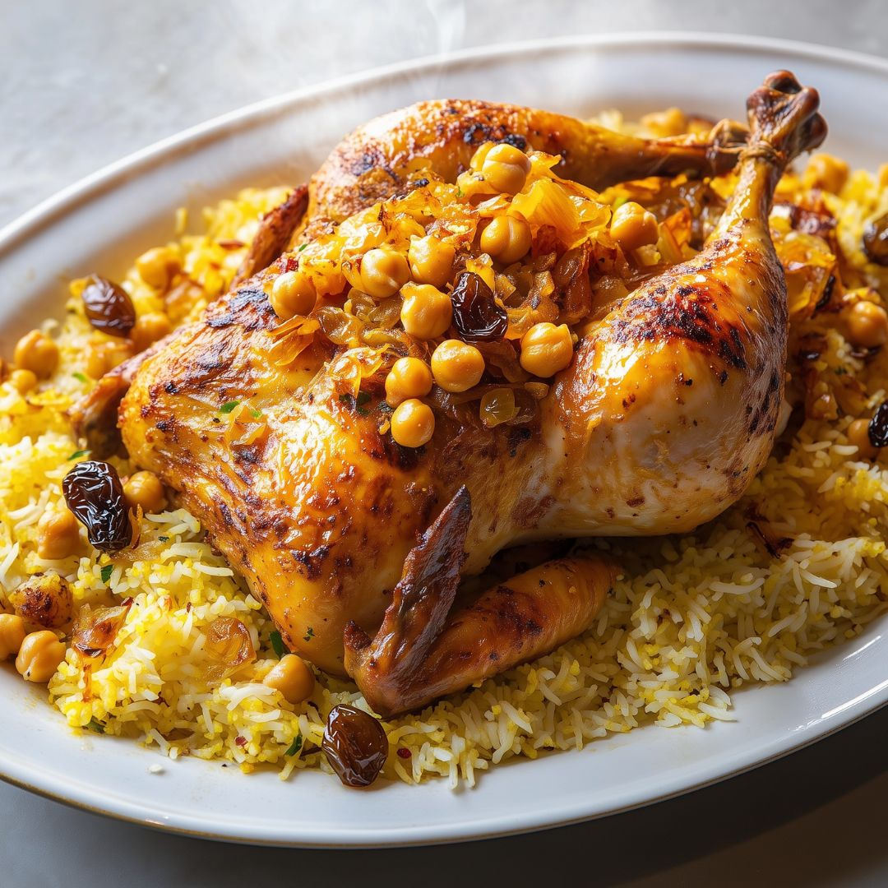

# Machboos

*Kuwait's national dish: long-grain basmati cooked with spice-rubbed chicken or lamb, dried lime and saffron, the rice stained gold and perfumed with cardamom, the meat falling off the bone on top.*

**Serves:** 6

**Prep Time:** 20 minutes

**Cook Time:** 1 hour 30 minutes

## Overview
Machboos is the centrepiece of the Kuwaiti table, the dish that sits in the middle of every Friday family lunch and every Ramadan iftar across the country. The technique is one pot: chicken or lamb is browned with onion and the Gulf baharat (a blend of black pepper, cumin, coriander, cinnamon, clove and dried lime), water goes in to make a spiced stock, then washed basmati is laid on top and steamed in the same pot until the grains stand separate and stained pale yellow. Loomi (dried black lime) gives the haunting sour-fermented note that distinguishes Gulf rice from its Persian and Indian cousins. The rice goes on the platter first, the meat on top, and daqoos sauce comes alongside to spoon over each bite.

## Ingredients

### Meat and marinade
- 1.5 kg chicken (cut into 6 pieces) or 1.5 kg lamb shoulder on the bone (cut into pieces)
- 2 tbsp Kuwaiti baharat (see notes)
- 1 tsp turmeric
- 1 tsp salt

### Pot
- 3 tbsp vegetable oil
- 2 large onions, finely chopped
- 5 garlic cloves, crushed
- 30 g fresh ginger, grated
- 2 tomatoes, chopped
- 3 dried limes (loomi), pierced with a knife
- 4 green cardamom pods
- 1 cinnamon stick
- 4 cloves
- 1 dried red chilli (optional)
- 1.2 litres hot water
- Salt to taste

### Rice
- 500 g basmati rice (soaked 30 minutes, drained)
- Pinch of saffron threads steeped in 3 tbsp warm rose water
- 2 tbsp ghee

### To finish
- 2 tbsp toasted slivered almonds
- 2 tbsp golden raisins fried briefly in ghee
- Chopped coriander

## Method

### Stage 1 - Marinate
1. Toss the chicken or lamb with baharat, turmeric and salt. Rest 20 minutes (or refrigerate up to 4 hours).

### Stage 2 - Build the pot
1. Heat the oil in a heavy pot over medium heat. Fry the onions for 10 minutes until deep gold.
2. Add garlic and ginger; cook 1 minute.
3. Add the meat; brown on all sides, 6 to 8 minutes.
4. Add tomatoes, dried limes (pierced so the flavour releases), cardamom, cinnamon, cloves and chilli if using. Stir for 1 minute.
5. Pour in the hot water. Bring to a simmer.
6. Cover and cook: chicken 35 minutes, lamb 1 hour 15 minutes, until the meat is tender. Salt to taste.

### Stage 3 - Lift the meat, cook the rice
1. Lift the meat out onto a plate; tent with foil.
2. Skim excess fat from the broth. Top up with hot water if needed: you want about 750 ml liquid for 500 g rice.
3. Add the drained rice to the pot, stir once to settle it under the surface.
4. Bring back to a brisk simmer, then cover tight, drop the heat to low, and steam 18 minutes.

### Stage 4 - Finish
1. Drizzle the saffron-rose water and ghee over the rice. Lay the meat back on top.
2. Cover and rest off the heat for 10 minutes.
3. Tip onto a wide platter: rice first, meat on top, scatter almonds, raisins and coriander.

## Notes
- **Baharat:** Mix 2 tbsp black pepper, 2 tbsp cumin, 2 tbsp coriander seed, 1 tbsp cinnamon, 1 tsp clove, 1 tsp cardamom, 1 tsp nutmeg; grind. Stores 3 months in a jar.
- **Loomi:** Dried black limes are sold whole at Middle Eastern groceries. Pierce them so the flavour seeps out as they simmer; remove before serving (they go bitter if eaten whole).
- **Rice-to-liquid:** The 1.5:1 ratio (liquid to rice) is the Gulf standard; basmati needs less water than other rices.

## Serving
Serve hot on a wide platter with daqoos sauce, salata huloo or salata arabia and laban (salted buttermilk) on the side.

## Storage
- Best eaten fresh; the rice firms up after refrigeration
- Refrigerate 3 days; reheat covered with a splash of water
- The cooked meat freezes 1 month
