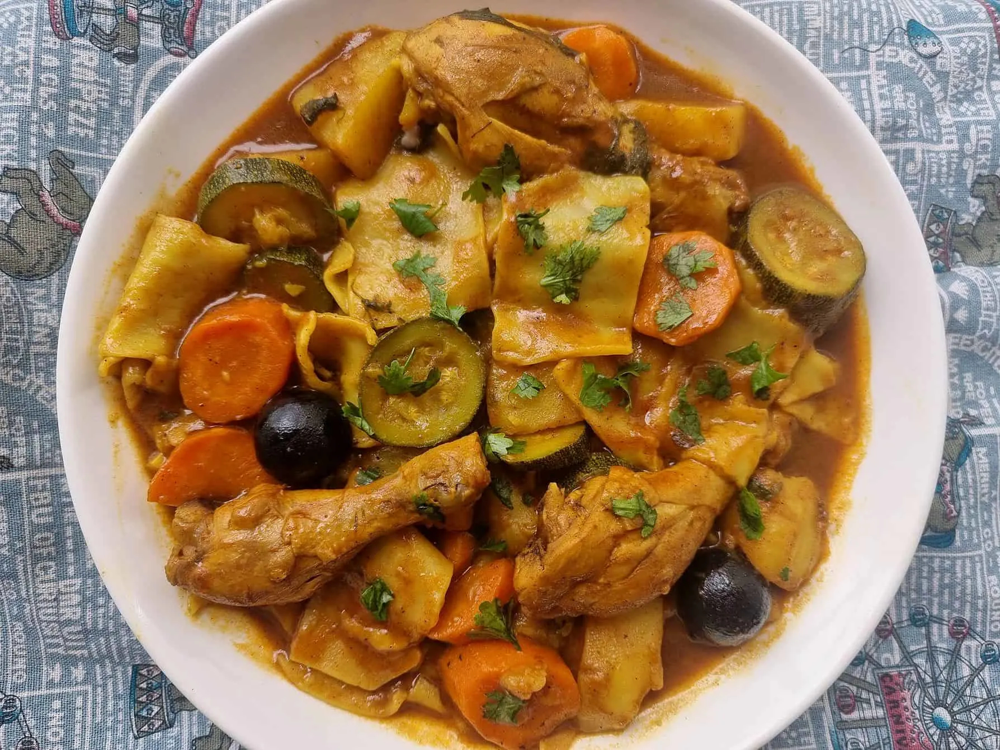

# Margoog

*Kuwaiti meat-and-vegetable stew with thin dough sheets cooked into the pot until they swell and thicken the broth: a one-pot dinner that holds the whole family at the table.*

**Serves:** 6

**Prep Time:** 30 minutes

**Cook Time:** 1 hour 30 minutes

## Overview
Margoog is winter food in Kuwait and the eastern Gulf, a stew of lamb or chicken with potato, pumpkin, courgette and tomato, finished with circles of thin unleavened dough laid directly into the simmering broth like Italian pasta. As the dough cooks it releases starch and turns the soup into something thicker than a stew but lighter than a casserole, the dough itself ending up tender and ragged. The flavour base is Gulf baharat, loomi and tomato; the dough is just flour, water and salt rolled paper-thin. Eat it from a deep bowl with a spoon, with the dough scooping up the broth.

## Ingredients

### Stew
- 800 g lamb shoulder on the bone (cut into pieces) or 800 g chicken pieces
- 2 tbsp vegetable oil
- 2 onions, finely chopped
- 4 garlic cloves, crushed
- 2 tbsp tomato paste
- 3 tomatoes, chopped
- 2 dried limes (loomi), pierced
- 1 tbsp Kuwaiti [baharat](../../base-ingredients/spices/baharat.md)
- 1 tsp turmeric
- 1 tsp cumin
- Salt and black pepper
- 1.5 litres hot water
- 300 g pumpkin or butternut squash, peeled and cubed
- 2 potatoes, peeled and cubed
- 2 courgettes, cubed
- 1 small aubergine, cubed
- Handful chopped coriander and parsley

### Dough
- 300 g plain flour
- 1 tsp salt
- 180 ml warm water
- 1 tbsp vegetable oil

## Method

### Stage 1 - The dough
1. Mix flour, salt, water and oil into a soft dough. Knead 5 minutes until smooth.
2. Rest covered for 30 minutes.
3. Divide into 8 balls; roll each one out paper-thin (about 2 mm). Cut into rough 10 cm circles or squares. Stack with flour between layers.

### Stage 2 - The stew
1. Heat oil in a wide heavy pot. Brown the meat in batches; set aside.
2. Add onions; cook 8 minutes until gold. Add garlic; 1 minute.
3. Stir in tomato paste; cook 2 minutes until darkened.
4. Add chopped tomatoes, baharat, turmeric and cumin; cook 3 minutes.
5. Return meat. Add dried limes, salt, pepper and hot water. Simmer covered: chicken 30 minutes, lamb 1 hour, until tender.

### Stage 3 - Vegetables
1. Add pumpkin and potato; simmer 10 minutes.
2. Add courgette and aubergine; simmer 10 more minutes.
3. Taste and adjust salt.

### Stage 4 - The dough goes in
1. Bring the stew to a gentle simmer.
2. Slide the dough circles in one at a time, separating each so they don't stick to one another. Push them down under the broth as you go.
3. Simmer uncovered 10 to 12 minutes; the dough cooks through and the broth thickens.
4. Stir in the chopped herbs.

## Notes
- **Dough thickness:** Roll thin (2 mm). Thicker pieces stay gummy in the middle.
- **The vegetable mix is flexible:** Pumpkin and potato are non-negotiable; courgette, aubergine, carrot or marrow are all fair game.
- **Lamb on the bone** is the proper choice; the bone gives the broth its body.

## Serving
- Serve in deep bowls, hot, with a wedge of lime and bread on the side.

## Storage
- Best the day it's made; the dough softens overnight
- Refrigerate 2 days; reheat with extra water
- Freezing is not advised (the dough texture suffers)

