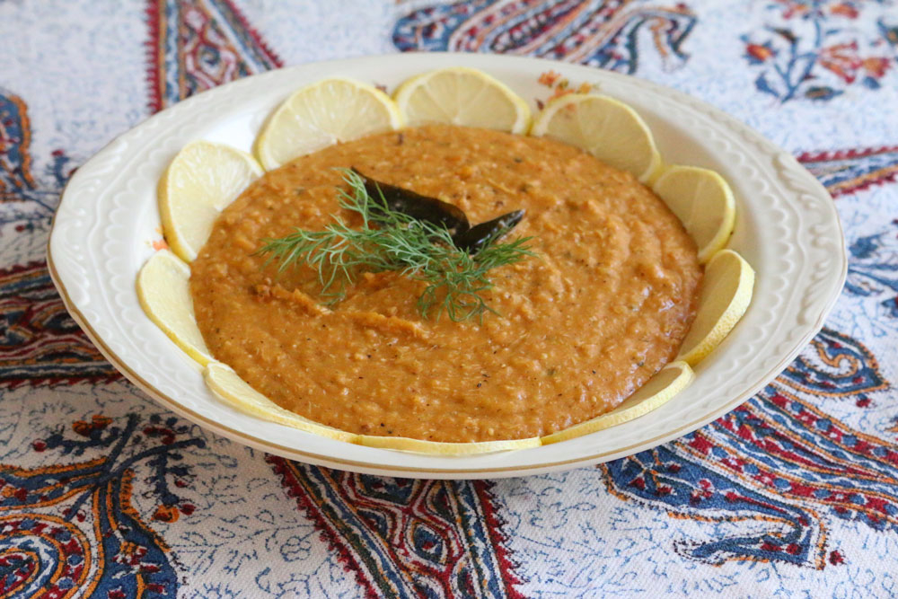

# Mathrooba

*Kuwaiti spiced wheat-and-chicken porridge, smoother and more aromatic than harees: a Ramadan iftar dish with baharat, loomi and tomato folded into the long-cooked grain.*

**Serves:** 6

**Prep Time:** 15 minutes (plus overnight soak)

**Cook Time:** 3 hours

## Overview
Mathrooba sits in the same Ramadan family as harees but takes the seasoning further: tomato, baharat, loomi and turmeric go into the wheat-and-chicken pot, and the finished dish is paler-orange rather than cream, smoother in mouthfeel, more layered in flavour. The name comes from a verb meaning "beaten" or "pounded", which is exactly what happens at the end: the cooked grain and meat are whipped together with a wooden spoon or hand whisk until they go silken. The Kuwaiti version is the more spiced of the Gulf takes, less austere than the Emirati and Saudi versions, with cumin and cinnamon perfuming each spoonful.

## Ingredients

- 300 g whole wheat berries (or coarsely cracked wheat), soaked overnight
- 700 g chicken thighs on the bone
- 2 tbsp ghee
- 2 onions, finely chopped
- 4 garlic cloves, crushed
- 2 tomatoes, chopped
- 2 tbsp tomato paste
- 1 tbsp Kuwaiti baharat
- 1 tsp turmeric
- 1 tsp ground cumin
- 1 cinnamon stick
- 4 cardamom pods
- 2 dried limes, pierced
- 2 tsp salt
- 2.5 litres water

### To finish
- 3 tbsp ghee, melted
- Chopped coriander
- 1 tsp ground cinnamon

## Method

### Stage 1 - Sauté the base
1. Melt ghee in a heavy pot. Fry the onions 8 minutes until gold.
2. Add garlic; 1 minute.
3. Add tomato paste; cook 2 minutes until darkened.
4. Add chopped tomatoes, baharat, turmeric and cumin; stir 2 minutes.

### Stage 2 - Bring it together
1. Drain the soaked wheat; add to the pot with the chicken thighs.
2. Add cinnamon, cardamom, dried limes, salt and water.
3. Bring to a boil; skim.

### Stage 3 - Long simmer
1. Cover and simmer on low for 2 hours, stirring occasionally and topping up water as needed.
2. Lift out the chicken. Strip the meat from the bones; discard skin, bones, cinnamon, cardamom and dried limes.
3. Shred the chicken finely; return it.

### Stage 4 - Beat smooth
1. Cook another 30 to 40 minutes on low, beating with a wooden spoon. The wheat collapses and the dish goes thick and silken.
2. Add hot water as needed; final texture should be like thick porridge.
3. Taste; adjust salt.

### Stage 5 - Serve
1. Spoon into a wide bowl.
2. Drizzle melted ghee across the top.
3. Scatter with coriander; dust with cinnamon.

## Notes
- **Pressure cooker shortcut:** 45 minutes high pressure after the sauté, then 30 minutes uncovered to beat down.
- **Smoother than harees:** Push it further with the spoon; the goal is a silken texture, not a porridge with bits.
- **Loomi out before serving:** Always remove dried limes before plating; they go bitter if eaten.

## Serving
- Hot, in shallow bowls, with bread and laban on the side. Iftar season favourite.

## Storage
- Refrigerate 3 days; reheat with hot water (it sets when cold)
- Freezes 2 months

