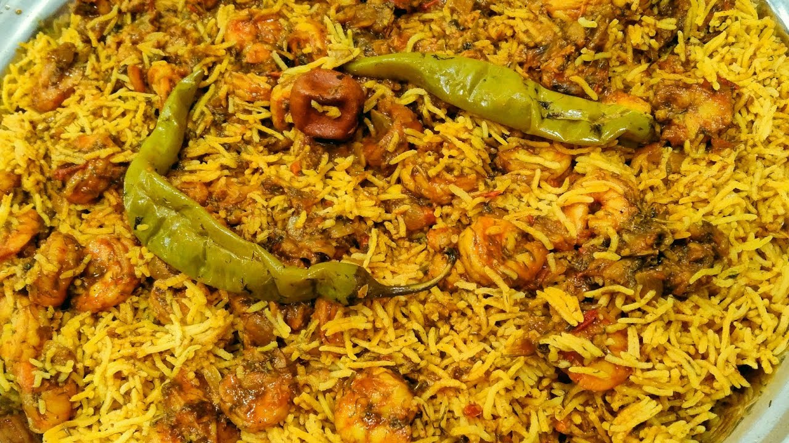

# Murabyan

*Kuwait's coastal speciality: spiced shrimp rice with dried lime and turmeric, the Gulf prawns folded through gold basmati at the end so they stay sweet and tender.*

**Serves:** 4 to 5

**Prep Time:** 20 minutes

**Cook Time:** 50 minutes

## Overview
Kuwait sits on the northern tip of the Gulf and its waters give big sweet prawns that show up in homes from Salmiya to Sharq through the cooler months. Murabyan is the dish that puts them on the table: the same one-pot rice technique as machboos but with shellfish in place of meat, the prawn shells fried first to flavour the oil, dried lime and turmeric tinting the broth, the prawns themselves added near the end so they don't toughen. Eat it from the platter with a spoon, with daqoos sauce alongside and a wedge of lime to brighten each bite.

## Ingredients

### Prawns
- 700 g large raw shell-on prawns
- 1 tsp salt
- 1 tsp turmeric
- 1 tsp Kuwaiti baharat

### Stock
- 2 tbsp vegetable oil
- 1 onion, halved
- 2 garlic cloves
- 1 dried lime, pierced
- 700 ml water

### Pot
- 3 tbsp vegetable oil
- 2 onions, finely chopped
- 4 garlic cloves, crushed
- 25 g fresh ginger, grated
- 1 green chilli, slit (optional)
- 2 tomatoes, chopped
- 2 tbsp tomato paste
- 1 tbsp Kuwaiti baharat
- 1 tsp turmeric
- 2 dried limes, pierced
- 1 cinnamon stick
- Salt

### Rice
- 500 g basmati (soaked 30 minutes, drained)
- Pinch of saffron in 2 tbsp warm water
- 2 tbsp ghee
- Chopped coriander

## Method

### Stage 1 - Prep prawns and prawn stock
1. Peel the prawns, keeping the shells. Devein the prawn flesh; toss with salt, turmeric and baharat. Refrigerate.
2. Heat 2 tbsp oil in a saucepan. Fry the shells with the halved onion and garlic for 5 minutes until pink and fragrant.
3. Add the pierced dried lime and water. Simmer 15 minutes. Strain into a jug; discard solids. You want about 600 ml stock.

### Stage 2 - Build the pot
1. Heat 3 tbsp oil in a heavy pot. Fry the chopped onions 10 minutes until deep gold.
2. Add garlic, ginger and chilli; 1 minute.
3. Stir in tomato paste and tomatoes; cook 4 minutes.
4. Add baharat, turmeric, pierced dried limes and cinnamon. Stir 30 seconds.
5. Pour in the prawn stock. Bring to a simmer. Salt to taste.

### Stage 3 - Rice
1. Add the drained rice. Stir once.
2. Cover tight; cook on low 15 minutes.
3. Open the lid. Lay the marinated prawns over the rice in a single layer.
4. Drizzle the saffron water and ghee over the top.
5. Cover; cook 5 to 7 more minutes until the prawns are pink and cooked through.

### Stage 4 - Serve
1. Off the heat; rest 10 minutes covered.
2. Fluff gently with a fork so the prawns stay on top.
3. Tip onto a platter; scatter with coriander.

## Notes
- **Shell-on prawns are the right choice.** The shells make the stock; without them the dish is flat.
- **Don't overcook the prawns.** Five to seven minutes on the rice is enough; they go rubbery if pushed.
- **Loomi pierced, not crushed.** Crush and they go bitter.

## Serving
Hot, on a wide platter, with daqoos sauce, salata arabia and wedges of lime.

## Storage
- Best fresh; the prawns toughen when reheated
- Refrigerate 1 day; reheat covered with a splash of water
- Freezing is not advised
