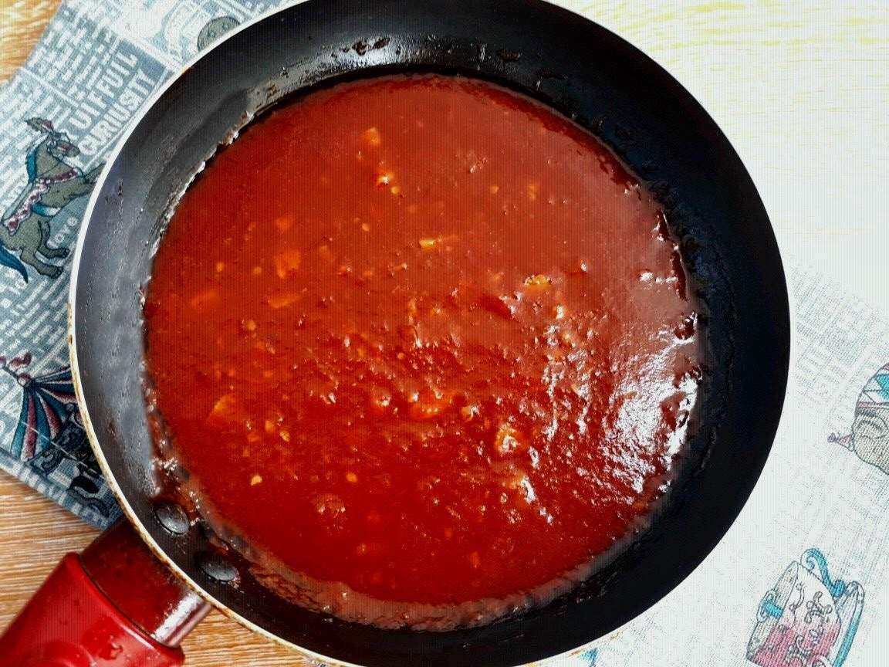

# Daqoos

*Kuwait's table sauce: a hot tomato-and-coriander relish with garlic and chilli, the spoon-over condiment for machboos, murabyan and grilled meat.*

**Serves:** 6 (makes about 350 ml)

**Prep Time:** 5 minutes

**Cook Time:** 15 minutes

## Overview
Daqoos is to the Kuwaiti table what salsa verde is to the Mexican: a punchy sharp condiment that goes on everything, spooned over machboos rice bite by bite, drizzled over grilled fish, splashed on a hummus plate. The base is tomato, but the cooking is short and the texture stays loose; garlic is pounded in raw and the coriander goes in at the end so it stays green. Chilli gives the heat and a squeeze of lime brightens. Make a jar; it keeps a week and goes on everything you cook for the next week.

## Ingredients

- 4 ripe tomatoes, finely diced (or 1 tin good chopped tomatoes)
- 2 tbsp olive oil
- 4 garlic cloves, crushed to a paste
- 1 green chilli, finely chopped (or to taste)
- 1 tsp ground cumin
- 1 tsp ground coriander
- 1/2 tsp salt
- Juice of 1/2 lime
- A large handful fresh coriander, finely chopped

## Method

### Stage 1 - Cook the tomato base
1. Heat the oil in a small saucepan over medium heat.
2. Add garlic and chilli; sizzle 20 seconds (don't brown).
3. Add the tomato, cumin, ground coriander and salt.
4. Simmer 10 to 12 minutes until the tomato collapses and the sauce thickens slightly but is still loose. Crush bigger chunks with the back of a spoon.

### Stage 2 - Finish
1. Off the heat, stir in the lime juice.
2. Cool 5 minutes.
3. Stir in the fresh coriander.
4. Taste; adjust salt, lime and chilli.

## Notes
- **Texture:** Should be spoonable, not thick. Loosen with a splash of water if it tightens.
- **The coriander goes in last and off heat.** Cooked coriander darkens and dulls; raw at the end keeps it bright.
- **Heat level:** One small green chilli is gentle Kuwaiti home style. Two or three Thai chillies turn it into the restaurant kick.

## Serving
Room temperature in a small bowl with a spoon, beside any rice dish, grilled meat or hummus.

## Storage
- Refrigerate 1 week in a sealed jar
- Stir before serving; the oil settles
- Freezes 1 month

