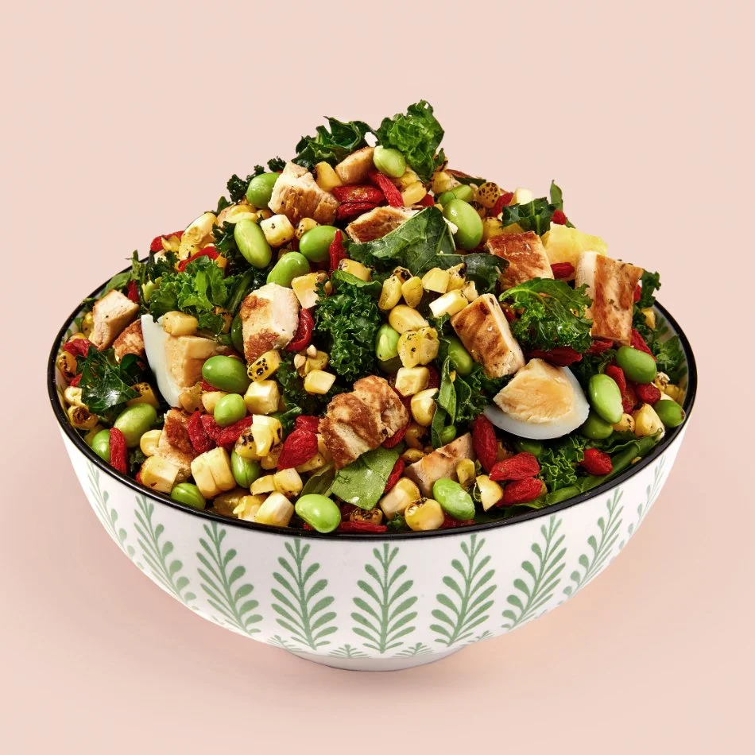

# Salata Huloo

*Kuwait's sweet salad: cucumber and tomato tossed with raisins, fresh mint and a lime-and-sugar dressing, served alongside spiced rice as the cooling counterweight.*

**Serves:** 4

**Prep Time:** 10 minutes

**Cook Time:** 0 minutes

## Overview
Salata huloo means "sweet salad" and it shows up on the Kuwaiti table whenever there's machboos or murabyan, the role being to cool and brighten the heavy spiced rice. The pull comes from the contrast: sharp lime, fresh cucumber, ripe tomato, fresh mint, and a handful of sweet raisins that plump up in the dressing while you mix. A teaspoon of sugar in the dressing rounds the lime, the salt holds it from going jammy, and the result is something between a salad and a relish. Serve cold from a shared bowl; everyone helps themselves with a spoon.

## Ingredients

- 2 small cucumbers (or 1 large), diced
- 3 ripe tomatoes, diced
- 1 small red onion, finely chopped
- 50 g golden raisins
- A small handful fresh mint leaves, chopped
- A small handful fresh coriander, chopped

### Dressing
- Juice of 2 limes
- 2 tbsp olive oil
- 1 tsp sugar
- 1/2 tsp salt
- 1/4 tsp ground black pepper

## Method

### Stage 1 - Dressing
1. Whisk lime juice, olive oil, sugar, salt and pepper in a small bowl until the sugar dissolves.

### Stage 2 - Toss
1. Combine cucumber, tomato, red onion and raisins in a serving bowl.
2. Pour over the dressing; toss gently.
3. Rest 5 minutes; the raisins plump.
4. Add the mint and coriander; toss once more.

## Notes
- **The raisins are the signature.** Don't skip them; they're what makes this dish Kuwaiti rather than generic.
- **Cucumber:** Small Persian or Lebanese cucumbers work best; if using English cucumber, deseed first.
- **Make ahead carefully:** Mix everything except the dressing in advance; dress only at the last minute or the tomatoes weep.

## Serving
- Cold, in a shared bowl, beside machboos, murabyan or any spiced rice.

## Storage
- Eats best within 2 hours of dressing
- The undressed components keep 1 day in the fridge

