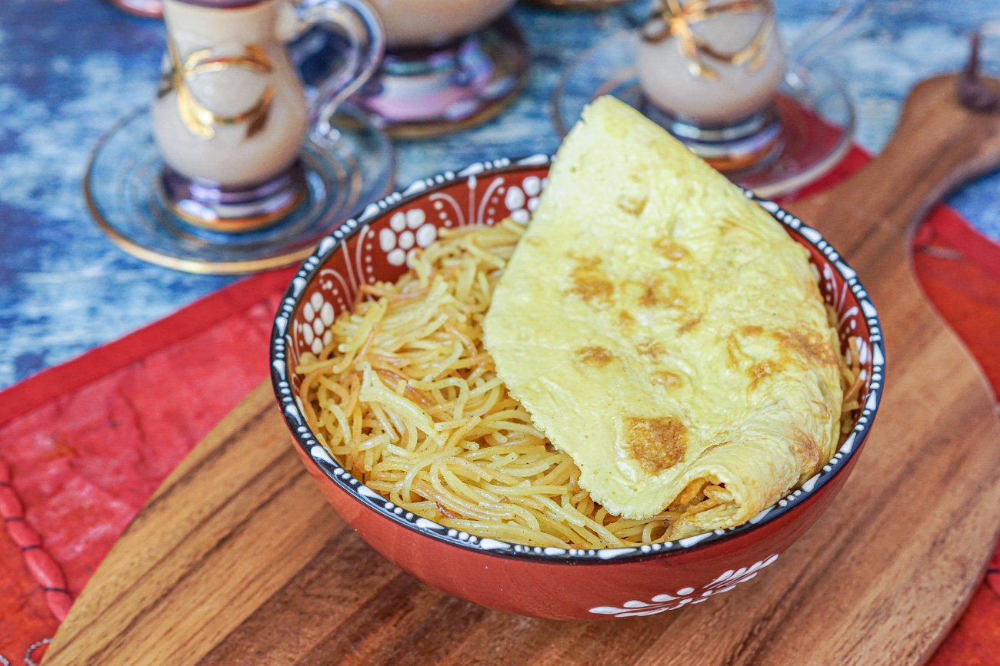

# Balaleet

*Kuwait's sweet-savoury breakfast: cardamom and saffron vermicelli simmered with sugar and rose water, topped with a folded fried egg, eaten at Ramadan suhoor and family Friday mornings.*

**Serves:** 4

**Prep Time:** 5 minutes

**Cook Time:** 25 minutes

## Overview
Balaleet is the Gulf's defining breakfast: thin wheat vermicelli (the same shaayriya used in pilaf) fried in ghee with cardamom and saffron, simmered briefly with sugar and rose water until tender and lightly sweet, then crowned with a thin omelette or a folded fried egg laid across the top. The contrast is the dish: sweet warm noodles below, savoury soft egg above, eaten together by the forkful. Kuwaiti and Bahraini families have it at suhoor (the pre-dawn meal in Ramadan) and on lazy Friday mornings; it shows up on every Gulf hotel breakfast buffet and on every grandmother's stove.

## Ingredients

### Vermicelli
- 250 g thin wheat vermicelli (shaayriya), broken into 3 to 4 cm lengths
- 4 tbsp ghee
- 80 g caster sugar
- 1/2 tsp ground cardamom
- 1/4 tsp saffron threads, steeped in 2 tbsp warm water
- 1 tbsp rose water
- 1/4 tsp salt
- About 500 ml hot water (or enough to cook the noodles)

### Egg topping
- 4 eggs
- 1 tbsp milk
- Pinch of salt
- 1 tbsp ghee for the pan

### To finish
- 1 tbsp pistachios, chopped (optional)

## Method

### Stage 1 - Toast the vermicelli
1. Melt the ghee in a wide pan over medium heat.
2. Add the broken vermicelli; stir constantly 4 to 5 minutes until deep gold-brown all over. Don't let it burn.

### Stage 2 - Simmer sweet
1. Add the sugar, cardamom, saffron-water, salt and 500 ml hot water.
2. Bring to a simmer; cover and cook 10 minutes until the vermicelli is tender and the liquid is mostly absorbed.
3. Off the heat, stir in the rose water.
4. Rest covered 5 minutes; the noodles finish absorbing.

### Stage 3 - Eggs
1. Beat the eggs with milk and a pinch of salt.
2. Heat the ghee in a small non-stick frying pan over medium-low.
3. Pour in the eggs; tilt the pan to spread.
4. Cook gently 2 to 3 minutes until just set on top; fold in half.

### Stage 4 - Plate
1. Pile the warm vermicelli on a plate.
2. Lay the folded omelette over the top.
3. Scatter with pistachio.

## Notes
- **Brown the vermicelli well.** The deep toast is the flavour; pale noodles read raw and pasty.
- **Saffron and rose water are the perfume.** Don't skip them; they're what makes balaleet balaleet rather than a sweet noodle dish.
- **One omelette across the top, not one each.** It's a sharing presentation; cut the omelette as everyone serves themselves.

## Serving
Warm, on a wide plate, for breakfast or Ramadan suhoor. Karak chai on the side.

## Storage
- Refrigerate 2 days; reheat the vermicelli with a splash of water
- Make the egg fresh each time

