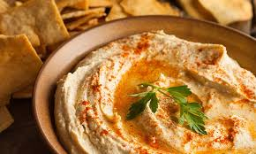

# Hummus Kuwaiti

*Kuwait's take on hummus: smooth tahini-and-chickpea base topped with whole simmered chickpeas, a drizzle of chilli oil and a dust of cumin, eaten with khubz at any time of day.*

**Serves:** 4 to 6

**Prep Time:** 10 minutes (plus chickpea soak)

**Cook Time:** 1 hour

## Overview
Hummus is Levantine in origin but the Kuwaiti version takes the format and gives it the Gulf treatment: a fraction more lemon, a touch of cumin, and the signature topping of whole spiced chickpeas warmed in olive oil with chilli flakes, the oil dripping red down the side of the plate. The base is still chickpeas, tahini, garlic and lemon, blended smooth, but the plating is what marks it as Kuwaiti rather than Lebanese: the swirl of paprika, the warm chickpeas piled in the centre, the chilli oil pooled around the edge. Eat with warm Kuwaiti bread at breakfast, beside grilled meat, or as a starter at any meal.

## Ingredients

### Hummus base
- 250 g dried chickpeas (or 2 tins, drained)
- 1 tsp bicarbonate of soda (if using dried)
- 4 tbsp tahini
- Juice of 2 lemons
- 2 garlic cloves, crushed
- 1/2 tsp ground cumin
- 1/2 tsp salt
- 100 ml ice-cold water

### Topping
- 4 tbsp olive oil
- 1 tsp dried chilli flakes (Aleppo style if available)
- 1/2 tsp ground cumin
- 1/2 tsp paprika
- Reserved 3 tbsp whole cooked chickpeas
- 1 tbsp chopped parsley
- 1 tbsp pine nuts (optional)

## Method

### Stage 1 - Chickpeas
1. Soak the dried chickpeas overnight in plenty of cold water with the bicarbonate of soda.
2. Drain. Simmer in fresh water for 50 to 60 minutes until very tender; the skins should slip when pinched.
3. Reserve 3 tbsp of whole chickpeas for the topping. Reserve 100 ml of the cooking water.
4. Skip to stage 2 if using tinned chickpeas; simmer them 10 minutes in fresh water with a pinch of bicarb to soften the skins.

### Stage 2 - Blend smooth
1. Put the cooked chickpeas (minus the reserved ones) in a food processor with tahini, lemon juice, garlic, cumin and salt.
2. Blend 1 minute.
3. Stream in the ice-cold water while blending; the hummus will turn pale and fluffy. Blend a full 3 to 4 minutes; the long blend is what makes it silken.
4. Taste; adjust salt and lemon.

### Stage 3 - Topping
1. Warm the olive oil in a small pan with the chilli flakes, cumin and paprika; about 1 minute, no browning.
2. Add the reserved whole chickpeas; warm through.

### Stage 4 - Plate
1. Spread the hummus in a wide shallow bowl with the back of a spoon, making a swirl with a well in the centre.
2. Pile the warm chickpeas in the well.
3. Pour the chilli-cumin oil over the top.
4. Scatter parsley and pine nuts.

## Notes
- **Bicarb in the soak** softens the skins; skinless chickpeas blend silkier.
- **Long blend, ice water.** The texture comes from blending well past the point where it looks done, with a slow stream of ice water at the end.
- **Tahini quality matters.** Buy a runny pourable tahini, not a stiff one; Lebanese or Palestinian brands are the right kind.

## Serving
Room temperature in a wide shallow bowl with warm Kuwaiti khubz or pita, fresh vegetables, and a small bowl of pickles alongside.

## Storage
- Refrigerate 4 days
- Top with fresh oil and warm chickpeas each time you serve

