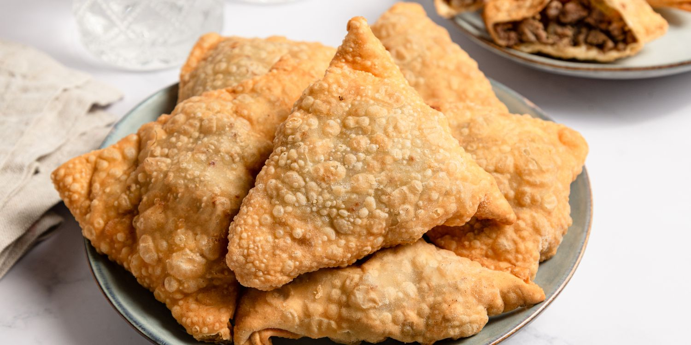

# Sambusa Kuwaiti

*Kuwait's iftar pastry: thin triangular parcels filled with spiced beef and onion or melting cheese, fried golden and eaten hot from the plate.*

**Serves:** 6 (makes about 24 pieces)

**Prep Time:** 30 minutes

**Cook Time:** 20 minutes

## Overview
Sambusa came to the Gulf from India and Persia along the same trade winds that carried cardamom and saffron, and Kuwait took it as its own. The Kuwaiti version uses thin spring-roll-style wrappers (samosa pastry, sold ready-made in every Gulf supermarket and Asian shop) folded into neat triangles around either a spiced beef filling (with onion, parsley and baharat) or a soft cheese filling (akkawi or halloumi with parsley and dill). They go in a hot oil bath and turn deep gold in three minutes. At Ramadan iftar a basket of them sits on the table next to the dates and the soup, the first thing eaten after the call to prayer.

## Ingredients

### Beef filling (for 12)
- 250 g minced beef
- 1 tbsp vegetable oil
- 1 large onion, finely chopped
- 2 garlic cloves, crushed
- 1 tsp Kuwaiti baharat
- 1/2 tsp ground cumin
- 1/2 tsp ground coriander
- 1/2 tsp black pepper
- Salt
- 2 tbsp chopped parsley
- Juice of 1/2 lemon

### Cheese filling (for 12)
- 200 g akkawi or halloumi, grated (or low-moisture mozzarella mixed with a pinch of feta)
- 2 tbsp chopped parsley
- 1 tbsp chopped dill
- 1/4 tsp black pepper

### Wrappers and seal
- 24 samosa pastry strips (about 8 cm wide, 30 cm long), thawed if frozen
- 2 tbsp flour mixed with 2 tbsp water to a paste (the glue)

### Frying
- Vegetable oil for deep frying

## Method

### Stage 1 - Beef filling
1. Heat oil in a pan; cook the onion 6 minutes until soft.
2. Add garlic; 1 minute.
3. Add the mince; break it up and brown 6 minutes.
4. Stir in baharat, cumin, coriander, pepper and salt; cook 1 minute.
5. Off the heat, add parsley and lemon. Cool fully.

### Stage 2 - Cheese filling
1. Combine grated cheese, parsley, dill and pepper. No salt needed (the cheese is salty).

### Stage 3 - Fold
1. Lay a wrapper strip on the work surface.
2. Spoon 1 heaped teaspoon of filling onto one end at a 45-degree angle.
3. Fold the corner over the filling to form a triangle, then keep folding the triangle along the strip (like folding a flag) until you reach the end.
4. Brush the loose end with flour paste; press to seal.
5. Repeat. Stack with parchment between layers.

### Stage 4 - Fry
1. Heat oil to 175 C in a wide pan.
2. Fry the sambusas in batches of 6, turning, for 3 minutes until deep gold.
3. Drain on kitchen paper.

## Notes
- **The fold is the part to practise.** Watch a video first if you're new to it; the triangle shape locks the filling in.
- **Don't overfill.** A heaped teaspoon is enough; bulging sambusas burst in the oil.
- **Freeze raw.** Sambusas freeze perfectly raw; fry from frozen, adding 1 minute to the cook time. This is how Kuwaiti families prep through Ramadan.

## Serving
Hot, on a wide plate, with daqoos or a yogurt-mint dip. Iftar staple.

## Storage
- Eat fresh; reheat in a hot oven for 5 minutes (microwave goes soggy)
- Raw assembled sambusas freeze 2 months

