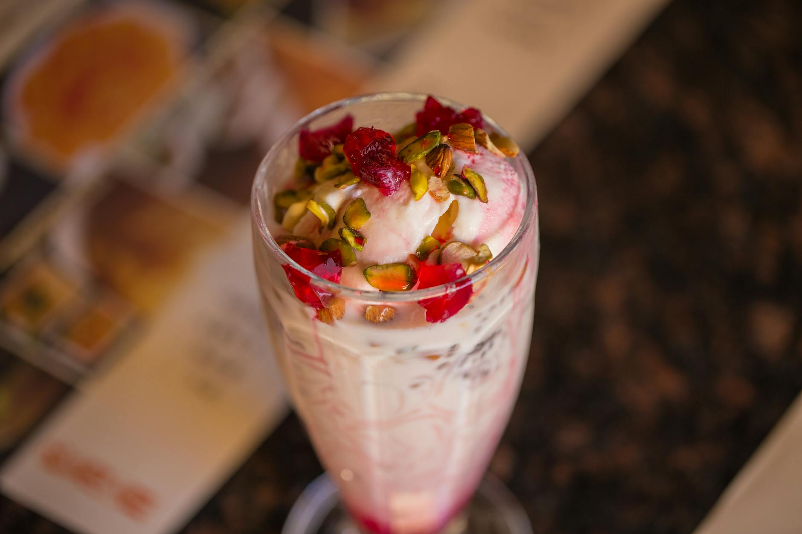

# Lahori Falooda

*Chilled rose-milk dessert: a tall glass layered with rose syrup, soaked basil seeds, cold vermicelli, scoops of kulfi or ice cream, milk, and nuts. The Lahori summer answer to a hot afternoon.*

**Serves:** 4 (large tall glasses)

**Prep Time:** 30 minutes (mostly soaking)

**Cook Time:** 10 minutes

## Overview
Chilled rose-milk dessert, the tall-glass sundae that gets sold from Lahori carts in summer and from corner kulfi shops year-round: layered rose syrup, soaked basil seeds (sabja), cold sweet vermicelli, a scoop of kulfi or vanilla ice cream, sweetened milk poured slowly down the side, more rose syrup over the top, a scatter of slivered pistachios and almonds. You soak sabja in cold water 20 minutes till they swell into clear jelly capsules (chia seeds work if you can't find them, but the texture is more gel than jelly). Boil thin vermicelli briefly till just tender, drain, chill hard in iced water. Sweeten the milk with sugar, cardamom and rose water, refrigerate. Falooda is built on temperature contrast, so the glasses go in the fridge too. Build the layers slowly, pouring the milk down the side of a tilted glass to keep the strata visible. Serve immediately with long sundae spoons; the drama is in the look and you only have minutes before the ice cream melts into the milk.

## Ingredients

### Basil seeds
- 2 tablespoons sweet basil seeds (sabja / tukmaria; not chia seeds, though they're a workable substitute)
- 250 ml cold water (for soaking)

### Vermicelli
- 60 g thin vermicelli (Indian semiya, or angel-hair pasta broken into 5 cm lengths as a substitute)
- 1 litre boiling water (for cooking)
- 500 ml iced water (for chilling)

### Sweetened milk
- 800 ml full-fat milk
- 60 g caster sugar (adjust to taste)
- ½ teaspoon ground cardamom
- 1 tablespoon rose water (or kewra water)

### Layering
- 8 tablespoons rose syrup (Rooh Afza is the Lahori standard; or homemade rose-sugar syrup)
- 4 scoops vanilla ice cream (or kulfi if you have it)
- 30 g pistachios (slivered)
- 30 g almonds (slivered, lightly toasted)
- 2 tablespoons chopped glacé cherries (optional, for colour)

### Equipment
- 4 tall glasses (the dish is presented; clear sundae glasses are ideal)

## Method

### Stage 1 - Soak the basil seeds
1. Place the basil seeds in a small bowl.
1. Cover with the 250 ml of cold water.
1. Soak for at least 20 minutes (the seeds will swell to 4-5 times their size and form a clear jelly around each kernel).
1. Drain off the excess water (some can remain).

### Stage 2 - Cook the vermicelli
1. Bring 1 litre of water to a boil.
1. Add the vermicelli.
1. Cook for 2-3 minutes (until just tender, no longer).
1. Drain immediately into a colander.
1. Plunge into iced water to stop the cooking and chill thoroughly.
1. Drain and reserve in the fridge.

### Stage 3 - Sweeten the milk
1. Whisk the cold milk with the sugar, cardamom and rose water until the sugar has dissolved.
1. Refrigerate to keep cold.

### Stage 4 - Chill the glasses
1. Place 4 tall glasses in the fridge for 10 minutes (cold glasses keep the falooda colder for longer).

### Stage 5 - Build
1. Drizzle 1 tablespoon of rose syrup into the bottom of each glass.
1. Spoon 2 tablespoons of soaked basil seeds on top.
1. Add a small handful of chilled vermicelli (about 4 tablespoons per glass).
1. Slowly pour 200 ml of sweetened milk into each glass.
1. Place a scoop of ice cream on top.
1. Drizzle another tablespoon of rose syrup over the ice cream.
1. Scatter the pistachios, almonds and chopped cherries on top.

### Stage 6 - Serve
1. Serve immediately with long sundae spoons.

## Notes
- **Basil seeds, not chia:** Sabja swells faster, jellies cleaner and tastes neutral. Chia seeds work but the texture is more gel-like and the flavour faintly nutty.
- **Cold everything:** Falooda is built on temperature contrast. Vermicelli, milk and glasses all chilled; the ice cream is the only cold-cold element. Warm milk would melt the ice cream.
- **Layer carefully:** Pouring the milk slowly down the side of the glass keeps the layers visible. The drama is in the look.

## Storage
- Assemble just before serving.
- Vermicelli, basil seeds and milk can be prepped 1 day ahead; keep separately in the fridge.
