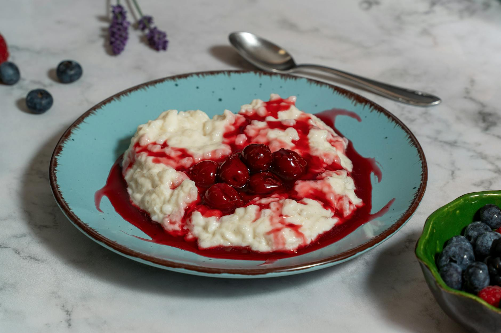

# Lahori Firni

*Rice-flour pudding: ground rice cooked slowly in cardamom-scented milk until thick, set in small earthenware bowls and chilled. The cooling Lahori Eid dessert; smoother than kheer, paler, ground-rice-fine.*

**Serves:** 6 (small earthenware bowls or ramekins)

**Prep Time:** 10 minutes (plus 30 minutes soak for the rice)

**Cook Time:** 35 minutes

## Overview
Aged basmati rice is soaked briefly and ground to a coarse paste (the Lahori way; modern shortcut is rice flour). Milk is brought to a boil, the rice paste whisked in carefully to avoid lumps, and the mixture cooked over low heat for 25-30 minutes with constant stirring as it thickens to a custard. Sugar, cardamom, saffron and a hint of rose go in at the end. The firni is poured into small earthenware bowls (the traditional vessel; the porous clay draws moisture out and intensifies the flavour). Chilled, topped with nuts.

## Ingredients

### Firni
- 60 g aged basmati rice (rinsed; or 50 g rice flour if shortcut)
- 80 ml water (for soaking and grinding)
- 1 litre full-fat milk
- 100 g caster sugar (adjust to taste)
- ½ teaspoon ground cardamom (or seeds from 6 pods, finely ground)
- ¼ teaspoon saffron threads
- 2 tablespoons warm milk (for blooming the saffron)
- 1 tablespoon rose water (or kewra water; both are Lahori traditional)
- A pinch of salt

### To finish
- 30 g blanched almonds (slivered)
- 30 g pistachios (slivered)
- 1-2 sheets of silver leaf (vark; optional)
- A few extra saffron threads
- 6 earthenware bowls (small, kulhars) or ramekins

## Method

### Stage 1 - Prep the rice
1. Rinse the rice in cold water.
1. Soak in 80 ml of water for 30 minutes.
1. Drain (reserving the soaking water).
1. Grind the soaked rice in a blender with 2-3 tablespoons of the reserved water to a coarse, gritty paste (not a smooth puree; you want the firni to have a bit of grain).

### Stage 2 - Bloom the saffron
1. Crumble the saffron into 2 tablespoons of warm milk.
1. Rest for 10 minutes.

### Stage 3 - Boil the milk
1. Pour the milk into a wide, heavy-bottomed pan.
1. Add a pinch of salt.
1. Bring to a boil over medium heat, stirring once or twice.

### Stage 4 - Add the rice paste
1. Reduce the heat to medium-low.
1. Slowly whisk the ground rice paste into the simmering milk (whisk constantly to avoid lumps).
1. Continue stirring for 25-30 minutes, scraping the bottom of the pan with a wooden spoon every 2-3 minutes, until the mixture has thickened to a thin custard (it should coat the back of a spoon; it will thicken further as it cools).

### Stage 5 - Sweeten
1. Stir in the sugar; cook for 2 minutes until dissolved.
1. Add the cardamom, the bloomed saffron and the rose water.
1. Cook for 1 more minute; pull from the heat.

### Stage 6 - Set
1. Pour the firni into the earthenware bowls or ramekins, filling each three-quarters of the way.
1. Cool to room temperature for 30 minutes (a skin will form on top; this is traditional).
1. Refrigerate for at least 4 hours, ideally overnight, until set firm.

### Stage 7 - Garnish and serve
1. Scatter the slivered almonds and pistachios over the top.
1. Lay a small piece of silver leaf on each (if using).
1. Drop 2-3 saffron threads on top for the look.
1. Serve cold, straight from the bowl.

## Notes
- **Ground rice, not rice flour:** Hand-grinding the soaked rice gives a coarser, more texturally interesting firni than commercial rice flour. The shortcut works but the dish loses character.
- **Stir constantly:** Firni catches the bottom of the pan in seconds. The 25-30 minute cook is genuinely active.
- **Earthenware matters:** The porous clay draws moisture out as the firni chills, concentrating the flavour. Ramekins work but the firni stays softer.

## Storage
- Refrigerate up to 3 days; the texture firms up further over time.
- Doesn't freeze (the texture turns grainy).
