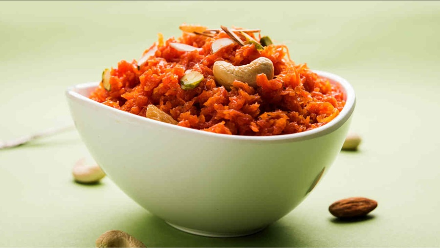

# Lahori Gajar Halwa

*Winter carrot halwa: red carrots cooked low and slow in full-fat milk with sugar, ghee and cardamom until thick and dark orange. Topped with toasted nuts and a flake of silver leaf. The Punjabi winter dessert.*

**Serves:** 6-8

**Prep Time:** 15 minutes

**Cook Time:** 1 hour 30 minutes

## Overview
Red winter carrots are grated coarsely on a box grater. The grated carrot is simmered with full-fat milk over medium heat, stirred frequently as the milk reduces and the carrots take on its colour and fat. After about 45 minutes the milk has cooked down to a thick paste with the carrots; sugar is added (which releases more water briefly), then ghee, cardamom and the dish is fried-dried over higher heat for the final 15 minutes until thick, dark and oily-glossy. Khoya (reduced milk solids) is the traditional finish; condensed milk is the modern shortcut.

## Ingredients
- 1 kg red carrots (winter carrots, preferably; orange standard carrots work but give a slightly different colour)
- 1.2 litres full-fat milk
- 200 g caster sugar (adjust to taste; reduce if using condensed milk)
- 4 tablespoons ghee
- 100 g khoya (reduced milk solids, mashed) (or 4 tablespoons sweetened condensed milk + reduce sugar to 150 g)
- 1 teaspoon ground cardamom (or seeds from 6 pods, crushed)
- ¼ teaspoon ground nutmeg (optional)
- A pinch of salt

### To finish
- 30 g flaked almonds (lightly toasted)
- 30 g pistachios (slivered)
- 30 g cashews (chopped, lightly toasted in ghee)
- 2-3 sheets of silver leaf (vark; optional)

## Method

### Stage 1 - Grate the carrot
1. Peel the carrots and grate coarsely on a box grater (not too fine; the texture should be visible in the final dish).

### Stage 2 - Cook with the milk
1. Tip the grated carrot into a wide, heavy-bottomed pan (the wider the pan, the faster the milk reduces).
1. Pour over the milk and a pinch of salt.
1. Bring to a boil over medium-high heat, stirring once or twice.
1. Reduce to medium heat and cook uncovered for 40-50 minutes, stirring every 5 minutes, until the milk has reduced almost entirely and the carrots have soaked up the milk fat (the mixture should be thick and the colour deepened from orange to a richer red-orange).

### Stage 3 - Add the sugar
1. Stir in the sugar.
1. Cook for 5 minutes over medium heat (the sugar will draw water out of the carrots; you'll see the mixture loosen briefly).
1. Continue stirring until the loose water cooks off, 5-7 more minutes.

### Stage 4 - Add the ghee and khoya
1. Stir in 2 tablespoons of the ghee.
1. Cook for 5 minutes, stirring; the ghee will absorb into the carrots.
1. Add the khoya (or condensed milk) and cook for 5 more minutes.
1. Add the remaining 2 tablespoons of ghee.

### Stage 5 - Finish
1. Sprinkle in the cardamom and nutmeg.
1. Cook for 5-8 more minutes over medium-high heat, stirring continuously, until the halwa pulls away from the sides of the pan and ghee starts to puddle at the edges.
1. Stir in half the toasted almonds, pistachios and cashews.

### Stage 6 - Serve
1. Transfer to a serving bowl.
1. Scatter the remaining toasted nuts on top.
1. Lay the silver leaf gently over (if using).
1. Serve warm or at room temperature.

## Notes
- **Red carrots if you can find them:** Winter red carrots give the halwa its iconic deep colour. Orange carrots give a paler dish but the same flavour.
- **Wide pan:** Reducing 1.2 litres of milk in a narrow pan takes hours. A wide pan halves the time.
- **Khoya or condensed milk:** Khoya is the traditional thickener; sweetened condensed milk is the modern shortcut. Both work; just reduce the sugar if using condensed milk.

## Storage
- Refrigerate up to 5 days; reheat with a splash of milk and a knob of ghee.
- Freezes well for 2 months. Defrost overnight in the fridge.
