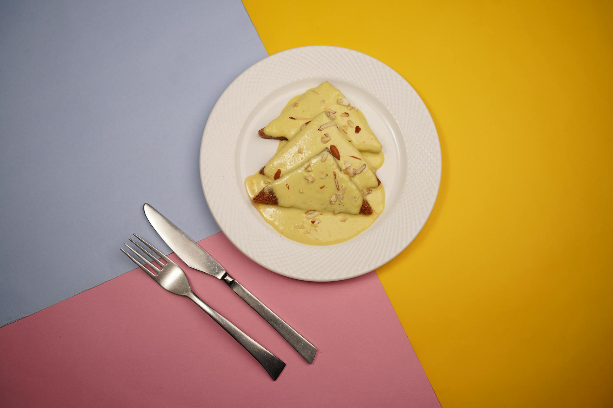

# Lahori Shahi Tukda

*Royal bread pudding: triangles of white bread fried in ghee until golden, soaked in a saffron-cardamom sugar syrup, then crowned with thickened cream and a scatter of nuts. A Mughal inheritance from Lahore's Old City sweet-makers.*

**Serves:** 6

**Prep Time:** 20 minutes

**Cook Time:** 40 minutes

## Overview
Slices of white bread are trimmed of their crusts and cut into triangles, then fried in ghee until deep golden. A sugar syrup is made fragrant with saffron, cardamom and rose water. A second pan reduces milk to a thick rabri (the milk-cream topping). The fried bread triangles are dipped briefly in the syrup so they soak it up without going mushy, layered onto a serving plate, and topped with the rabri. Toasted nuts and silver leaf finish.

## Ingredients

### Bread
- 8 slices of thick-cut white bread (day-old works best; cut the crusts off and slice each piece into 4 triangles)
- 6 tablespoons ghee (for shallow-frying)

### Sugar syrup
- 200 g caster sugar
- 200 ml water
- ½ teaspoon saffron threads
- ½ teaspoon ground cardamom (or 4 pods, lightly crushed)
- 1 tablespoon rose water (or kewra water)
- ½ lemon (prevents crystallisation, juice)

### Rabri (thickened cream)
- 750 ml full-fat milk
- 100 ml double cream
- 50 g caster sugar
- ½ teaspoon ground cardamom
- 2 tablespoons fine semolina (optional, for body; speeds the reduction)

### To finish
- 30 g flaked almonds (lightly toasted)
- 30 g pistachios (slivered)
- 1-2 sheets of silver leaf (vark; optional)
- A few extra saffron threads (for the look)

## Method

### Stage 1 - Reduce the rabri
1. Pour the milk and cream into a wide, heavy-bottomed pan.
1. Bring to a boil, then reduce to a low simmer.
1. Cook for 25-30 minutes, stirring every 3-5 minutes (scrape the bottom to prevent burning), until the milk has reduced by half and thickened.
1. Add the sugar, cardamom and the semolina (if using).
1. Cook for 5 more minutes; the rabri should now coat the back of a spoon.
1. Pull from the heat and cool to warm.

### Stage 2 - Make the sugar syrup
1. While the milk reduces, combine the sugar and water in a saucepan over medium heat.
1. Stir until the sugar has dissolved.
1. Bring to a simmer and cook for 5 minutes (the syrup should thicken slightly but still pour freely).
1. Add the saffron, ground cardamom, rose water and lemon juice.
1. Stir, then pull from the heat.

### Stage 3 - Fry the bread
1. Heat 3 tablespoons of the ghee in a wide pan over medium heat.
1. Add 6-8 bread triangles (work in batches).
1. Fry for 1-2 minutes a side, until deep golden.
1. Lift onto kitchen paper to drain.
1. Repeat with the remaining bread and ghee.

### Stage 4 - Soak
1. Bring the sugar syrup back to a gentle warmth (don't boil).
1. Dip each fried bread triangle in the warm syrup for 5-10 seconds (long enough to absorb but not collapse).
1. Lift out with a slotted spoon and arrange in a single layer on a serving plate.

### Stage 5 - Top with rabri
1. Spoon the warm rabri generously over the soaked bread (about 2 tablespoons per triangle).
1. Scatter the toasted almonds and pistachios over.
1. Lay the silver leaf gently across (if using).
1. Garnish with a few saffron threads.

### Stage 6 - Serve
1. Serve immediately while the rabri is warm, or chill for 1 hour for a cold dessert (also traditional in Lahore).

## Notes
- **Day-old bread is the dish:** Fresh bread falls apart in the syrup. Stale bread soaks up the syrup and holds its shape.
- **Don't over-soak:** 5-10 seconds in the syrup is the target. Longer and the bread loses its crisp golden shell and turns mushy.
- **Rabri is the soul:** A thin, watery topping makes the dessert feel cheap. The 30-minute slow reduction is what gives the rabri its restaurant-style body.

## Storage
- Refrigerate up to 2 days. The bread softens further but the flavour holds.
- Doesn't freeze well.
