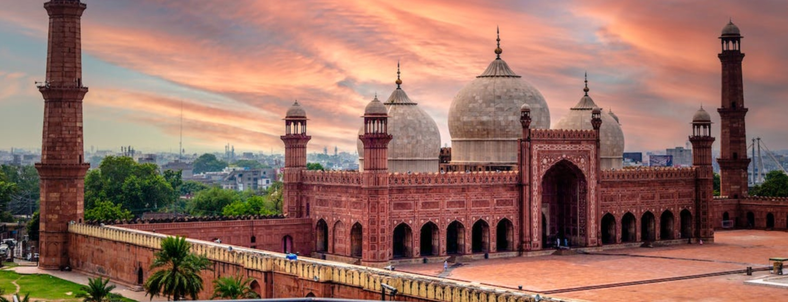

# Lahori Cuisine

The food of Lahore, Punjab's old Mughal capital and Pakistan's culinary heart. Slow-cooked meat traditions (nihari, paya, haleem) sit beside the city's signature charcoal kebabs (chargha, chapli, boti, seekh) and the Punjabi tarka-dal-roti-saag everyday triad. Lahori cooking leans on garam masala built around black cardamom, mace and javitri, with kasuri methi and dried pomegranate seed (anardana) used for souring. The dessert table runs to gajar halwa, shahi tukda, firni and kulfi; the rice tradition runs from yakhni pulao to mutton biryani and the sweet zarda of weddings and Eid.
