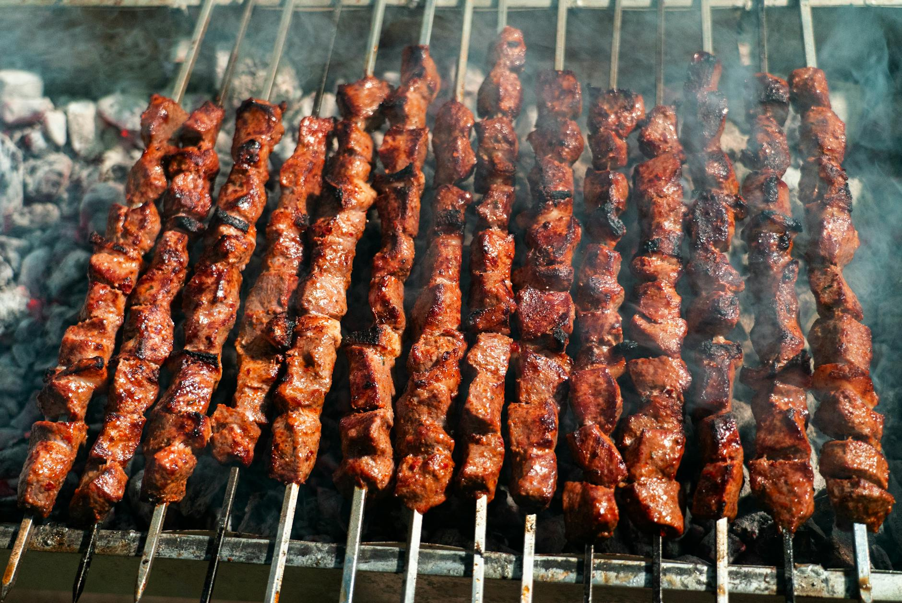

# Lahori Beef Boti Kebab

*Lahore's chargrilled beef cubes: tenderloin marinated in papaya, yogurt and Lahori masala, threaded onto skewers and grilled over charcoal until the edges char and the centre stays pink. Eaten with naan, raw onion and a splash of vinegar-soused chillies.*

**Serves:** 4-6

**Prep Time:** 20 minutes (plus 4 hours marinade)

**Cook Time:** 12 minutes

## Overview
Beef tenderloin or fillet is cut into 3 cm cubes and marinated in two stages. A first short rub with raw papaya, ginger-garlic, salt and a splash of vinegar tenderises the meat (papaya enzymes break down the muscle fibre). After 30 minutes the second marinade goes in: yogurt, Kashmiri chilli, garam masala, kasuri methi, mustard oil and a touch of besan. The beef sits for at least 3 hours, ideally overnight. Threaded onto skewers and grilled hot until charred at the edges; the inside should stay pink and juicy.

## Ingredients

### Beef
- 800 g beef tenderloin (or fillet, sirloin or rump; cut into 3 cm cubes)

### First marinade (tenderiser)
- 2 tablespoons green papaya paste (or 1 tablespoon meat tenderiser, or 2 tablespoons natural yogurt for a lighter version)
- 1 tablespoon ginger-garlic paste
- 1 tablespoon white vinegar
- 1 teaspoon salt

### Second marinade
- 200 g natural yogurt (thick; strained if loose)
- 1 tablespoon Kashmiri chilli powder
- 1 teaspoon [Garam Masala](../indian/Spice-Mixes/garam-masala.md)
- 1 teaspoon ground cumin
- 1 teaspoon ground coriander
- ½ teaspoon turmeric
- 1 teaspoon black pepper
- ½ teaspoon ground cardamom
- 1 tablespoon crushed kasuri methi (dried fenugreek leaves)
- 2 tablespoons mustard oil (smoked first)
- 2 tablespoons gram flour (besan; toasted in a dry pan for 1 minute)
- 1 teaspoon salt

### To cook
- 8 metal skewers (or 16 wooden skewers, soaked for 30 minutes)
- 2 tablespoons melted butter (for basting)

### To serve
- Sliced red onion (soaked briefly in vinegar with a pinch of salt)
- Mint-yogurt chutney
- Lemon wedges
- Warm naan (or roghni naan)
- Pickled green chillies

## Method

### Stage 1 - First marinade
1. Combine the papaya paste (or substitute), ginger-garlic paste, vinegar and salt.
1. Rub into the beef cubes.
1. Rest for 30 minutes at room temperature (the papaya enzymes start breaking down the muscle fibre).

### Stage 2 - Smoke the mustard oil
1. Heat the mustard oil in a small pan until just smoking.
1. Pull from the heat and cool.

### Stage 3 - Second marinade
1. Whisk together the yogurt, all the dried spices, kasuri methi, cooled mustard oil, toasted besan and salt into a thick red paste.
1. Add the marinated beef.
1. Toss to coat every piece.
1. Refrigerate for at least 3 hours, ideally overnight.

### Stage 4 - Bring to room temperature
1. Lift the beef out of the fridge 30 minutes before cooking.

### Stage 5 - Skewer
1. Thread 4-5 cubes onto each skewer, leaving small gaps so the heat reaches all sides.

### Stage 6 - Grill
1. Heat a charcoal grill until the coals are white-hot (or set an oven grill to its highest setting).
1. Lay the skewers across the grill (not directly on the bars).
1. Cook for 3-4 minutes a side, turning the skewers 90 degrees twice per side, until the edges of the cubes char.
1. Baste with melted butter at the final turn.

### Stage 7 - Rest and serve
1. Rest the skewers on a plate for 3-4 minutes (the meat continues to cook in the residual heat).
1. Push the cubes off the skewers onto a serving plate.
1. Pile with the sliced onion and serve with mint chutney, lemon, naan and pickled chillies.

## Notes
- **Don't over-papaya:** Green papaya is a powerful tenderiser. Leave the beef in the first marinade for more than 45 minutes and it turns to mush. ½ hour is the sweet spot.
- **Smoke the mustard oil:** Raw mustard oil is bitter. Heating to the smoke point knocks the rawness back and leaves a clean, warming pungency.
- **White-hot coals:** Boti kebabs are a quick-cook. The grill needs to be aggressive. Anything cooler grey-steams the meat instead of charring it.

## Storage
- Best within an hour of grilling.
- Marinated, uncooked beef refrigerates up to 24 hours.
- Cooked leftovers refrigerate 2 days; eat at room temperature in a wrap.
