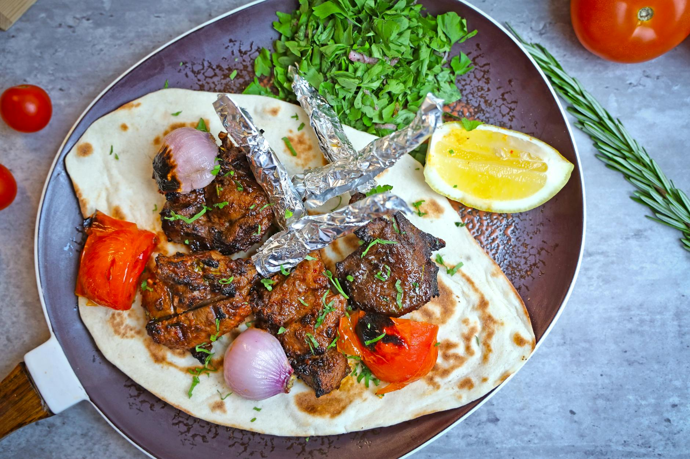

# Lahori Chapli Kebab

*Flat, crisp-edged minced beef patties studded with pomegranate seeds, fresh coriander and green chilli. A Khyber-Peshawari import that Lahore made its own; eaten with naan and a wedge of lemon.*

**Serves:** 4 (makes 8 kebabs)

**Prep Time:** 20 minutes (plus 30 minutes rest)

**Cook Time:** 25 minutes

## Overview
Flat, crisp-edged minced beef patties from the Khyber-Peshawari kitchens that Lahore made its own: a generous handful of fresh coriander, chopped tomato, green chilli and ginger folded into beef mince with crushed coriander seeds and dried pomegranate seeds for sourness, pressed paper-thin (chapli means slipper, after the shape), and shallow-fried hot in beef dripping till the edges crisp. Squeeze the chopped onion and tomato dry in a tea towel; wet vegetables make a loose mixture that won't hold together when flipped. Mix the mince with the squeezed vegetables, ginger-garlic paste, egg, toasted gram flour, cornflour, coarsely crushed coriander seeds (not powdered; the cracked seeds are part of the texture), anardana, cumin, Kashmiri chilli and garam masala. Knead till tacky, rest thirty minutes in the fridge. Divide into eight, flatten each ball to a 10 to 12 cm thin disc, press a slice of dried tomato into the centre. Shallow-fry in beef dripping three or four minutes a side. Serve with lemon wedges, sliced onion, mint chutney and warm naan.

## Ingredients

### Kebab mix
- 600 g minced beef (15% fat; lean mince makes dry kebabs)
- 1 onion (very finely chopped, then squeezed dry in a tea towel)
- 2 green chillies (finely chopped)
- 1 tablespoon ginger-garlic paste
- A handful of fresh coriander (chopped fine, stems included)
- 2 tomatoes (very finely chopped, then squeezed dry; reserve a tablespoon of slices for pressing onto the patties)
- 1 egg (large, beaten)
- 2 tablespoons gram flour (besan, toasted briefly in a dry pan)
- 1 tablespoon cornflour
- 1 ½ tablespoons coriander seeds (coarsely crushed, not powdered)
- 1 tablespoon dried pomegranate seeds (anardana; or 1 teaspoon amchur as a substitute)
- 1 teaspoon cumin seeds (lightly crushed)
- ½ teaspoon ground black pepper
- 1 teaspoon Kashmiri chilli powder
- 1 teaspoon salt (to taste)
- ¼ teaspoon [Garam Masala](../../base-ingredients/curry-powder/garam-masala.md)

### To cook
- 4 tablespoons beef dripping (or vegetable oil), for shallow-frying

### To serve
- Lemon wedges
- Sliced red onion
- Mint-yogurt chutney
- Warm naan (or roti)

## Method

### Stage 1 - Squeeze the onion and tomato
1. Squeeze the chopped onion in a tea towel to remove the water (wet onion makes the mixture loose; dry onion gives a kebab that holds together).
1. Same with the chopped tomato; reserve a tablespoon of dry tomato slices for the top of the patties.

### Stage 2 - Mix the kebab
1. In a large bowl, combine the minced beef, dried onion, green chilli, ginger-garlic paste, coriander, dried tomato, egg, toasted gram flour, cornflour and all the spices.
1. Knead with your hands for 2-3 minutes until the mixture is uniform and slightly tacky.

### Stage 3 - Rest
1. Cover and refrigerate for 30 minutes (the rest firms the mixture so the kebabs hold their shape; cold mince also fries crisper).

### Stage 4 - Shape
1. Divide the mixture into 8 equal balls.
1. Wet your palms with cold water (prevents sticking).
1. Flatten each ball into a 10-12 cm thin disc, about 1 cm thick.
1. Press one slice of dried tomato into the centre of each patty (the traditional finish).

### Stage 5 - Shallow-fry
1. Heat 2 tablespoons of beef dripping in a wide, heavy frying pan over medium heat.
1. Lay the patties in the pan in batches; don't overcrowd.
1. Fry for 3-4 minutes a side until the edges crisp and the surface caramelises.
1. Lift onto kitchen paper to drain.
1. Top up the fat between batches.

### Stage 6 - Serve
1. Serve immediately with lemon wedges, sliced onion, mint-yogurt chutney and warm naan.

## Notes
- **Flat is the dish:** "Chapli" means slipper. The patties should be thin (1 cm or less). Thick patties cook unevenly and lose the shape.
- **Beef dripping is traditional:** It gives the kebabs their characteristic Lahori flavour. Vegetable oil works but the dish loses depth.
- **Coriander seed coarse, not powdered:** Bites of coarsely cracked coriander seed give the kebab its texture. Ground coriander disappears into the mince.

## Storage
- Best within 30 minutes of frying.
- Uncooked patties refrigerate up to 24 hours.
- Cooked patties refrigerate up to 2 days; reheat in a hot pan for 1 minute a side to re-crisp.
