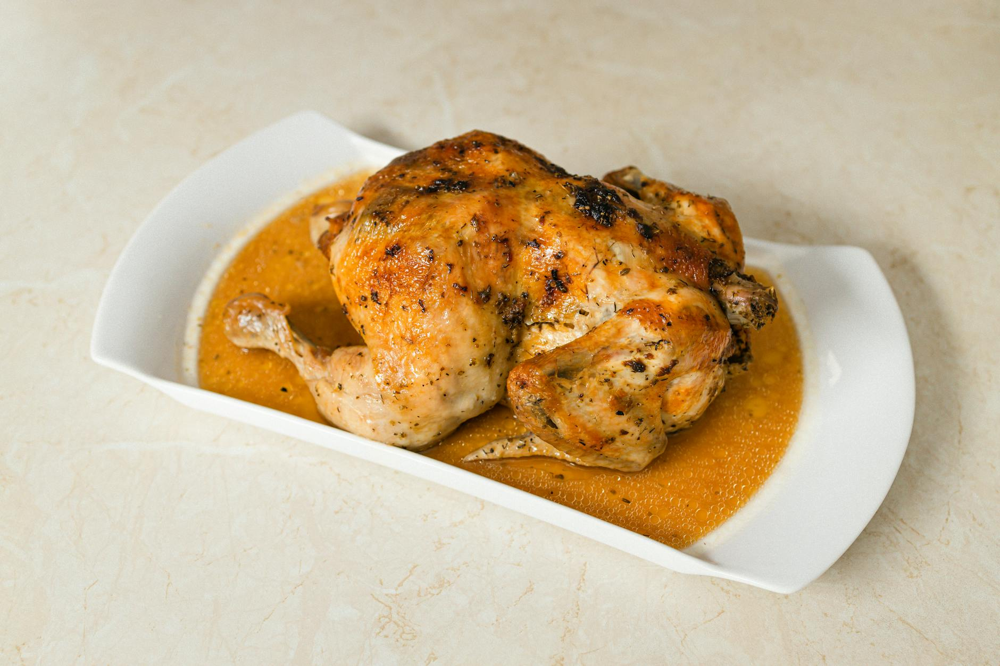

# Lahori Chargha

*The Lahori weekend feast bird: a whole chicken slashed, marinated in spiced yogurt for hours, steamed until tender then deep-fried until the skin crackles. Eat with raita, naan and a tomato-onion salad.*

**Serves:** 4-6

**Prep Time:** 20 minutes (plus 4 hours marinade)

**Cook Time:** 1 hour 10 minutes

## Overview
The Lahori weekend feast bird, named for the chargha (clay-pit roasting) tradition: a whole chicken slashed to the bone, marinated overnight in spiced yogurt, steamed till tender, then deep-fried till the skin crackles. The two-stage cook is the signature; a deep-fry alone leaves the bird raw at the bone, a steam alone gives no colour. Pat the chicken dry, slash deep into the breast and thighs so the marinade reaches the inside, rub with salt and lemon. The marinade whisks yogurt, ginger-garlic, Kashmiri chilli, chaat masala, garam masala, cumin, coriander, turmeric, vinegar, smoked mustard oil and toasted besan into a thick red-orange paste. Refrigerate four hours minimum, overnight ideally. Steam breast-up over five centimetres of water for thirty minutes till a thigh reads 75 °C, then rest fifteen minutes so the surface dries. Deep-fry at 180 °C six to eight minutes turning once, till the skin is deep mahogany and crackling. Put on a board, serve with mint-yogurt raita, sliced onion, lemon wedges and warm naan.

## Ingredients

### Chicken
- 1 whole chicken (about 1 ½ kg)
- 2 teaspoons salt (for rubbing)
- 1 lemon (juice)

### Marinade
- 200 g natural yogurt (thick; strained if loose)
- 2 tablespoons ginger-garlic paste
- 2 tablespoons Kashmiri chilli powder
- 1 tablespoon [Chaat Masala](../../base-ingredients/spices/chaat-masala.md)
- 1 teaspoon [Garam Masala](../../base-ingredients/curry-powder/garam-masala.md)
- 1 teaspoon ground cumin
- 1 teaspoon ground coriander
- 1 teaspoon turmeric
- 1 teaspoon black pepper
- 2 tablespoons white vinegar
- 2 tablespoons mustard oil (or vegetable oil)
- 1 tablespoon gram flour (besan; for thickening and the flavour)
- 2 teaspoons salt
- A few drops of orange (or red food colouring, traditional but optional)

### To cook
- 2 litres vegetable oil (for deep-frying)

### To serve
- Mint-yogurt raita
- Sliced red onion
- Lemon wedges
- Naan (or roti)

## Method

### Stage 1 - Score and salt
1. Pat the chicken dry inside and out.
1. Cut deep slashes into the breast, thighs and drumsticks down to the bone (this lets the marinade and steam reach the inside).
1. Rub the chicken with salt and lemon juice; rest for 10 minutes.

### Stage 2 - Toast the gram flour
1. Heat a small dry pan over medium-low heat.
1. Toast the gram flour for 2 minutes, stirring, until pale gold and nutty-smelling.
1. Cool.

### Stage 3 - Marinate
1. Combine all the marinade ingredients (including the toasted besan) in a large bowl.
1. Whisk to a smooth red-orange paste.
1. Rub the marinade thoroughly over the chicken, working it into the slashes and the cavity.
1. Cover and refrigerate for at least 4 hours, ideally overnight.

### Stage 4 - Steam
1. Bring the chicken to room temperature 30 minutes before cooking.
1. Place a steaming rack in a wide pot over 5 cm of water.
1. Set the chicken on the rack, breast up.
1. Cover tightly and steam over medium heat for 30 minutes (the chicken should be cooked through; a thigh should read 75°C).
1. Lift the chicken out and rest on a tray for 15 minutes to dry the surface (a wet bird spits in hot oil).

### Stage 5 - Deep-fry
1. Heat the oil in a large deep pot or wok to 180°C.
1. Carefully lower the chicken into the oil (it should be just submerged; if not, baste with hot oil as it cooks).
1. Fry for 6-8 minutes, turning once with two long forks, until the skin is deep mahogany red and crackling.
1. Lift onto a rack to drain.

### Stage 6 - Serve
1. Rest the chicken for 5 minutes.
1. Place on a board for the table.
1. Serve with raita, sliced onion, lemon wedges and warm naan.

## Notes
- **Steam first, fry second:** Frying alone gives a crisp outside and raw inside. Steaming first guarantees the meat is cooked; the fry is for colour and crunch.
- **Dry the surface:** Steaming wets the skin. The 15-minute rest dries it; lowering a wet bird into hot oil is dangerous and the skin won't crisp.
- **Don't overcrowd:** One whole chicken per pot. Two at once drops the oil temperature and the skin softens.

## Storage
- Best the day it's fried.
- Leftover meat refrigerates 2 days; reheats in a hot oven (the skin re-crisps).
