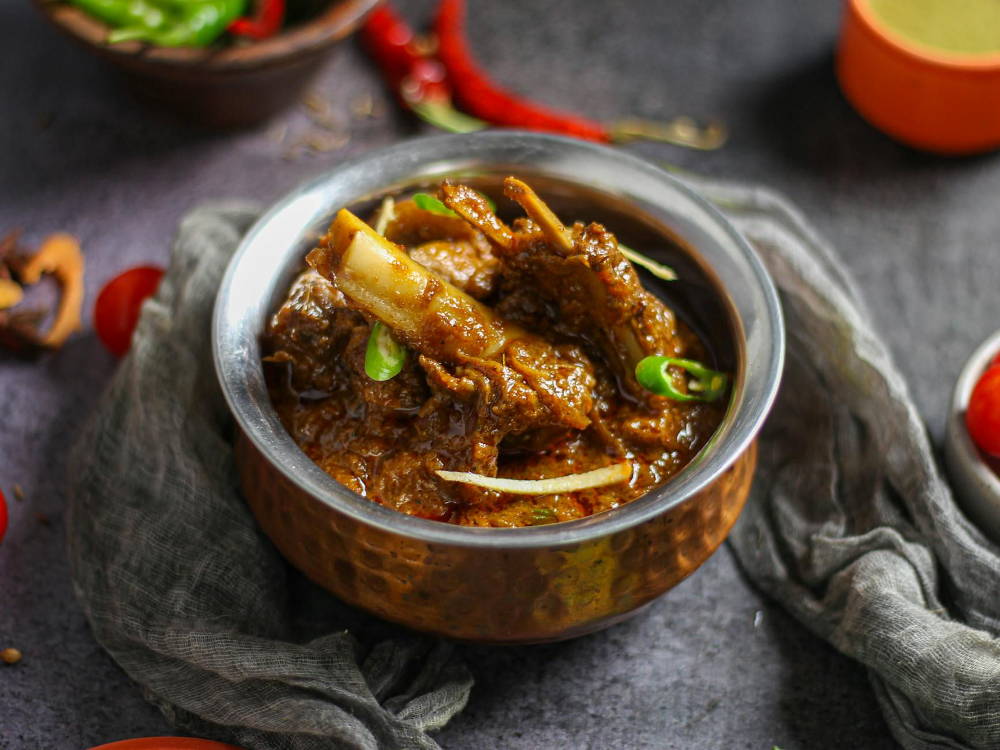

# Lahori Mutton Karahi

*The Lahori roadside karahi: mutton (or lamb) cooked hard and fast in a wok-shaped karahi with tomato, ginger and a heavy hand of fresh green chilli. No onion, no thick gravy: just meat, tomato and a slick of clarified butter at the end.*

**Serves:** 4-6

**Prep Time:** 15 minutes

**Cook Time:** 1 hour 15 minutes

## Overview
Bone-in lamb is browned in ghee with a small handful of whole spices, then ginger-garlic paste and tomato are added in two stages: first chopped, to break down into a base sauce, then sliced, to give texture at the end. The dish cooks uncovered the entire time, which is what defines Lahori karahi (the gravy reduces by half and concentrates). Green chilli, fresh ginger and coriander finish; a tablespoon of butter or ghee makes the slick on top.

## Ingredients

### Mutton
- 1 kg lamb shoulder (or leg, cut into 4 cm bone-in chunks; mutton if you can find it)
- 1 teaspoon salt (for initial seasoning)

### Cooking fat
- 4 tablespoons ghee (or vegetable oil + butter)

### Whole spices
- 1 cinnamon stick (small)
- 6 cloves
- 4 green cardamom pods (lightly crushed)
- 1 black cardamom pod
- 2 bay leaves
- 1 tablespoon cumin seeds

### Aromatics
- 2 tablespoons ginger-garlic paste
- 1 teaspoon Kashmiri chilli powder
- 1 teaspoon ground coriander
- ½ teaspoon turmeric
- 1 teaspoon salt (to taste)
- ½ teaspoon ground black pepper

### Tomatoes
- 6 ripe tomatoes (3 finely chopped for the base, 3 sliced into wedges for the finish)
- 1 tablespoon tomato paste

### To finish
- 4 fresh green chillies (slit lengthways)
- 30 g fresh ginger (cut into matchsticks)
- A handful of fresh coriander (chopped)
- 1 teaspoon [Garam Masala](../indian/Spice-Mixes/garam-masala.md)
- 1 teaspoon crushed kasuri methi (dried fenugreek)
- 1 tablespoon butter (or ghee, for the surface slick)

### To serve
- Warm naan, roti (or roghni naan)
- Lemon wedges
- Sliced onion

## Method

### Stage 1 - Brown the meat
1. Heat the ghee in a wide karahi or heavy wok over medium-high heat.
1. Add the whole spices and cumin seeds; sizzle for 30 seconds.
1. Tip in the lamb and a teaspoon of salt.
1. Cook over high heat for 8-10 minutes, stirring, until the meat has browned (this colour stage is essential; pale lamb gives a thin karahi).

### Stage 2 - Aromatics
1. Reduce the heat to medium.
1. Stir in the ginger-garlic paste; cook for 2 minutes.
1. Add the Kashmiri chilli, ground coriander, turmeric, salt and black pepper; cook for 30 seconds.

### Stage 3 - First tomato stage
1. Add the chopped tomatoes (the first three) and tomato paste.
1. Stir and cook for 10-12 minutes over medium-high heat, breaking the tomatoes down with the spoon, until the oil starts to separate from the masala at the edges.

### Stage 4 - Slow cook
1. Pour in 200 ml of hot water.
1. Reduce to a low simmer.
1. Cover partially (a karahi shouldn't be fully sealed; the gravy should reduce) and cook for 40-50 minutes, stirring every 10 minutes, until the lamb is fork-tender.

### Stage 5 - Second tomato stage
1. Add the sliced tomato wedges.
1. Increase the heat to medium-high.
1. Cook uncovered for 6-8 minutes, until the tomato wedges soften but still hold their shape and the gravy has reduced to a thick, oil-slicked sauce.

### Stage 6 - Finish
1. Stir in the slit green chillies, half the ginger matchsticks, half the coriander, the garam masala and the crushed kasuri methi.
1. Cook for 2 minutes.
1. Drop the tablespoon of butter or ghee on top; let it melt.

### Stage 7 - Serve
1. Transfer to a serving karahi.
1. Scatter the remaining ginger matchsticks and coriander over.
1. Serve with warm naan and lemon wedges.

## Notes
- **No onion:** This is the Lahori signature. Onion-based karahis are from elsewhere; Lahori karahi is meat, tomato, ginger, chilli.
- **Uncovered cooking:** A karahi reduces. Don't cover tightly or the gravy stays thin.
- **Two stages of tomato:** Cooked-down tomato gives the base sauce; sliced wedges added late give the eat-up texture and the look on top.

## Storage
- Refrigerate up to 4 days; the flavour deepens overnight.
- Freezes well for 2 months.
