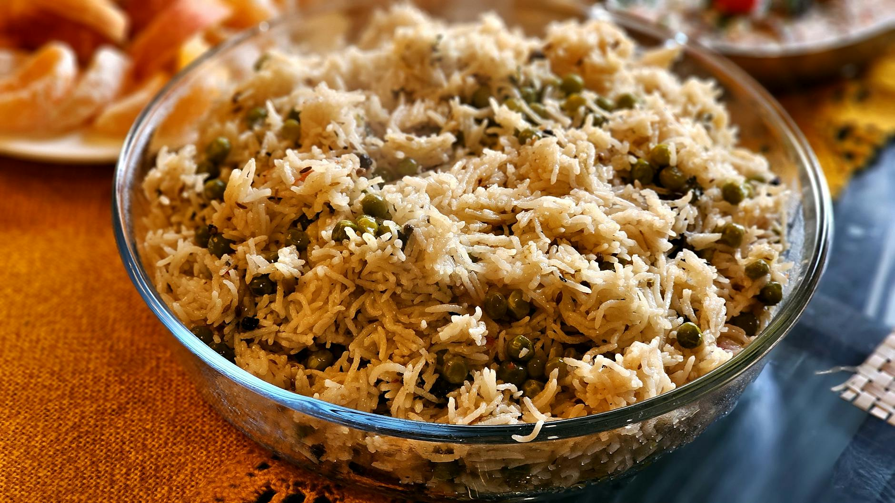

# Lahori Chana Pulao

*Chickpea pulao: basmati cooked in a fragrant onion-and-spice base with whole chickpeas folded through. A vegetarian Lahori workhorse, the dal-rice swap for a meatless meal.*

**Serves:** 4-6

**Prep Time:** 15 minutes (plus overnight soak and 30 minutes rice soak)

**Cook Time:** 1 hour 30 minutes

## Overview
Whole chickpeas are soaked overnight and simmered until tender (or pressure-cooked). The chickpea cooking liquor is measured and reserved as part of the rice cooking liquid. A fried-onion base is built in ghee with whole spices, ginger-garlic paste and ground spices, and the cooked chickpeas are folded in. Soaked basmati is toasted in the base, then the measured cooking liquor goes in for the steam. A scatter of fried onion and coriander finishes.

## Ingredients

### Chickpeas
- 250 g dried chickpeas (soaked overnight)
- 1 teaspoon salt
- 1 bay leaf
- 1 cinnamon stick (small)
- 4 cloves
- 1 black cardamom pod
- 1 litre water (for cooking)

### Pulao
- 400 g aged basmati rice (rinsed, soaked for 30 minutes)
- 4 tablespoons ghee (or oil + butter)
- 1 onion (large, finely sliced)
- 1 cinnamon stick (small)
- 4 green cardamom pods (lightly crushed)
- 4 cloves
- 1 bay leaf
- 1 teaspoon cumin seeds
- 1 tablespoon ginger-garlic paste
- 2 green chillies (slit)
- 1 teaspoon ground coriander
- 1 teaspoon Kashmiri chilli powder
- ½ teaspoon turmeric
- 1 teaspoon salt (to taste)
- ½ teaspoon [Garam Masala](../../indian/Spice-Mixes/garam-masala.md)
- 800 ml chickpea cooking liquor (topped up with hot water if needed)

### To finish
- A handful of fresh coriander (chopped)
- 1 tablespoon dried pomegranate seeds (anardana, optional)
- Reserved fried onion
- ½ lemon (juice)

## Method

### Stage 1 - Cook the chickpeas
1. Drain the soaked chickpeas.
1. Place in a pot with the salt, whole spices and 1 litre of water.
1. Bring to a boil; skim the foam.
1. Reduce to a low simmer and cook for 1 hour to 1 hour 15 minutes, until completely tender (a pressure cooker reduces this to 25 minutes).
1. Drain, reserving the cooking liquor; discard the whole spices and bay leaf.
1. Measure 800 ml of liquor; top up with hot water if needed.

### Stage 2 - Fry the onion
1. Heat the ghee in a wide saucepan with a tight-fitting lid over medium heat.
1. Add the sliced onion and a pinch of salt.
1. Cook for 10-12 minutes until deep golden brown.
1. Lift about a third out with a slotted spoon and reserve for the finish.

### Stage 3 - Bloom the spices
1. Add the cinnamon, cardamom, cloves, bay and cumin seeds to the remaining onions in the pan.
1. Sizzle for 30 seconds.

### Stage 4 - Aromatics
1. Stir in the ginger-garlic paste and the slit green chillies.
1. Cook for 1 minute.
1. Sprinkle in the ground coriander, Kashmiri chilli and turmeric; cook for 30 seconds.

### Stage 5 - Add the chickpeas
1. Tip the cooked chickpeas into the pan.
1. Toss to coat in the spice base.
1. Cook for 3 minutes for the chickpeas to absorb the flavour.

### Stage 6 - Toast the rice
1. Drain the soaked rice well.
1. Tip into the pan and stir gently for 2 minutes to coat in the ghee.
1. Sprinkle in the salt and garam masala.

### Stage 7 - Cook
1. Pour in the 800 ml of chickpea liquor.
1. Bring to a boil.
1. Reduce to the lowest heat, cover with a tight-fitting lid.
1. Cook for 14-16 minutes (don't lift the lid).
1. Pull from the heat and rest, still covered, for 12 minutes.

### Stage 8 - Serve
1. Lift the lid and fluff with a fork.
1. Scatter the reserved fried onions, coriander, dried pomegranate seeds (if using) over.
1. Squeeze the lemon juice across.
1. Serve with raita and a green chutney.

## Notes
- **Don't skip the chickpea liquor:** Using plain water gives a flat pulao. The chickpea cooking liquor is fragrant with the whole spices and gives the rice its depth.
- **Tender, not mushy chickpeas:** Overcooked chickpeas break down in the rice; aim for fully tender but holding their shape.
- **Anardana finish:** Dried pomegranate seeds give the dish a sour-sweet pop that is distinctly Lahori; worth seeking out.

## Storage
- Refrigerate up to 3 days; reheat covered with a splash of water.
- Freezes well in portions for 2 months.
