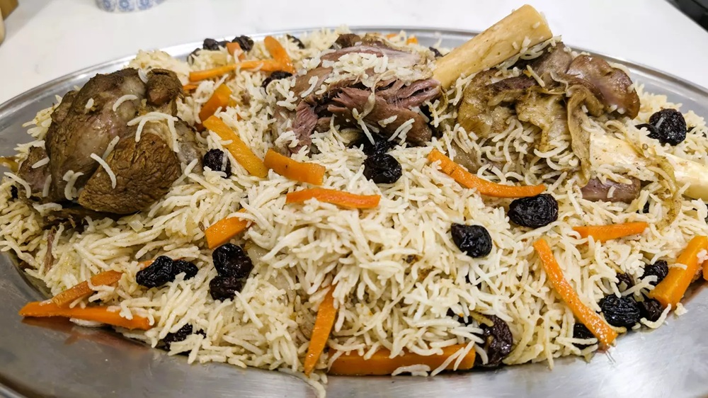

# Lahori Chicken Pulao

*Lahori-style chicken pulao: basmati cooked in a yakhni (chicken stock) flavoured with whole spices and ginger, the chicken folded through. Lighter than biryani, the Friday-lunch staple.*

**Serves:** 4-6

**Prep Time:** 15 minutes (plus 30 minutes soak)

**Cook Time:** 1 hour

## Overview
A chicken yakhni (broth) is built first by simmering chicken pieces with onion, ginger, garlic, fennel seeds, coriander seeds, peppercorns, cardamom and bay until the meat is just tender. The broth is strained and measured; the chicken is reserved. Basmati is soaked, fried briefly with cinnamon, cumin and clove in ghee, then cooked in exactly the right amount of strained yakhni. The chicken is folded back in for the steam. Finished with fried onions and fresh coriander.

## Ingredients

### Yakhni (chicken stock)
- 800 g chicken pieces (thighs, drumsticks; bone-in and skinless)
- 1 onion (halved)
- 30 g fresh ginger (sliced)
- 6 garlic cloves (whole)
- 1 tablespoon coriander seeds
- 1 tablespoon fennel seeds
- 1 teaspoon black peppercorns
- 4 green cardamom pods
- 1 black cardamom pod
- 4 cloves
- 2 bay leaves
- 1 small cinnamon stick
- 1 teaspoon salt
- 1.2 litres water

### Pulao
- 400 g aged basmati rice (rinsed, soaked for 30 minutes)
- 4 tablespoons ghee
- 1 small cinnamon stick
- 4 green cardamom pods (lightly crushed)
- 1 black cardamom pod
- 4 cloves
- 1 bay leaf
- 1 teaspoon cumin seeds
- 1 large onion (finely sliced)
- 6 garlic cloves (finely chopped)
- 25 g fresh ginger (finely grated)
- 2 green chillies (slit)
- 1 teaspoon Kashmiri chilli powder
- 1 teaspoon ground coriander
- 1 teaspoon salt (to taste)
- 800 ml strained yakhni (from above)

### To finish
- A handful of fresh coriander (chopped)
- A handful of fried onions (reserved from the slicing onion if you crisped some)
- Juice of ½ lemon

## Method

### Stage 1 - Make the yakhni
1. Place all the yakhni ingredients in a pot.
1. Bring to a boil; skim any foam.
1. Reduce to a low simmer.
1. Cover partially and cook for 30 minutes, until the chicken is just cooked and the stock is fragrant.
1. Lift the chicken out and reserve.
1. Strain the stock through a fine sieve into a measuring jug; discard the solids.
1. Measure exactly 800 ml; top up with hot water if needed.

### Stage 2 - Fry the onion
1. Heat the ghee in a wide saucepan with a tight-fitting lid over medium heat.
1. Add the sliced onion and a pinch of salt.
1. Cook for 10-12 minutes until deep golden brown.
1. Lift about a third of the onion out with a slotted spoon and reserve for the finish.

### Stage 3 - Bloom the spices
1. Add the cinnamon, green and black cardamom, cloves, bay and cumin seeds to the remaining onions in the pan.
1. Sizzle for 30 seconds.

### Stage 4 - Aromatics
1. Stir in the chopped garlic, grated ginger and green chilli.
1. Cook for 1 minute.
1. Sprinkle in the Kashmiri chilli and ground coriander; cook for 30 seconds.

### Stage 5 - Add the chicken
1. Add the reserved chicken pieces.
1. Toss to coat in the spice base.
1. Cook for 3 minutes for the chicken to absorb the flavour.

### Stage 6 - Toast the rice
1. Drain the soaked rice well.
1. Tip into the pan and stir gently for 2 minutes to coat in the spiced ghee.
1. Add the salt.

### Stage 7 - Cook
1. Pour in the 800 ml of measured yakhni.
1. Bring to a boil.
1. Reduce to the lowest heat, cover with a tight-fitting lid.
1. Cook for 14-16 minutes (don't lift the lid).
1. Pull from the heat and rest, still covered, for 12 minutes.

### Stage 8 - Serve
1. Lift the lid and fluff with a fork.
1. Scatter the reserved fried onions, fresh coriander and a squeeze of lemon over.
1. Serve with raita and the salad of your choice.

## Notes
- **Yakhni first:** The defining technique. Cooking the rice in chicken stock (not water) is what gives Lahori pulao its depth. Worth the extra 30 minutes.
- **Exactly 800 ml of stock:** The rice-to-liquid ratio is precise. Measure; don't eyeball.
- **Don't lift the lid:** The 16-minute cook plus 12-minute rest is what gives the long, separated grains. Lifting the lid lets out steam and the rice cooks unevenly.

## Storage
- Refrigerate up to 3 days; reheat covered with a splash of water.
- Freezes well in portions for 2 months.
