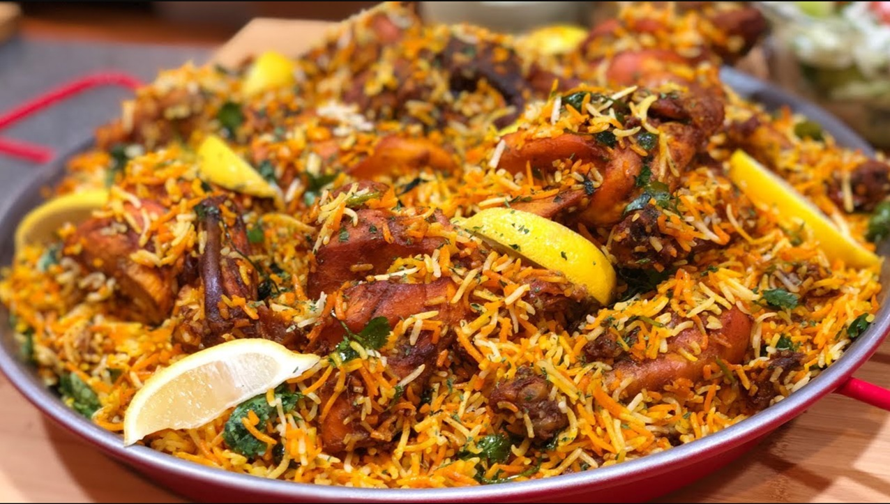

# Lahori Mutton Biryani

*Lahori-style mutton biryani: bone-in mutton cooked in a slow-simmered masala, layered with parboiled saffron rice and finished under dum until the rice picks up the spice perfume. Heavier and meatier than Hyderabadi; distinct in its use of plums and kewra.*

**Serves:** 6-8

**Prep Time:** 30 minutes (plus 4 hours marinade)

**Cook Time:** 2 hours

## Overview
Heavier and meatier than its Hyderabadi cousin, the Lahori-style mutton biryani has its own marker: dried sour plums (aloo bukhara) folded into the marinade that dissolve into the masala and give the dish a sweet-sour edge no other biryani has. You marinate bone-in mutton overnight in thick yogurt with browned onion, ginger-garlic, Kashmiri chilli, garam masala and pitted soaked aloo bukhara. Brown a second batch of sliced onion, save a third for the layers, then cook the marinated meat in its marinade till the mutton is fork-tender and the gravy has reduced to a thick masala with very little liquid. Parboil basmati to 70% in heavily salted water with bay and whole spices (overcooked at this stage means mushy after the dum). Bloom saffron in warm milk. Build in layers: meat, half the rice, fried onion, mint and coriander, half the saffron milk and kewra water; repeat with the second layer; drizzle melted ghee on top. Seal with foil pressed onto the rice, lid clamped down, three minutes on high, then 35 minutes on the lowest heat over a diffuser; rest sealed 15 minutes more. Fold the layers gently from the bottom up so the mutton comes through, serve with raita and a tomato-onion salad.

## Ingredients

### Mutton marinade
- 1 kg mutton (or lamb shoulder, on the bone, cut into 8 cm chunks)
- 250 g natural yogurt (thick)
- 2 tablespoons ginger-garlic paste
- 2 tablespoons Kashmiri chilli powder
- 1 tablespoon [Garam Masala](../../indian/Spice-Mixes/garam-masala.md)
- 1 teaspoon ground turmeric
- 1 teaspoon ground coriander
- 1 teaspoon black pepper
- 8 dried aloo bukhara (sour plums; soaked 30 min)
- 1 tablespoon crushed kasuri methi
- 2 teaspoons salt

### Cooking
- 4 tablespoons ghee
- 2 onions (thinly sliced and fried until deep gold; reserve the cooking ghee)
- 4 green chillies (slit)
- 2 ripe tomatoes (chopped)

### Rice
- 600 g aged basmati rice (rinsed)
- 3 litres water
- 2 tablespoons salt
- 2 bay leaves
- 1 cinnamon stick (small)
- 6 cloves
- 6 green cardamom pods (lightly crushed)
- 2 black cardamom pods
- 1 teaspoon cumin seeds

### Layering
- ¼ teaspoon saffron threads
- 3 tablespoons warm milk
- 2 tablespoons kewra water (or rose water; both are Lahori traditional)
- A handful of fresh mint leaves (chopped)
- A handful of fresh coriander (chopped)
- 2 tablespoons melted ghee

## Method

### Stage 1 - Marinate
1. In a large bowl, combine the yogurt, ginger-garlic paste, all the ground spices, the soaked aloo bukhara (pitted), kasuri methi and salt.
1. Add the mutton and toss to coat.
1. Cover and refrigerate for at least 4 hours, ideally overnight.

### Stage 2 - Brown the onion and cook the meat
1. Heat 4 tablespoons of ghee in a wide heavy pot over medium-high heat.
1. Add the sliced onion and a pinch of salt; fry for 12-15 minutes until deep golden.
1. Lift about a third of the onion out with a slotted spoon and reserve.
1. Add the marinated mutton (with all the marinade) to the remaining onion.
1. Cook for 12-15 minutes over medium-high heat, stirring, until the meat is browned and the marinade has tightened to a thick paste.
1. Add the chopped tomatoes and slit green chillies; cook for 5 minutes.
1. Pour in 400 ml of hot water; bring to a simmer.
1. Cover and cook for 1 hour to 1 hour 15 minutes over low heat, until the mutton is fork-tender and the gravy has reduced to a thick masala (very little liquid should remain).

### Stage 3 - Parboil the rice
1. Bring 3 litres of water to a hard boil with the 2 tablespoons of salt, the bay leaves and all the whole spices.
1. Add the rinsed rice.
1. Cook for 5-6 minutes, until the grains are 70% cooked (firm at the centre, soft outside).
1. Drain immediately in a colander.

### Stage 4 - Bloom the saffron
1. Crumble the saffron into the warm milk; rest for 10 minutes.

### Stage 5 - Layer
1. Spread half the parboiled rice over the cooked mutton.
1. Scatter half the fried onion, half the mint and coriander.
1. Drizzle half the saffron milk and half the kewra water over.
1. Add the second layer of rice; top with the remaining fried onion, mint, coriander, saffron milk and kewra.
1. Drizzle the 2 tablespoons of melted ghee over the top.

### Stage 6 - Dum
1. Cover the pot tightly with a sheet of foil pressed onto the rice.
1. Press the lid down on top.
1. Place over high heat for 3 minutes.
1. Reduce to the lowest heat (use a heat diffuser) and cook for 35 minutes.
1. Pull from the heat and rest, sealed, for 15 more minutes.

### Stage 7 - Serve
1. Lift the lid and gently fold the layers from the bottom up so the mutton comes through the rice.
1. Serve with raita and a fresh tomato-onion salad.

## Notes
- **Aloo bukhara is the Lahori touch:** Sour dried plums in the marinade. They dissolve into the masala and give the biryani its distinct sweet-sour Lahori flavour. Prunes are a workable substitute.
- **Kewra and saffron:** Kewra water (pandan flower extract) is the perfume that distinguishes Lahori biryani from Indian counterparts. Find it in any South Asian grocer.
- **Don't over-parboil:** 70% is the target. Overcooked at the parboil stage means mush after the dum.

## Storage
- Refrigerate up to 3 days; reheat covered with a splash of water.
- Freezes well in portions for 2 months.
