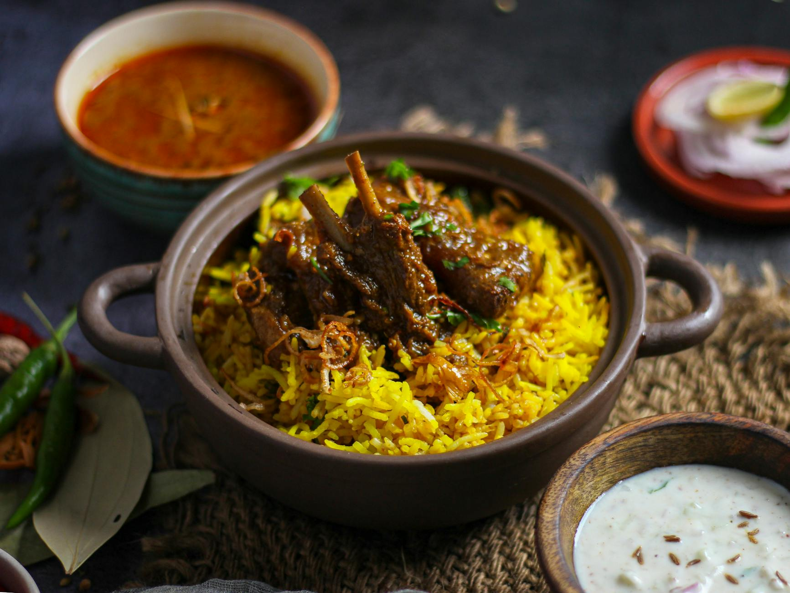

# Lahori Mutton Yakhni Pulao

*The wedding-table pulao: basmati cooked in a slow-simmered mutton broth fragrant with whole spices and bone marrow. Lahori cuisine's quietest pinnacle, all about the stock.*

**Serves:** 6

**Prep Time:** 20 minutes (plus 45 minutes soak)

**Cook Time:** 2 hours 30 minutes

## Overview
Lahori cuisine's quietest pinnacle, the pulao that turns up on wedding tables and Eid mornings: basmati cooked in a deep, slow-simmered mutton broth fragrant with marrow bones and a muslin pouch of whole spices. The yakhni is the dish, not the rice. Marrow bones if your butcher can supply them are essential to the proper depth; the marrow dissolves into the stock and gives restaurant-level body that plain bones can't match. The whole spices go in a tied muslin pouch rather than loose, so the broth stays clear and the cook can lift them out cleanly. Patient skimming of the grey foam through the first 20 minutes is the difference between a clear pale-amber yakhni and a cloudy grey one. The strained yakhni then becomes the rice's cooking liquid, measured precisely (about one litre to 600 g of soaked basmati). The long lid-down rest is what gives the separated grains.

## Ingredients

### Yakhni (mutton stock)
- 1 kg mutton (or lamb shoulder, on the bone; ask the butcher to include 2-3 marrow bones)
- 2 onions (halved)
- 50 g fresh ginger (sliced)
- 8 garlic cloves (whole)
- 1 teaspoon salt
- 1.8 litres water

### Spice pouch (tie in muslin)
- 2 tablespoons coriander seeds
- 1 tablespoon fennel seeds
- 1 teaspoon cumin seeds
- 1 teaspoon black peppercorns
- 6 green cardamom pods (lightly crushed)
- 2 black cardamom pods
- 6 cloves
- 1 cinnamon stick (small, broken)
- 2 bay leaves
- 1 blade of mace

### Pulao
- 500 g aged basmati rice (rinsed, soaked for 45 minutes)
- 4 tablespoons ghee
- 1 onion (large, finely sliced)
- 1 tablespoon ginger-garlic paste
- 1 teaspoon cumin seeds
- 2 green chillies (slit)
- 1 teaspoon salt (to adjust)
- 1 litre of strained yakhni (from above)

### To finish
- A handful of fresh coriander (chopped)
- A handful of fresh mint leaves (chopped)
- ½ lemon (juice)

## Method

### Stage 1 - Build the yakhni
1. Place all the spice-pouch ingredients in a small piece of muslin and tie tightly with string.
1. Place the mutton, halved onions, sliced ginger, whole garlic, spice pouch, salt and 1.8 litres of water in a large pot.
1. Bring to a boil; skim the grey foam off the top thoroughly (this keeps the stock clear).
1. Reduce to a low simmer.
1. Cover partially and cook for 2 hours, until the mutton is fork-tender.

### Stage 2 - Strain
1. Lift the mutton out with a slotted spoon and reserve.
1. Strain the stock through a fine sieve into a measuring jug; discard the spice pouch, the onions and the aromatics.
1. Measure exactly 1 litre of stock; top up with hot water if needed.

### Stage 3 - Fry the onion
1. Heat the ghee in a wide saucepan with a tight-fitting lid over medium heat.
1. Add the sliced onion and a pinch of salt.
1. Cook for 10-12 minutes until deep golden brown.

### Stage 4 - Build the base
1. Add the cumin seeds; sizzle for 15 seconds.
1. Stir in the ginger-garlic paste and the slit green chillies; cook for 1 minute.

### Stage 5 - Add the mutton
1. Tip the cooked mutton into the pan.
1. Toss in the onion-spice base.
1. Cook for 3-4 minutes for the mutton to absorb the flavour.

### Stage 6 - Toast the rice
1. Drain the soaked rice well.
1. Tip into the pan and stir gently for 2 minutes to coat the grains in the ghee.
1. Add the 1 teaspoon of salt.

### Stage 7 - Cook
1. Pour in the 1 litre of strained yakhni.
1. Bring to a boil.
1. Reduce to the lowest heat, cover with a tight-fitting lid.
1. Cook for 16-18 minutes (don't lift the lid).
1. Pull from the heat and rest, still covered, for 15 minutes.

### Stage 8 - Serve
1. Lift the lid and fluff gently with a fork (the mutton should be soft enough to break apart on the spoon).
1. Scatter the coriander and mint over.
1. Squeeze the lemon juice across.
1. Serve with raita and a fresh tomato-onion salad.

## Notes
- **Don't skip the spice pouch:** Loose whole spices in the stock would have to be picked out one by one. The muslin pouch comes out in a single move.
- **The yakhni is the dish:** A weak stock gives a flat pulao. A long, slow simmer extracts gelatin, fat and flavour from the bones; the rice tastes of all three.
- **Marrow bones are the secret:** If your butcher can supply 2-3 small marrow bones, drop them in the yakhni. The marrow dissolves into the stock and gives the pulao its restaurant-level depth.

## Storage
- Refrigerate up to 4 days; the flavour deepens overnight.
- Freezes well in portions for 2 months.
