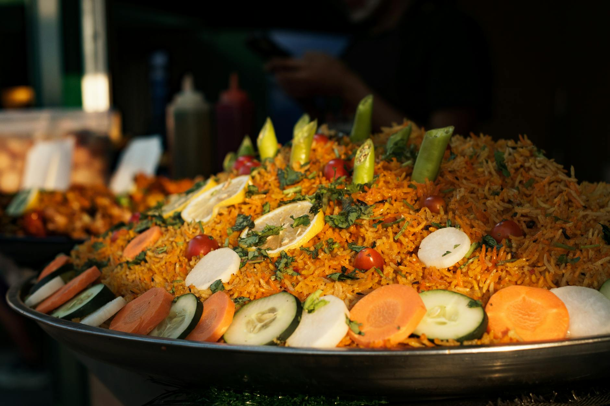

# Lahori Zarda

*Sweet saffron rice: basmati cooked with sugar, saffron and orange food colouring, studded with nuts, raisins and candied fruit. The wedding-and-Eid table sweet rice; eats as a dessert or alongside savoury biryani.*

**Serves:** 6-8

**Prep Time:** 15 minutes (plus 30 minutes soak)

**Cook Time:** 35 minutes

## Overview
Basmati is parboiled with saffron, orange colouring, whole cardamom and cinnamon until 80% cooked, then drained. A separate pan makes a sugar syrup with crushed cardamom; the parboiled rice is added back to the syrup pan with ghee, raisins, nuts and dried fruit. The mixture is steamed under a tight lid for 15 minutes to absorb the syrup. Finished with rose or kewra water and a scatter of toasted nuts.

## Ingredients

### Rice
- 400 g aged basmati rice (rinsed, soaked for 30 minutes)
- 2 litres water (for parboiling)
- ¼ teaspoon saffron threads
- 1 teaspoon orange food colouring (or a generous pinch of saffron alone)
- 4 green cardamom pods
- 1 cinnamon stick (small)
- 4 cloves
- 1 teaspoon salt

### Sugar syrup
- 300 g caster sugar
- 100 ml water
- ½ teaspoon ground cardamom
- 4 tablespoons ghee

### Add-ins
- 50 g raisins (or sultanas)
- 30 g flaked almonds (lightly toasted)
- 30 g cashew halves (lightly toasted in ghee)
- 30 g pistachios (slivered)
- 50 g candied or glacé fruit (mixed; cherries, orange peel, melon seed; traditional but optional)
- 20 g charoli or sunflower seeds (optional)

### To finish
- 1 tablespoon rose water (or kewra water; or a 50/50 mix, the Lahori signature)
- ¼ teaspoon ground nutmeg (optional)
- 2 tablespoons silver leaf (vark; optional, for festive plates)

## Method

### Stage 1 - Bloom the saffron
1. Crumble the saffron into 2 tablespoons of warm milk; rest for 10 minutes.

### Stage 2 - Parboil the rice
1. Bring 2 litres of water to a boil in a wide pot.
1. Add the orange food colouring, the bloomed saffron, the green cardamom, cinnamon, cloves and salt.
1. Add the soaked rice.
1. Cook for 6-7 minutes, until the grains are 80% cooked (still firm at the centre).
1. Drain immediately in a colander.

### Stage 3 - Make the sugar syrup
1. In a wide, heavy pan with a tight-fitting lid, combine the sugar and 100 ml of water.
1. Place over medium heat and stir until the sugar has dissolved.
1. Bring to a simmer and cook for 2-3 minutes until the syrup thickens slightly (the consistency of warm honey).
1. Stir in the ground cardamom and 2 tablespoons of the ghee.

### Stage 4 - Add the rice
1. Tip the parboiled rice into the syrup pan.
1. Toss very gently with a wooden spoon (don't stir aggressively; broken grains kill the look).
1. Scatter the raisins, half the toasted almonds, half the cashews, half the pistachios and the candied fruit over.

### Stage 5 - Steam
1. Drizzle the remaining 2 tablespoons of ghee over the top.
1. Cover with a tight-fitting lid.
1. Place over the lowest heat (use a heat diffuser).
1. Cook for 12-15 minutes (don't lift the lid).
1. Pull from the heat and rest, still covered, for 10 minutes.

### Stage 6 - Finish
1. Lift the lid and drizzle the rose water (and kewra water if using) across the top.
1. Sprinkle the ground nutmeg over.
1. Fluff gently with a fork.
1. Transfer to a serving plate; scatter the remaining nuts and pistachios on top.
1. Top with silver leaf (vark) if using.

## Notes
- **80% parboil:** Crucial. Fully cooked rice at the parboil stage breaks down when tossed in the syrup; the dish becomes a sweet rice pudding instead of a pulao-style zarda.
- **Sugar syrup, not water:** A syrup gives even sweetness; sugar added directly to the rice ends up in patches.
- **Kewra is the Lahori signature:** It's what distinguishes Lahori zarda from any other regional sweet rice. Use a careful hand; too much is perfumey-cloying.

## Storage
- Refrigerate up to 4 days; reheat covered with a tablespoon of water.
- Freezes well in portions for 2 months.
