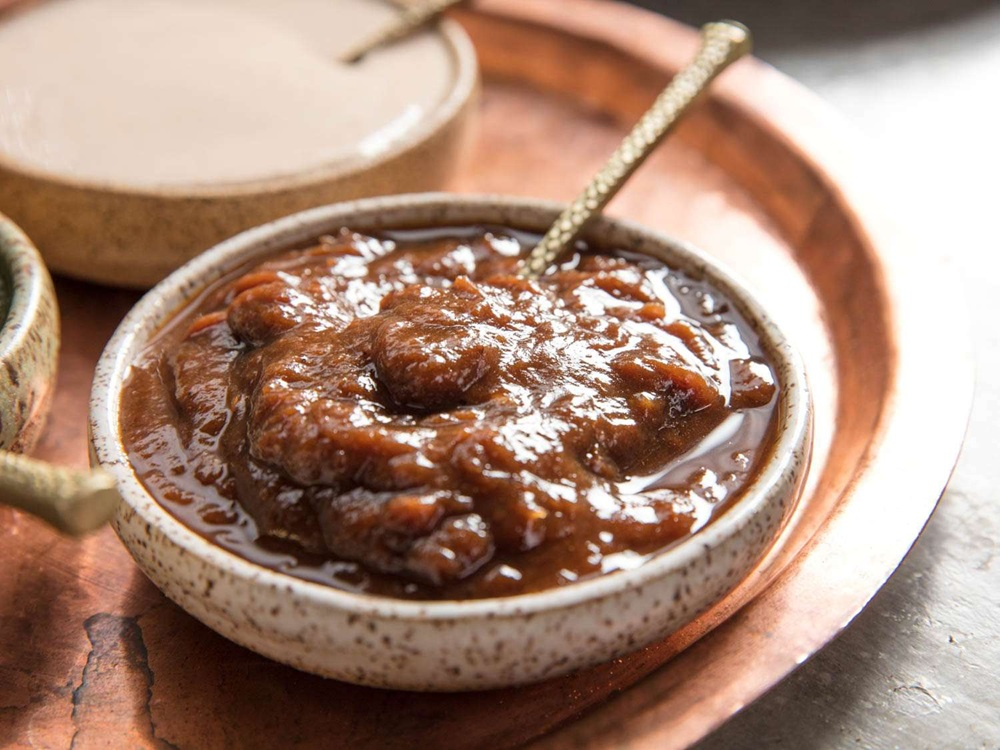

# Lahori Imli Chutney

*Tamarind-jaggery chutney: deep mahogany, sweet-sour and warm with cumin and ginger. The other half of the chaat-stall double act (with mint chutney); also the everyday accompaniment to samosas and pakoras.*

**Serves:** 8-10 (as an accompaniment); makes about 350 ml

**Prep Time:** 10 minutes

**Cook Time:** 20 minutes

## Overview
The other half of the chaat-stall double act (mint chutney is the first): deep mahogany tamarind-jaggery chutney, sweet-sour and warm with cumin and ginger, the everyday accompaniment to samosas, pakoras and chapli kebabs across Lahore and Old Delhi. Block tamarind soaked and strained gives the proper deep extract; tamarind concentrate from a jar works but tastes one-dimensional in comparison. Palm jaggery (not white sugar) gives the dish its molasses-caramel depth; dark brown muscovado is the closest substitute. Black salt (kala namak) is the defining Lahori touch; the faint sulphurous note is what distinguishes this from any generic tamarind sauce. The chutney reduces to a glossy coats-the-spoon consistency and thickens more as it cools, so pull it from the heat slightly looser than you want it. Sweet, sour, salty and hot all at once is the target. Keeps weeks in a jar in the fridge.

## Ingredients
- 100 g tamarind (lump; or 5 tablespoons of tamarind concentrate paste)
- 400 ml hot water
- 200 g palm jaggery (or dark brown sugar)
- 1 teaspoon salt
- ½ teaspoon black salt (kala namak)
- 1 teaspoon ground cumin (lightly toasted)
- ½ teaspoon ground fennel
- ½ teaspoon ground ginger (or 1 tablespoon freshly grated ginger)
- ¼ teaspoon ground black pepper
- ¼ teaspoon ground cinnamon
- ½ teaspoon Kashmiri chilli powder
- 1 teaspoon [Chaat Masala](../../indian/Spice-Mixes/chaat-masala.md)
- 1 tablespoon raisins (optional, for the sweet pop)
- 1 tablespoon dates (chopped, optional)
- 200 ml water

## Method

### Stage 1 - Extract the tamarind
1. If using lump tamarind, soak in 400 ml of hot water for 15 minutes.
1. Squeeze and strain through a fine sieve to get a thick brown liquid; discard the seeds and pulp.
1. If using concentrate paste, dissolve in 400 ml of hot water.

### Stage 2 - Toast the cumin (optional but worth it)
1. Toast cumin seeds in a dry pan for 30 seconds until fragrant.
1. Grind to a powder (or use ready-ground).

### Stage 3 - Cook the chutney
1. Pour the tamarind extract into a heavy saucepan.
1. Add the palm jaggery, salt, black salt, cumin, fennel, ginger, black pepper, cinnamon, Kashmiri chilli, chaat masala and the raisins and dates (if using).
1. Add 200 ml of additional water.
1. Place over medium-low heat.
1. Stir until the jaggery has dissolved.

### Stage 4 - Reduce
1. Cook for 15-20 minutes, stirring occasionally, until the chutney has reduced and thickened to a syrupy consistency that coats the back of a spoon (the chutney will thicken further as it cools).
1. Pull from the heat.
1. Taste and adjust salt and sugar.

### Stage 5 - Cool
1. Let the chutney cool to room temperature; it thickens to a thick syrup or light jam.
1. Transfer to a clean jar.

### Stage 6 - Serve
1. Serve cold or at room temperature alongside samosas, pakoras, chapli kebabs or any chaat.

## Notes
- **Sweet, sour, salty, hot:** A good imli chutney hits all four. Taste as you cook; adjust the jaggery, lemon, salt or chilli as needed.
- **Strain the tamarind:** Even small fibres in the chutney are unpleasant. A double-strain is worth the effort.
- **Black salt for the funk:** Kala namak has a faint sulphurous, eggy aroma that gives the chutney its distinctive Lahori flavour. Don't substitute regular salt; the dish lacks the depth without it.

## Storage
- Refrigerate up to 2 months in a clean jar.
- The chutney thickens further in the fridge; loosen with 1-2 teaspoons of hot water if needed.
