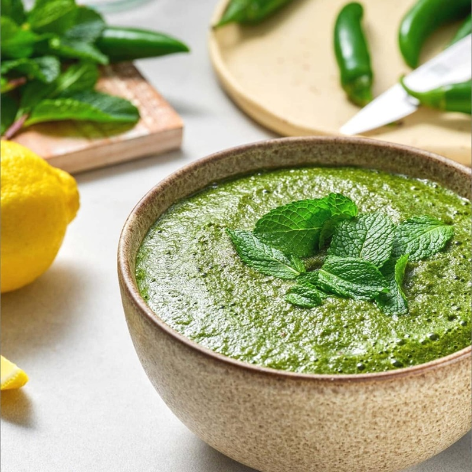

# Lahori Mint Chutney

*Pudina chutney: fresh mint, coriander and green chilli ground with yogurt, lemon and a touch of cumin. The cool green accompaniment to every chargrilled Lahori kebab.*

**Serves:** 6 (as an accompaniment)

**Prep Time:** 10 minutes

**Cook Time:** 0 minutes

## Overview
The cool green accompaniment to every chargrilled Lahori kebab: fresh mint, coriander and green chilli ground with yogurt, lemon, cumin and a small handful of roasted gram or cashews for body. You strip mint leaves off their stems (stems are bitter and leave a woody note), wash the leaves and shake dry. Toast cumin briefly in a dry pan till fragrant, grind. Blend mint, coriander, green chillies, garlic, ginger and roasted cashews with cumin, chaat masala, black salt, salt, a spoon of sugar and lemon juice; use cold water in the blender (heat kills the green colour). Fold thick natural yogurt in at the end: half for a vivid green dipping sauce, all of it for the paler restaurant style. Taste for salt, sugar and lemon (the chutney should be salty, sour and sweet at once). Refrigerate 30 minutes to chill, serve cold alongside chargha, boti, chapli kebabs or any chargrilled Lahori main.

## Ingredients
- 60 g fresh mint leaves (no stems; the stems are bitter)
- 60 g fresh coriander (leaves and tender stems)
- 2-3 green chillies (deseed if you want milder)
- 2 garlic cloves
- 15 g fresh ginger
- 2 tablespoons roasted cashews
- ½ teaspoon ground cumin (lightly toasted in a dry pan)
- 1 teaspoon [Chaat Masala](../../indian/Spice-Mixes/chaat-masala.md)
- ½ teaspoon black salt (kala namak; optional but distinctive)
- 1 teaspoon salt (to taste)
- 1 tablespoon caster sugar (or 1 teaspoon honey)
- 1 lemon (or 2-3 tablespoons of white vinegar, juice)
- 4 tablespoons cold water
- 200 g thick natural yogurt (Greek-style is fine)

## Method

### Stage 1 - Strip the mint
1. Pinch the mint leaves off their stems (the stems leave a bitter, woody note that distorts the chutney).
1. Wash the leaves and shake dry.

### Stage 2 - Toast the cumin
1. Toast the cumin seeds in a dry pan over medium-low heat for 30 seconds until fragrant.
1. Grind to a powder in a pestle and mortar (or use the ground cumin if you don't have whole).

### Stage 3 - Blend
1. Place the mint, coriander, green chillies, garlic, ginger and roasted cashews in a blender.
1. Add the cumin, chaat masala, black salt, salt, sugar and lemon juice.
1. Pour in the 4 tablespoons of cold water.
1. Blend on high to a smooth, bright-green paste; add another tablespoon of water if needed to keep the blade turning.

### Stage 4 - Fold in the yogurt
1. Tip the blended chutney into a bowl.
1. Whisk the yogurt smooth.
1. Fold half the yogurt into the chutney for a vivid green dipping sauce.
1. Or fold all the yogurt in for a paler, mellower chutney (the traditional restaurant style).

### Stage 5 - Taste and serve
1. Taste and adjust salt, sugar and lemon (the chutney should be salty, sour and sweet at once).
1. Refrigerate for 30 minutes to chill.
1. Serve cold alongside any chargrilled or fried Lahori meat.

## Notes
- **Use cold water and ice:** Heat in the blender kills the green colour. Cold water keeps the chutney vivid.
- **Roasted gram for body:** A traditional thickener. Without it the chutney is thin and watery. Cashews are a substitute.
- **Chaat masala matters:** It's the secret to the Lahori restaurant flavour. Find it in any South Asian grocer or online.

## Storage
- Refrigerate up to 3 days; the colour dulls over time.
- The yogurt thins the chutney slightly each day; refresh with a squeeze of lemon and a pinch of salt before serving.
