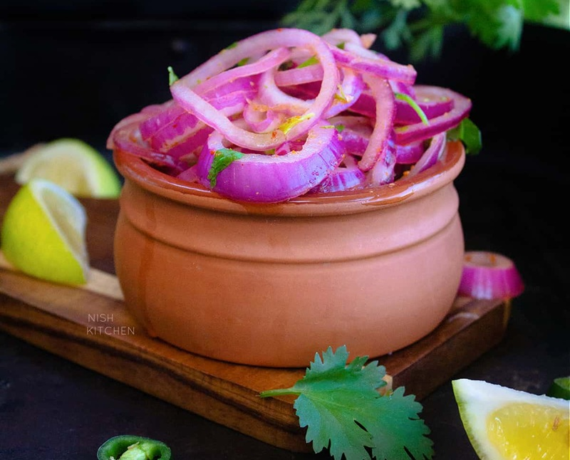

# Lahori Onion Salad

*The dhaba-table onion salad: thinly sliced red onion soaked briefly in iced vinegar-water, drained and tossed with lemon, chaat masala, chilli flakes and coriander. The cooling raw-bite alongside any chargrilled Lahori main.*

**Serves:** 4-6 (as a side)

**Prep Time:** 10 minutes (plus 15 minutes soak)

**Cook Time:** 0 minutes

## Overview
Red onion is sliced as thin as possible (mandoline is ideal). The slices are soaked in iced water with a small splash of vinegar for 15 minutes, which kills the raw sulphurous bite and crisps them up. Drained and patted dry, the slices are tossed with lemon juice, chaat masala, salt, a pinch of sugar and a small handful of finely chopped fresh coriander or mint. Pickled green chillies on the side complete it.

## Ingredients
- 2 large red onions (about 350 g; peeled and very thinly sliced)
- 400 ml iced water (for the soak)
- 1 tablespoon white vinegar (for the soak)
- 1 teaspoon salt (for the soak)
- Juice of 1 lemon
- 1 teaspoon chaat masala
- ½ teaspoon Kashmiri chilli flakes
- ¼ teaspoon ground black pepper
- A pinch of sugar
- ½ teaspoon salt (to adjust)
- A handful of fresh coriander (chopped) (or fresh mint, or both)
- 1 green chilli (finely chopped, optional)

### To finish
- 1 tablespoon pomegranate seeds (optional, for the look)
- Pickled green chillies (on the side)

## Method

### Stage 1 - Slice the onion
1. Use a mandoline (or a very sharp knife) to slice the onion as thinly as possible (1-2 mm).
1. Separate the slices into rings.

### Stage 2 - Soak
1. Combine the iced water, vinegar and salt in a bowl.
1. Add the sliced onion.
1. Soak for 15 minutes (the soak knocks back the raw sulphur and crisps the slices).

### Stage 3 - Drain
1. Drain the onion in a colander.
1. Pat dry with a clean tea towel.

### Stage 4 - Toss
1. Transfer to a bowl.
1. Add the lemon juice, chaat masala, chilli flakes, black pepper, sugar and salt.
1. Toss to coat.
1. Add the coriander and green chilli (if using).
1. Toss again.

### Stage 5 - Serve
1. Taste and adjust salt and lemon.
1. Scatter the pomegranate seeds (if using) over.
1. Serve immediately, alongside grilled or fried Lahori mains.

## Notes
- **Soak the onion:** A 15-minute soak in iced vinegar-water is what separates a Lahori onion salad from a raw onion ring. The onion comes out crisp, bright pink, and edible by the spoonful.
- **Thin slices matter:** Thick rings are unpleasant raw. The mandoline is worth the kitchen drawer space.
- **Chaat masala is non-negotiable:** It's the secret ingredient that pushes the salad from raw onion to chaat-stall salad. Buy a small jar.

## Storage
- Best within 30 minutes of dressing.
- The drained, undressed onion keeps in the fridge for a day; toss with the dressing just before serving.
