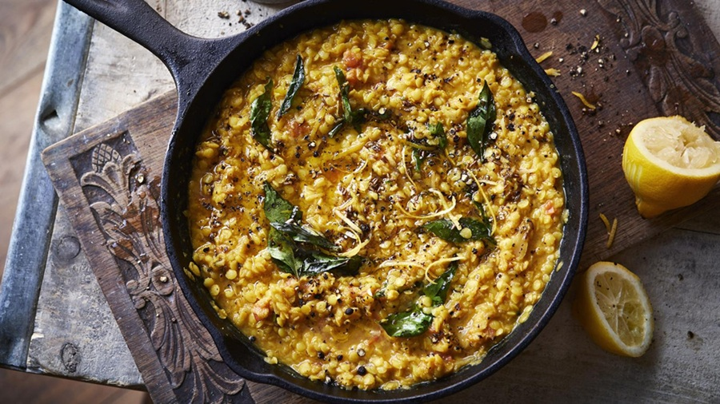

# Lahori Tarka Dal

*The Lahori everyday dal: yellow lentils cooked soft, then finished with a sizzling tarka of ghee, garlic, dried red chilli and cumin poured hot over the top. The bowl-of-comfort that anchors every Punjabi lunch table.*

**Serves:** 4-6

**Prep Time:** 5 minutes

**Cook Time:** 45 minutes

## Overview
Split yellow moong dal (or chana dal, or a mix) is rinsed and pressure-cooked or simmered with turmeric until completely soft. The dal is mashed lightly to a porridge consistency. A second pan fries ghee with whole cumin, garlic, sliced green chilli, dried red chilli and curry leaves until the garlic just turns golden. The hot tarka is poured over the dal with a dramatic sizzle; coriander and lemon finish.

## Ingredients

### Dal
- 200 g split yellow moong dal (or chana dal, or a 1:1 mix)
- 1 litre water
- 1 teaspoon turmeric
- 1 teaspoon salt
- 1 tomato (finely chopped, optional but traditional in Lahori)
- 25 g fresh ginger (finely grated)
- 1 green chilli (slit)

### Tarka
- 4 tablespoons ghee (or 3 ghee + 1 mustard oil)
- 1 teaspoon cumin seeds
- ½ teaspoon black mustard seeds
- 6 garlic cloves (sliced thinly)
- 2 dried red chillies (broken in half)
- 1 green chilli (slit lengthways)
- ½ teaspoon Kashmiri chilli powder (added off the heat for colour)
- ¼ teaspoon asafoetida (hing)
- 10 fresh curry leaves (optional)

### To finish
- A handful of fresh coriander (chopped)
- ½ lemon (juice)

### To serve
- Steamed basmati rice (or warm chapati)
- A dish of sliced red onion (small)

## Method

### Stage 1 - Rinse and cook the dal
1. Rinse the dal in 3-4 changes of cold water until the water runs clear.
1. Place in a pot with the litre of water, the turmeric, the chopped tomato, ginger and green chilli.
1. Bring to a boil; skim any foam.
1. Reduce to a low simmer.
1. Cover partially and cook for 30-40 minutes, until the dal has completely broken down (a pressure cooker reduces this to 12-15 minutes).
1. Add the salt; whisk the dal lightly to a thick porridge consistency (loosen with hot water if too thick).
1. Keep warm over very low heat.

### Stage 2 - Make the tarka
1. Heat the ghee in a small pan over medium heat.
1. Add the cumin and mustard seeds; when the mustard pops, add the sliced garlic.
1. Cook for 1 minute until the garlic is pale gold (don't let it go brown; it will continue cooking in the residual heat).
1. Add the dried red chillies and the slit green chilli; cook for 30 seconds.
1. Add the curry leaves (if using); sizzle for 5 seconds.
1. Pull from the heat.
1. Stir in the asafoetida and the Kashmiri chilli powder (this last step gives the deep red colour; do it off the heat or the chilli burns).

### Stage 3 - Combine
1. Pour the hot tarka over the dal in the serving bowl (the sizzle as it hits is the point).
1. Don't fully stir; let the diner mix the two with their first spoonful.

### Stage 4 - Finish
1. Scatter the coriander over.
1. Squeeze the lemon juice across.
1. Serve with steamed rice or warm chapati.

## Notes
- **The tarka is the dish:** A plain bowl of dal is a backdrop. The character comes entirely from what's in the hot ghee at the end.
- **Garlic golden, not brown:** Brown garlic is bitter. Pull the pan at the pale-gold stage; residual heat does the rest.
- **Don't over-mash:** Tarka dal should look like a thick porridge with a few intact grains visible. Pureed dal eats like baby food.

## Storage
- Refrigerate up to 4 days; reheat with a splash of water.
- The tarka loses its drama on day two; refresh with a fresh small tarka when reheating if you can.
