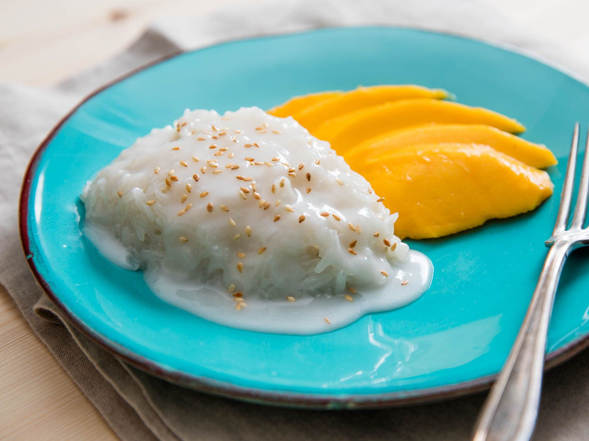

# Khao Niao Mamuang (Lao Mango Sticky Rice)

*Laos's warm-season dessert: sweet coconut-soaked sticky rice with thick slices of ripe yellow mango, a salty-sweet coconut cream drizzle and toasted mung beans scattered on top.*

**Serves:** 4

**Prep Time:** 15 minutes (plus overnight sticky rice soak)

**Cook Time:** 25 minutes

## Overview
Mango sticky rice is one of Southeast Asia's most-beloved desserts and arguably the most-photographed Lao/Thai sweet. The dish is also Thai-traditional (khao niao mamuang) but deeply Lao at its core; sticky rice culture is Lao territory. Three components carry the dish: the sticky rice itself (soaked overnight, steamed in a bamboo basket), the coconut sweetening (full-fat coconut milk warmed with sugar and a pinch of salt, absorbed into the hot rice), and the mango (ripe, fragrant, sweet; the yellow-fleshed Lao or Thai variety is traditional, with champagne, Ataulfo or Manila mango as Western substitutes). The drizzle on top is the unmistakable Lao/Thai signature: the thick cream from a coconut milk tin, sweetened with sugar and salted to a salty-sweet finishing sauce. Toasted yellow mung beans (split, hulled, dry-roasted) give a small textural crunch across the top. Eat in mango season (March to July) at every Lao market stall and household.

## Ingredients

### The sticky rice
- 1 batch warm Lao sticky rice (see [Sticky Rice](../side-dishes/sticky-rice.md); 300 g cooked rice)

### The sweet coconut soak
- 250 ml full-fat coconut milk
- 60 g caster sugar (or palm sugar for deeper flavour)
- 1/2 teaspoon salt
- 1 pandan leaf, torn and knotted (optional but very traditional)

### The drizzle (salty coconut cream topping)
- 150 ml the thick "cream" from a chilled tin of coconut milk (the thick part that floats to the top when refrigerated)
- 1 tablespoon caster sugar
- 1/4 teaspoon salt
- 1 teaspoon rice flour (thickens slightly)

### The mango
- 2 large ripe yellow-fleshed mangos (champagne / Ataulfo / Manila / Honey), peeled, stoned and sliced into 1 cm thick wedges

### The garnish
- 2 tablespoons split yellow mung beans, dry-toasted in a pan till golden and fragrant
- OR 2 tablespoons toasted sesame seeds
- A few fresh pandan-leaf-flavoured oils (optional, modern)

## Method

### Stage 1 - Make sticky rice
1. Steam Lao sticky rice as in the [Sticky Rice](../side-dishes/sticky-rice.md) recipe.
2. Keep warm in a covered basket.

### Stage 2 - Make the coconut soak
1. In a heavy small saucepan, combine the coconut milk, sugar, salt and pandan leaf.
2. Warm over medium-low heat 4-5 minutes till the sugar dissolves and the coconut milk steams (do NOT boil).
3. Remove the pandan leaf.

### Stage 3 - Soak the warm rice
1. Tip the warm sticky rice into a large bowl.
2. Pour the warm coconut soak over the rice.
3. Fold gently with a wooden spoon to combine.
4. Cover; let stand 10-15 minutes, the rice absorbs the coconut and sweetens.

### Stage 4 - Make the drizzle
1. In a small saucepan, combine the thick coconut cream, sugar, salt and rice flour.
2. Whisk to combine.
3. Warm over medium-low heat 2-3 minutes, whisking, till the cream thickens slightly (the rice flour binds it into a pourable but slightly thick sauce).
4. Take off the heat.

### Stage 5 - Toast the mung beans
1. Dry-toast the split mung beans in a small pan over medium heat 4-5 minutes till deep golden and fragrant.

### Stage 6 - Plate
1. Spoon a generous mound of coconut-soaked sticky rice on each small plate (or a small banana-leaf cone).
2. Lay 3-4 slices of mango alongside.
3. Drizzle 2 tablespoons of the warm salty coconut cream over the rice.
4. Scatter toasted mung beans (or sesame seeds) over.

### Stage 7 - Serve
1. Serve while the rice is still warm and the mango is fresh.
2. Eat with a fork or spoon; the rice and mango are eaten together.

## Notes
- **Use yellow-fleshed thin-skinned mango:** Honey / Ataulfo / Manila / champagne. Tommy Atkins / Kent / Haden are too firm and tart.
- **Warm coconut absorbs into warm rice:** the temperature timing matters. Cold coconut + cold rice gives a wet, unconnected dessert.
- **Salt in the drizzle:** the small pinch is what makes the sweet-salty signature.
- **Toasted mung beans give traditional crunch:** sesame seeds substitute well.
- **Pandan leaf is optional but very traditional:** adds the unmistakable Southeast Asian floral note.

## Variations
- **Black sticky rice variant:** use half white sticky rice, half black sticky rice for a striped purple-and-white effect.
- **Durian sticky rice:** swap mango for ripe durian; the more aggressive Lao variant.
- **With ice cream:** add a small scoop of coconut ice cream alongside, the modern Lao-fusion variant.
- **Coconut sticky rice with banana:** swap mango for ripe banana; the budget variant.
- **Out-of-season (substitute):** use frozen mango chunks defrosted and dressed with a teaspoon of lime juice and sugar.

## Serving
- At a Lao market stall in mango season (March-July; the traditional setting) · at a Lao Pi Mai (New Year, April) celebration · at a Lao home as dessert after a heavy meal · at a Lao temple festival · at home as the traditional Lao/Thai sweet · paired with strong Lao coffee or jasmine tea.

## Storage
- Best within 4 hours of assembly.
- Sticky rice + coconut soak refrigerates 2 days; reheat gently in the microwave with a damp tea towel covering.
- The drizzle keeps refrigerated 5 days; warm to use.
- Don't refrigerate with mango; the mango weeps and the rice gets soggy. Assemble fresh per serving.
