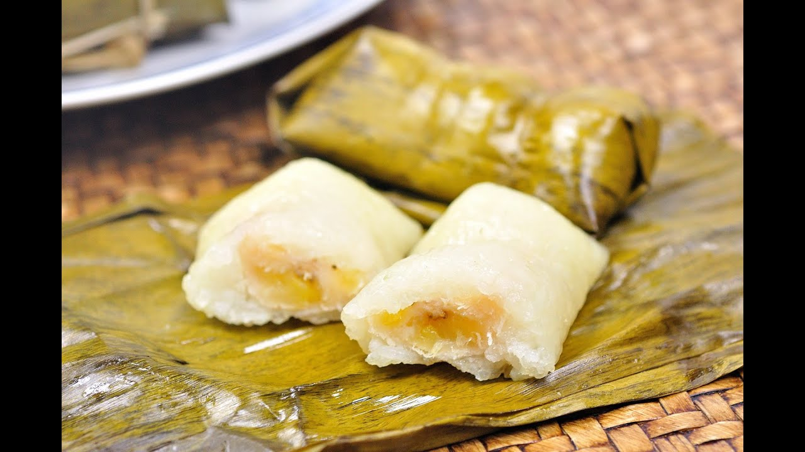

# Khao Tom Mat (Lao Sticky Rice and Banana in Banana Leaves)

*Laos's festival sweet: small parcels of coconut-soaked sticky rice wrapped around ripe banana, folded into banana leaves, tied with banana fibre and steamed till the banana inside turns almost jammy.*

**Serves:** 12 small parcels

**Prep Time:** 45 minutes (plus overnight sticky rice soak)

**Cook Time:** 90 minutes

## Overview
Khao tom mat is one of Laos's most ceremonially important sweets, traditionally made for Buddhist temple offerings, weddings and Lao New Year (Pi Mai). The construction comes in three layers. The rice base is sticky rice briefly cooked in coconut milk with palm sugar and a pinch of salt, slightly under-cooked at this stage since it finishes inside the wrapped parcel during steaming. A piece of ripe Thai banana sits at the centre of each portion of rice; some Lao versions add a few black beans or a small piece of jackfruit alongside. The wrap is a softened banana-leaf square folded into a flat 8 × 8 cm envelope and tied crossways with banana-leaf fibre or kitchen twine. Ninety minutes of steaming turns the banana inside almost jammy and the rice absorbs both the coconut and the banana flavour. The leaf itself imparts a faint green-floral aroma that's part of the traditional character. Eat cool, peeled out of the leaf with a drizzle of palm sugar syrup.

## Ingredients

### The sticky rice
- 500 g Thai or Lao long-grain sticky rice, soaked overnight in cold water
- 300 ml full-fat coconut milk
- 80 g palm sugar
- 1 teaspoon salt
- 1 pandan leaf, torn (optional)

### The fillings
- 6 firm-ripe Thai bananas (or 4 regular bananas, halved lengthways) - cut into 12 pieces total, 8 cm × 2 cm
- 100 g cooked black beans OR 100 g chopped jackfruit (optional, the festive variant)

### The wrapping
- 12 squares banana leaf (each 25 × 20 cm; sold frozen at Asian / Caribbean shops; thaw before use)
- Kitchen twine (or strips of softened banana leaf for the traditional Lao tying)

### To serve (optional)
- A small dish of palm sugar syrup (50 g palm sugar dissolved in 100 ml hot water)
- Toasted sesame seeds for sprinkling
- A cup of strong Lao coffee

## Method

### Stage 1 - Soften the banana leaves
1. Pass each banana leaf over an open flame for 5-7 seconds (the smooth side toward the flame) - the leaves change from rigid to flexible.
2. Or pour boiling water over the leaves and let stand 1 minute.
3. Pat dry with kitchen paper.

### Stage 2 - Pre-cook the rice base
1. Drain the soaked sticky rice.
2. In a wide pan, combine the rice with the coconut milk, palm sugar, salt and (optional) pandan leaf.
3. Cook over medium-low heat 8-10 minutes, stirring occasionally, till the rice has absorbed most of the coconut milk and is starting to soften but is NOT fully cooked (the grains should still be slightly firm; final cooking happens inside the wrap).
4. Remove the pandan leaf.

### Stage 3 - Assemble each parcel
1. Lay a softened banana leaf flat on the work surface, smooth-side-up.
2. Spoon 2 heaped tablespoons of the rice mixture into the centre.
3. Place a piece of banana on top (and a small spoon of black beans or jackfruit if using).
4. Top with another 1 tablespoon of rice (covering the banana).
5. Fold the long sides of the leaf over the filling.
6. Fold the short ends to close into a flat square envelope (about 8 × 8 cm).
7. Tie crosswise with kitchen twine (or strips of softened banana leaf).
8. Repeat with the remaining banana leaves and filling.

### Stage 4 - Steam
1. Fill a large heavy pot with 5 cm of water; place a wire rack or steamer insert inside.
2. Bring the water to a steady boil.
3. Stack the wrapped parcels on the rack (can be stacked 2-3 high).
4. Cover with a tight lid.
5. Steam 90 minutes; check the water level every 30 minutes and top up as needed.

### Stage 5 - Cool and serve
1. Lift the parcels out with tongs; let cool to room temperature on a rack (the rice firms slightly as it cools).
2. To serve: each diner unwraps their own parcel; the green-floral aroma of the leaf releases on opening.
3. Eat with the fingers or a fork; optionally drizzle with palm sugar syrup or sprinkle with toasted sesame seeds.

## Notes
- **Soften the banana leaves:** rigid leaves crack. Open flame or boiling water both work.
- **Firm-ripe bananas:** yellow with a few black spots. Very-ripe bananas dissolve into mush.
- **Pre-cook the rice partially:** under-cook at stage 2 (rice still slightly firm); the rest finishes inside the parcel. Fully-cooked-then-wrapped rice goes mushy.
- **Steam time:** 90 minutes minimum. The rice + banana take this long to fully cook through the leaf wrap.
- **Eat cool:** the parcels are at their peak at room temperature. Hot or freshly-cooked is fine but the texture is best when slightly cooled.

## Variations
**Khao tom mat with mung bean:** add a tablespoon of cooked mung bean alongside the banana - the Northern Lao variant.
**Khao tom mat with taro:** swap banana for a small piece of cooked taro - the rural variant.
**Coconut palm-sugar drizzle:** before serving, drizzle a small amount of warm palm-sugar syrup over the opened parcel.
**Modern bake-in-a-tin variant:** if you can't get banana leaves, bake the rice + banana mixture in a 23 × 23 cm tin at 180°C for 50 minutes - less aromatic but practical.
**Cha lao (Lao temple offering version):** smaller parcels (4 × 4 cm); served at Buddhist temple offerings on Lao New Year.

## Serving
At a Lao temple offering (the traditional setting; the traditional Buddhist alms food) · at a Lao Pi Mai (New Year, April) celebration · at a Lao wedding · at a Lao funeral · at home as the traditional Lao festival sweet · paired with strong Lao coffee or jasmine tea.

## Storage
- Wrapped parcels refrigerate 4 days; reheat by re-steaming for 15 minutes.
- Freezes 2 months wrapped; defrost overnight and re-steam.
- The opened parcels (rice + banana out of the leaf) keep refrigerated 2 days; less aromatic.
- The pre-cooked rice base (stage 2 result) refrigerates 24 hours before wrapping.
