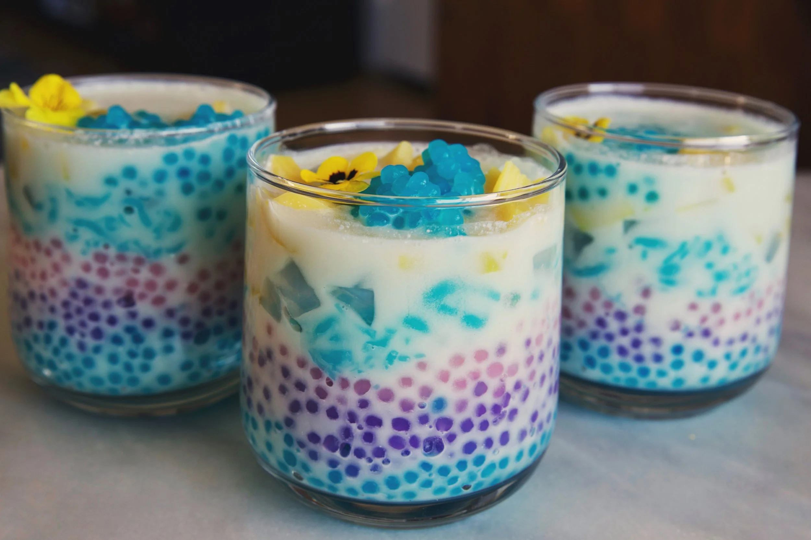

# Nam Wan (Lao Coconut Fruit Sweet)

*Laos's cooling sweet: a small bowl of seasonal tropical fruits in a coconut-milk syrup flavoured with pandan and palm sugar, topped with shaved ice.*

**Serves:** 6

**Prep Time:** 20 minutes

**Cook Time:** 15 minutes

## Overview
Nam wan (literally "sweet liquid") is a family of Lao mixed-fruit desserts served in coconut milk syrup, sold from market stalls across Vientiane and Luang Prabang at midday in the hot months. The coconut syrup is the backbone: full-fat coconut milk with palm sugar, a pandan leaf and a tiny pinch of salt warmed gently till the sugar dissolves and the pandan releases its aroma. The fruit mix is whatever's in season: jackfruit (traditional), longan or lychee, young coconut flesh, palm seeds, sweet potato cubes, banana, taro cubes. Assembled into small individual bowls with the warm coconut syrup poured over, then topped with shaved ice and an optional sprinkle of toasted sesame seeds or chopped peanuts. The Lao version is lighter and less sweet than its Thai cousin, which uses more palm sugar and sometimes adds tapioca pearls.

## Ingredients

### The coconut syrup
- 500 ml full-fat coconut milk
- 80 g palm sugar (or soft brown sugar)
- 2 pandan leaves, torn and knotted (or 1/2 tsp pandan extract)
- 1/4 teaspoon salt
- 1 teaspoon vanilla extract (optional)

### The fruit mix (use any combination; aim for variety)
- 100 g fresh jackfruit, chopped (or canned)
- 100 g longan flesh (or lychee), pitted (canned works)
- 200 g sweet potato, peeled, diced 1.5 cm, boiled in salted water 8 minutes till just tender, drained
- 1 ripe banana, sliced 1 cm thick
- 100 g taro, peeled, diced 1.5 cm, boiled 12 minutes till just tender (optional)
- 80 g palm seeds (sold at Asian shops as "attap seeds" or in cans)
- Young coconut flesh from one young coconut, sliced (canned young coconut works)

### To finish (per serving)
- Shaved ice OR crushed ice (1 small handful per serving)
- 1 teaspoon toasted sesame seeds
- 1 tablespoon toasted crushed peanuts
- A small mint sprig

## Method

### Stage 1 - Make the coconut syrup
1. In a heavy saucepan, combine the coconut milk, palm sugar, pandan leaves and salt.
2. Warm gently over medium-low heat 6-8 minutes, stirring, till the sugar dissolves and the coconut milk steams (do NOT boil).
3. Remove the pandan leaves.
4. Stir in optional vanilla.

### Stage 2 - Prep the fruits
1. Cube the boiled sweet potato and taro into 1.5 cm pieces.
2. Chop the jackfruit, longan, lychee, young coconut as listed.
3. Slice the banana 1 cm thick.

### Stage 3 - Assemble
1. Divide the mixed fruit between 6 small dessert bowls.
2. Pour 100 ml of warm coconut syrup over each (warm or chilled to taste).

### Stage 4 - Finish
1. Add a small handful of crushed or shaved ice on top.
2. Sprinkle with toasted sesame seeds and crushed peanuts.
3. Add a mint sprig.

### Stage 5 - Serve immediately
1. Hand to diners.
2. Eat with a spoon; the ice melts into the warm coconut syrup as you eat.

## Notes
- **Variety is the dish:** the more fruit types, the more interesting. Use what's seasonal.
- **Warm coconut + cold ice:** the temperature contrast is traditional.
- **Don't oversweeten:** Lao nam wan is moderately sweet, not aggressively so. The fruits contribute their own sweetness.
- **Pandan leaf:** the traditional Southeast Asian aromatic. Dried extract is the workable substitute.

## Variations
- **Nam wan with tapioca pearls:** add 4 tablespoons of cooked small tapioca pearls, the Thai-influenced variant.
- **Iced nam wan (chilled):** chill the coconut syrup; serve cold with ice; the cool summer variant.
- **Hot nam wan:** skip the ice; serve the syrup warm over the fruit; the winter variant.
- **Nam wan with sticky rice cake:** add small cubes of cooked sticky rice cake to each bowl.
- **Vegan nam wan:** the recipe is already vegan.

## Serving
- At a Lao market stall (the traditional setting; sold from carts at midday in hot months) · at a Lao Pi Mai (New Year, April) celebration · at home as the traditional Lao summer dessert · paired with strong Lao coffee.

## Storage
- The coconut syrup keeps refrigerated 5 days; warm gently to serve.
- The fruit mix is best fresh; refrigerate cut fruit 1-2 days.
- Assemble per serving; don't pre-mix and refrigerate (the fruit weeps).
