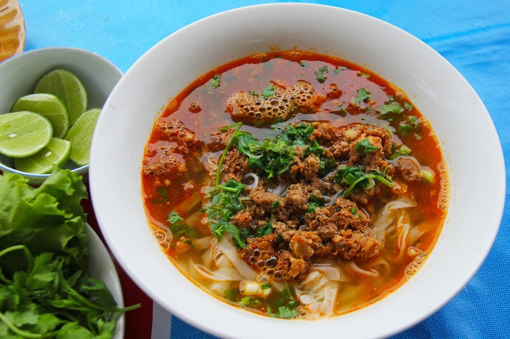

# Khao Soi Lao (Lao Noodle Soup)

*Laos's northern noodle soup: a clear meaty broth over rice noodles, topped with a savoury minced-pork-and-tomato-and-fermented-soybean ragout, fresh herbs, bean sprouts and lime.*

**Serves:** 4

**Prep Time:** 25 minutes

**Cook Time:** 1 hour 10 minutes

## Overview
Khao soi Lao is one of the most-confused dishes in Southeast Asian cuisine: the Thai khao soi (a Chiang Mai yellow coconut-curry noodle soup) is so famous internationally that the Lao dish of the same name gets ignored. They are unrelated and the Lao version is its own world, sold from every Luang Prabang market stall in the morning. The broth is clear and slightly cloudy, a meat-and-pork-bone stock simmered for an hour with star anise, cinnamon, garlic and a generous fistful of cilantro stems. The topping sauce is the traditional Lao signature: finely minced pork sautéed with finely chopped tomato, a generous spoonful of Lao fermented soybean paste (tao jeo, similar to Korean doenjang but distinctly Lao), fish sauce, sugar and a touch of dried chilli, all cooked down to a thick savoury ragout. Assembled with cooked rice noodles, the broth ladled over, the meat sauce piled on top, bean sprouts, fresh herbs, sliced shallot, chilli, lime wedges and pickled mustard greens. The diner mixes everything together at the table.

## Ingredients

### The broth
- 800 g pork bones (back ribs or marrow bones)
- 300 g beef shin
- 1 onion, halved
- 4 cloves garlic, smashed
- 5 cm piece ginger, sliced
- 1 star anise pod
- 1 cinnamon stick
- A small bunch fresh cilantro stems (about 30 g)
- 1.5 litres water
- 2 tablespoons fish sauce
- 1 tablespoon palm sugar
- 1 teaspoon white peppercorns

### The topping sauce (the traditional Lao signature)
- 300 g finely minced pork
- 2 tablespoons sunflower oil
- 4 cloves garlic, finely chopped
- 2 shallots, finely chopped
- 4 medium ripe tomatoes, finely chopped
- 3 tablespoons tao jeo (Lao fermented soybean paste) OR Korean doenjang
- 2 tablespoons fish sauce
- 1 tablespoon palm sugar
- 1 teaspoon dried chilli flakes
- 200 ml of the broth (added to thin the sauce)

### The noodles
- 500 g fresh thick rice noodles OR 300 g dried rice vermicelli (cooked according to packet)

### The table garnish (each diner picks)
- 200 g fresh bean sprouts
- A large bunch fresh mint
- A large bunch fresh cilantro
- A small bunch holy basil OR Thai basil
- 4 fresh red chillies, sliced
- 2 shallots, sliced thin
- 4 lime wedges
- 1 small bowl Lao pickled mustard greens (som phak gat)
- A small dish of chilli flakes
- A small dish of crushed roasted peanuts

## Method

### Stage 1 - Make the broth
1. Place the pork bones, beef shin, onion, garlic, ginger, star anise, cinnamon stick, cilantro stems, water, fish sauce, palm sugar and peppercorns in a large pot.
2. Bring to a gentle boil; skim any foam from the surface.
3. Reduce to a low simmer; cook covered 60 minutes.
4. Strain through a fine sieve; reserve about 1.2 litres of broth and the cooked beef (chop the beef into small pieces; discard the bones).

### Stage 2 - Make the topping sauce
1. Heat the oil in a wide pan over medium heat.
2. Add the chopped garlic and shallots; sweat 4 minutes.
3. Add the minced pork; break up with a wooden spoon; cook 6 minutes till the pork loses its pink colour.
4. Add the chopped tomato; cook 5 minutes till it breaks down.
5. Stir in the tao jeo (or doenjang), fish sauce, palm sugar and chilli flakes.
6. Pour in 200 ml of the reserved broth; simmer 10-12 minutes till the sauce is thick, glossy and the colour of deep brown gravy.
7. Stir in the chopped cooked beef from the broth.

### Stage 3 - Cook the noodles
1. If using dried rice vermicelli, soak in hot water 5 minutes, drain.
2. If using fresh rice noodles, briefly blanch in boiling water 30 seconds.
3. Divide the noodles between 4 large bowls.

### Stage 4 - Assemble
1. Pour a generous ladle of hot broth over the noodles in each bowl.
2. Spoon a generous portion of the topping sauce over the noodles (each bowl should have a substantial heap of sauce floating on the broth).

### Stage 5 - Serve with the garnish plate
1. Place the herb-and-vegetable garnish plate at the centre of the table.
2. Each diner adds bean sprouts, mint, cilantro, basil, sliced shallot, sliced chilli, pickled mustard greens and a squeeze of lime to their own bowl according to taste.
3. Eat with chopsticks and a spoon - chopsticks for the noodles, spoon for the broth.

## Notes
- **Lao khao soi vs Thai khao soi:** completely different dishes. The Lao version has a clear broth and a meat-tomato-soybean topping; the Thai has a yellow coconut curry and crispy noodles on top. Don't confuse.
- **Tao jeo (Lao fermented soybean paste):** the traditional Lao signature. Sold at Lao / Thai grocers. Korean doenjang or yellow miso paste are the workable substitutes.
- **Fresh rice noodles ideal:** the soft fresh wide rice noodles are the traditional Lao choice. Dried vermicelli is the home substitute.
- **The garnish plate is the dish:** without the fresh herbs, bean sprouts, chillies, lime and pickled mustard greens, the bowl is incomplete.

## Variations
**Khao soi with beef only (no pork):** swap the pork-and-bones broth for an all-beef broth; the topping sauce uses minced beef. The slightly heartier variant.
**Khao soi pa (fish):** swap the topping pork for finely flaked freshwater fish; the river-village variant.
**Vegetarian khao soi:** vegetable stock + a mushroom-and-tomato-and-fermented-soybean topping; same garnish plate.
**Khao soi with crispy pork crackling:** scatter a small handful of crispy pork crackling (kham moo) over each bowl.

## Serving
At a Luang Prabang morning market stall (the traditional setting; sold from 6 am till noon) · at a Vientiane noodle shop · at a Lao breakfast counter · at a Lao New Year celebration · at home as a substantial Lao breakfast or lunch.

## Storage
- The broth refrigerates 5 days; freezes 3 months.
- The topping sauce refrigerates 4 days; freezes 3 months.
- The fresh noodles, herbs and bean sprouts should be fresh per serving.
- Assemble each bowl fresh; pre-assembled bowls go soggy.
