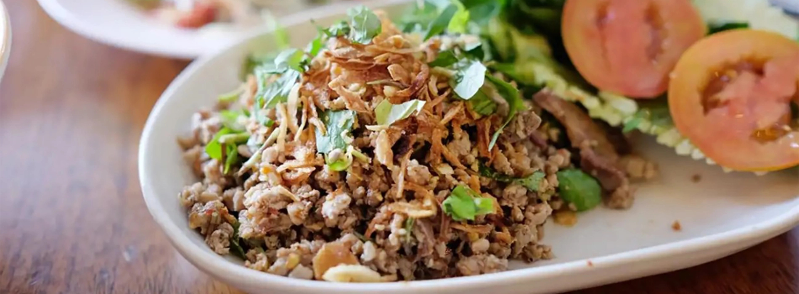

# Laap (Lao Minced Meat Salad)

*Laos's national dish: finely minced meat tossed with toasted rice powder, fresh mint, cilantro, shallot, lime juice, fish sauce and dried chilli, eaten at room temperature with sticky rice.*

**Serves:** 4

**Prep Time:** 25 minutes

**Cook Time:** 8 minutes

## Overview
Laap (also spelled larb in English) is the most identity-defining Lao dish, eaten at every meal across the country with sticky rice and a plate of raw vegetables for scooping. The toasted rice powder (khao khua) is the traditional Lao signature that sets it apart from generic minced-meat salads: raw sticky rice grains dry-toasted till deep golden and nutty, then ground coarse, sprinkled generously over the finished dish as both thickener and textural element. The meat cooks gently in a dry pan with a splash of water just till opaque, never browned hard, to keep it tender. Traditionally beef or buffalo (the rural Lao staple); modern home versions use chicken, pork or duck. While still warm the meat tosses in a wide bowl with fish sauce, fresh lime juice, dried chilli flakes, sliced shallot, spring onion, fresh mint and cilantro, and that generous spoonful of toasted rice powder. Served at room temperature, scooped by hand with sticky rice and raw cabbage, long beans or cucumber.

## Ingredients

### The laap
- 500 g finely minced (or hand-chopped) beef, chicken, pork, duck or freshwater fish (15% fat if possible)
- 100 ml water (for the gentle cook)
- 3 tablespoons fish sauce (Tiparos or Squid brand)
- 3 tablespoons fresh lime juice
- 1 tablespoon caster sugar (or palm sugar)
- 2-3 teaspoons dried chilli flakes (or fresh red chilli, finely chopped, to taste)
- 4 shallots, very thinly sliced
- 4 spring onions, sliced into 5 mm rings
- 1 stalk lemongrass (tender white part only), very finely sliced
- 4 tablespoons toasted rice powder (recipe below)
- A generous bunch fresh mint leaves
- A small bunch fresh cilantro, roughly chopped
- A small bunch culantro / sawtooth coriander (optional, very traditional), chopped

### Toasted rice powder (khao khua)
- 4 tablespoons raw Thai sticky rice (or basmati as substitute)
- Dry-toast in a pan over medium heat 6-8 minutes, stirring, till deep golden and fragrant. Grind to coarse powder in a mortar or spice grinder. Use within 48 hours.

### To serve
- 1 basket warm Lao sticky rice (khao niao) - see [Sticky Rice](side-dishes/sticky-rice.md)
- A plate of raw vegetables for scooping: cabbage wedges, long beans, cucumber spears, lettuce leaves
- A small dish of jeow bong (Lao chilli paste) - optional

## Method

### Stage 1 - Make the toasted rice powder
1. Dry-toast the raw sticky rice in a heavy frying pan over medium heat 6-8 minutes, stirring or shaking constantly.
2. The grains turn deep golden and smell strongly nutty.
3. Cool 5 minutes, then grind to a coarse powder in a mortar or spice grinder.

### Stage 2 - Cook the meat
1. In a wide pan, combine the minced meat with the 100 ml water.
2. Cook over medium heat, breaking up with a wooden spoon, 5-6 minutes till just cooked through.
3. Don't brown - this is a gentle steam-cook to keep the meat tender.
4. The water mostly evaporates; the meat should be just-cooked and moist.

### Stage 3 - Dress while still warm
1. Tip the warm cooked meat into a large mixing bowl.
2. Add the fish sauce, lime juice, sugar, chilli flakes, sliced shallot, spring onion and lemongrass.
3. Toss thoroughly to coat.
4. Let cool 5 minutes (the dressing penetrates the meat as it cools).

### Stage 4 - Finish
1. Add the toasted rice powder; toss.
2. Fold in the mint, cilantro and (optional) culantro at the very last moment to keep them fresh.
3. Taste; adjust fish sauce (more salt), lime (more sour), chilli (more heat) and sugar (rounds the balance).

### Stage 5 - Serve
1. Pile the laap on a wide platter.
2. Serve with warm sticky rice (in a small bamboo basket, the traditional Lao serving) and a plate of raw vegetables.
3. The diner pulls a small ball of sticky rice with the fingers, presses it into the laap, scoops a fresh herb leaf and bites.

## Notes
- **Toasted rice powder is the traditional Lao signature:** without it, you've made larb but not laap.
- **Gentle cook, no browning:** the meat should be tender, not crusty. This is not stir-frying.
- **Eat at room temperature, not hot:** laap is meant to be served just-warm or cooled; it brings the herbs to life.
- **Sticky rice is the traditional pairing:** plain jasmine rice works but the texture is wrong; the small ball of sticky rice pressed into the laap is the traditional Lao eating method.
- **Make the toasted rice powder fresh:** it loses aroma within 48 hours.

## Variations
**Laap pa (fish laap):** swap meat for finely chopped raw or briefly poached freshwater white fish; Lao river-fish traditional.
**Laap ped (duck laap):** finely chopped roast duck meat; richer, more festive.
**Laap dip (raw laap):** the traditional Northern Lao version uses raw beef tartare-style; not for the squeamish, and not recommended outside Laos for food-safety reasons.
**Vegetarian laap (laap het):** swap meat for finely chopped mushrooms (king oyster, shiitake) or crumbled fried tofu; same dressing.
**Laap with extra heat:** double the dried chilli flakes; add 1 finely chopped fresh bird's-eye chilli.

## Serving
At a Lao family dinner (the traditional setting) · at a Luang Prabang restaurant alongside or lam and sticky rice · at a Vientiane street stall · at a Lao New Year (Pi Mai, mid-April) celebration · at home as the traditional Lao dinner-party plate · with sticky rice, raw vegetables and a Beerlao.

## Storage
- Eat within 4 hours; the herbs wilt and the rice powder loses crunch.
- The cooked meat (alone, no herbs or dressing) refrigerates 2 days; assemble fresh with the dressing and herbs.
- The toasted rice powder keeps 2-3 days at room temperature in a sealed jar.
- Leftover laap stirred into a fresh omelette is an excellent Lao breakfast.
