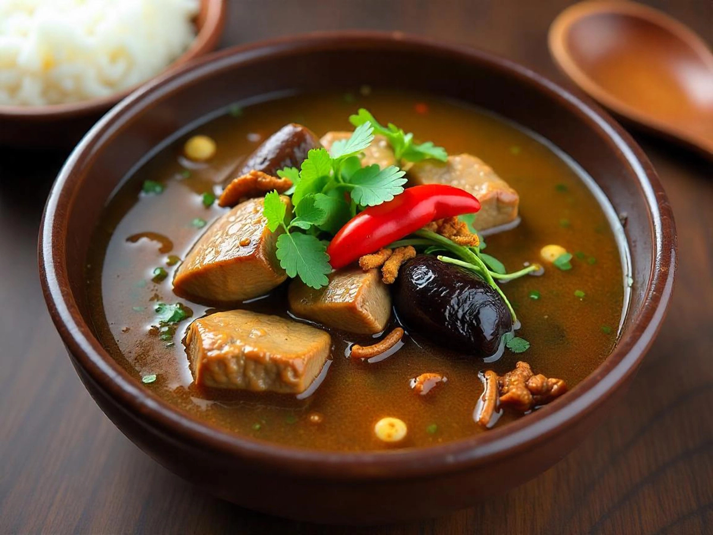

# Or Lam (Luang Prabang Herb Stew)

*Luang Prabang's signature stew: chunks of buffalo or beef slow-braised with aubergine, long beans, oyster mushrooms, sliced green chillies and a generous fistful of fresh dill, basil, lemongrass and the traditional Lao "sakhan" (a bitter aromatic wood from the climbing pepper vine Piper ribesioides that grows in the Luang Prabang forests). The wood gives the stew its identifying bitter-numbing depth - similar in spirit to Sichuan peppercorn but distinctly Lao. Served over sticky rice with a small dish of jeow bong (sweet chilli paste).*

**Serves:** 6

**Prep Time:** 25 minutes

**Cook Time:** 1 hour 30 minutes

## Overview
Or lam is the most identity-specifically Luang Prabang dish, the deep herb-and-wood stew that defines northern Lao cooking. The sakhan is the traditional Lao signature: dried bark from the climbing pepper vine Piper ribesioides, added in 5-7 cm pieces during the long simmer to release a bitter-warm-numbing aromatic that's the dish's identifying note. Similar in spirit to Sichuan peppercorn but more woody and pepper-forward. Outside Laos, sakhan sells dried at specialist Southeast Asian shops; a teaspoon each of crushed Sichuan peppercorn and black peppercorn substitutes. The herb pile is enormous and goes in during the last fifteen minutes: fresh dill (surprisingly Lao given dill's European associations; Lao kitchens use it heavily), basil, lemongrass, kaffir lime leaves and culantro. Vegetables are pea aubergines (small purple aubergine cubes substitute), long beans, oyster mushrooms and sliced green chillies, all braised with chunks of buffalo or beef. The stew is brothy rather than thick; served over sticky rice with a small dish of jeow bong (sweet chilli paste) on the side.

## Ingredients

### The base
- 600 g beef shin OR chuck OR buffalo, cut into 4 cm chunks
- 1.5 litres beef stock OR water
- 2 stalks lemongrass, lightly crushed and cut into 5 cm lengths
- 4 kaffir lime leaves, torn
- 5 cm piece galangal, sliced thin
- 4 cloves garlic, smashed
- 2 shallots, halved
- 3 pieces sakhan wood (about 5 cm each); OR 1 tsp crushed Sichuan peppercorn + 1 tsp black peppercorn
- 2 tablespoons fish sauce
- 1 tablespoon padaek (Lao fermented fish sauce; optional but very traditional)

### The vegetables (added in stages)
- 200 g small Thai pea aubergines (or 1 large Asian aubergine cut into 3 cm chunks)
- 200 g long beans, cut into 4 cm pieces
- 200 g oyster mushrooms, torn into strips
- 4 fresh green chillies, sliced
- 200 g whole baby corn (optional, but very Lao)

### The herbs (added in the last 15 minutes)
- A small bunch fresh dill (about 30 g), chopped
- A small bunch holy basil OR Thai basil
- A small bunch culantro (sawtooth coriander), chopped (substitute with regular cilantro)
- 2 spring onions, sliced

### To finish
- 1 tablespoon fresh lime juice
- 1 small dried red chilli, crumbled (optional, for extra heat)

### To serve
- 1 large basket warm sticky rice
- A small dish of jeow bong (Lao sweet chilli paste)
- Raw vegetables for nibbling: cucumber, cabbage, mint sprigs

## Method

### Stage 1 - Brown the beef
1. Heat 1 tablespoon oil in a heavy pot over medium-high.
2. Brown the beef chunks 3 minutes per side; transfer to a plate.

### Stage 2 - Build the broth
1. In the same pot, sweat the smashed garlic and shallots 2 minutes.
2. Add the stock, lemongrass, kaffir lime leaves, galangal, sakhan (or peppercorn substitute), fish sauce and (optional) padaek.
3. Return the beef.
4. Bring to a gentle simmer; cover loosely.

### Stage 3 - Slow simmer
1. Cook 60 minutes on the lowest heat till the beef is tender but not falling apart.

### Stage 4 - Add the vegetables
1. Add the aubergine pieces; cook 10 minutes.
2. Add the long beans, oyster mushrooms, baby corn and sliced green chillies.
3. Cook 8-10 more minutes till the vegetables are tender but still bright.

### Stage 5 - Finish with the herbs
1. Stir in the chopped dill, basil, culantro and spring onion.
2. Add the lime juice and (optional) extra crumbled chilli.
3. Simmer 2-3 minutes to wilt the herbs slightly.
4. Taste; adjust fish sauce and lime.

### Stage 6 - Serve
1. Ladle the brothy stew into wide bowls.
2. Serve with a basket of sticky rice alongside and a small dish of jeow bong.
3. Eat by pulling sticky rice with the fingers, dipping into the broth and picking up vegetables and meat.

## Notes
- **Sakhan is the traditional Lao signature:** find at specialist Lao shops; the Sichuan+black-peppercorn substitute gets you 70% of the way there.
- **Fresh dill is surprising but right:** Lao cooking uses dill heavily; don't substitute with cilantro for this dish.
- **Brothy not thick:** or lam is a stew with a generous broth; don't reduce it to a thick gravy.
- **Aubergine variety matters:** small Thai pea aubergines stay firm; large Western aubergines collapse. The small Asian aubergine is the workable compromise.

## Variations
**Or lam pa (fish version):** swap beef for chunks of firm freshwater white fish - the river-fish variant.
**Or lam moo (pork version):** swap beef for pork belly chunks.
**Or lam kai (chicken version):** swap beef for bone-in chicken thighs.
**Vegetarian or lam:** skip the meat and fish sauce; use vegetable stock; double the mushrooms and add tofu chunks; use soy sauce in place of fish sauce.

## Serving
At a Luang Prabang riverside restaurant (the traditional setting) · at a Lao family dinner · at a Lao New Year (Pi Mai) celebration · at a Lao temple festival · at home as a Lao-themed dinner-party main · paired with sticky rice and laap.

## Storage
- Refrigerates 4 days; reheat on the stovetop, adding a splash of water if too reduced.
- Freezes 3 months; defrost overnight in the fridge.
- Better the day after - the sakhan / pepper aromatics deepen overnight.
- Add fresh herbs at serving each time; don't store with herbs incorporated.
