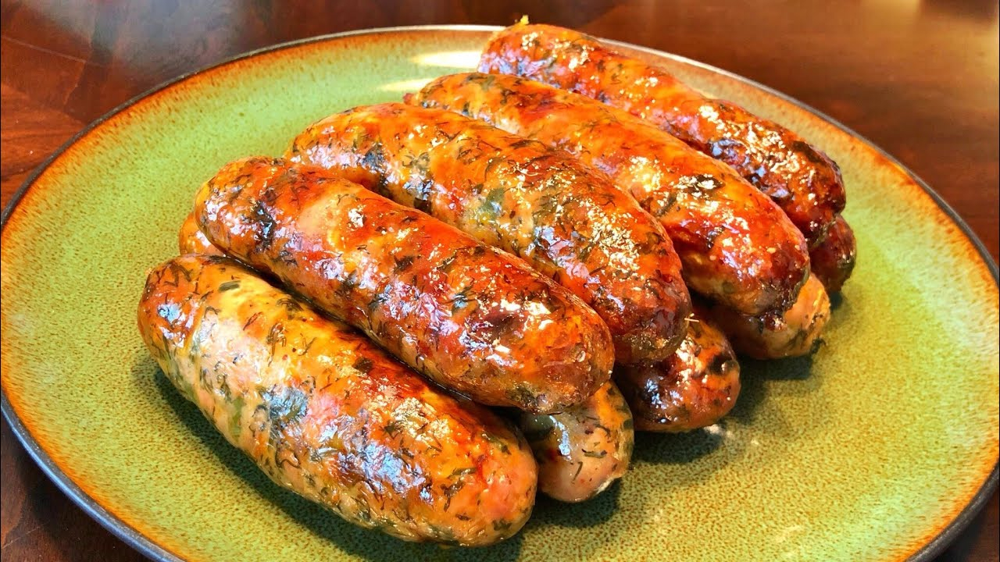

# Sai Oua (Lao Lemongrass Sausage)

*Northern Laos's signature sausage: coarsely ground pork shoulder mixed with lemongrass, kaffir lime, galangal, dill and chillies, stuffed into casings, coiled into spiral rounds and grilled over hot charcoal.*

**Serves:** 6 (about 12 sausage links)

**Prep Time:** 30 minutes (plus 4 hours marinating)

**Cook Time:** 25 minutes

## Overview
Sai oua is northern Laos's most identity-defining sausage and one of Luang Prabang's most-loved street foods. The aromatic load is enormous: lemongrass, kaffir lime leaves, galangal, shallots, garlic, dried Thai red chillies and a generous fistful of fresh dill, all finely chopped to a textural mince (the canonical Lao technique is a slow hand-chop with a cleaver, not a smooth paste). Sai oua should taste of the herbs as much as the pork. The pork itself is coarsely ground pork shoulder at 25-30% fat; the high-fat ratio is essential for tender juicy sausages. Stuffed into natural pork casings, coiled into the canonical Luang Prabang flat spiral (rather than left as straight links), grilled over hot charcoal till the casings blister and the inside reaches medium-juicy. Sliced thin and served with sticky rice, a small dish of jeow bong, lettuce leaves and fresh herbs.

## Ingredients

### The pork mixture
- 1 kg pork shoulder, coarsely ground (or hand-chopped with a cleaver) with about 25-30% visible fat content

### The aromatics (finely chopped)
- 4 stalks lemongrass (tender white part only), very finely chopped (about 4 tablespoons)
- 8 kaffir lime leaves, central rib removed, leaves finely chopped (or finely chiffonaded)
- 4 cm piece galangal, peeled and finely chopped
- 4 cm piece fresh turmeric, peeled and finely chopped (or 1 teaspoon ground)
- 8 cloves garlic, finely chopped
- 4 shallots, finely chopped
- 4 dried Thai red chillies, soaked in hot water 10 minutes, drained, finely chopped (or 2 teaspoons chilli flakes)
- 2 fresh red chillies, finely chopped
- A small bunch fresh dill (about 30 g), finely chopped
- A small bunch culantro (or cilantro), finely chopped
- 4 spring onions, finely sliced

### The seasonings
- 3 tablespoons fish sauce
- 2 tablespoons padaek (Lao fermented fish sauce; substitute with 1 tbsp shrimp paste + 1 tbsp extra fish sauce)
- 1 tablespoon palm sugar
- 1 teaspoon ground white pepper
- 1 tablespoon roasted rice powder (see [Laap](laap.md))

### For stuffing
- 2 metres natural pork sausage casings (sold at butchers or specialty stores; soaked 30 minutes in cold water to soften)
- A sausage stuffer attachment OR a wide piping nozzle attached to a piping bag

### For cooking
- 2 tablespoons sunflower oil (for brushing the grill or pan)

### To serve
- Sticky rice in a small bamboo basket
- A small dish of jeow bong (Lao sweet chilli paste)
- Fresh lettuce leaves, mint sprigs, basil sprigs, cilantro
- Sliced cucumber, raw long beans, raw cabbage
- A small dish of crushed roasted peanuts (optional)
- Lime wedges

## Method

### Stage 1 - Mix the sausage filling
1. In a large bowl, combine the ground pork with all the chopped aromatics (lemongrass, kaffir lime leaves, galangal, turmeric, garlic, shallots, dried chillies, fresh chillies, dill, culantro, spring onions).
2. Add the fish sauce, padaek, palm sugar, white pepper and roasted rice powder.
3. Mix vigorously with clean hands (or a wooden spoon) for 3-4 minutes - the meat should become slightly tacky and the aromatics evenly distributed.
4. The mixture should hold together when pressed.

### Stage 2 - Marinate
1. Cover the bowl with cling film.
2. Refrigerate at least 4 hours, ideally overnight.
3. The aromatics penetrate the pork; the dish develops its characteristic Lao depth.

### Stage 3 - Stuff the casings
1. Rinse the soaked casings briefly under cold water; pat dry.
2. Fit a sausage stuffer attachment to your mixer (or use a wide piping nozzle).
3. Thread a length of casing onto the stuffer nozzle; tie one end with kitchen twine.
4. Stuff the filling slowly into the casings; don't pack too tight (the sausages can split when cooking).
5. Twist every 12-15 cm into individual links.
6. Tie off the open end.

### Stage 4 - Form the spirals (canonical Lao)
1. Coil each pair of links into a flat spiral shape (a snail-shell form), about 12 cm across.
2. Fix the spiral with 2 wooden skewers crossed through to hold the shape.
3. Place on a tray.

### Stage 5 - Grill (canonical) or pan-fry / bake
1. **Grill (canonical):** heat a charcoal grill to medium-hot (the embers should glow but not flame). Brush the sausage spirals lightly with oil. Grill 12-15 minutes total, turning once, till the casings are blistered, the inside reaches 70°C and juices run clear.
2. **Pan-fry (no grill):** heat a heavy frying pan over medium with 1 tbsp oil. Cook the spirals 6-7 minutes per side till deeply golden and cooked through.
3. **Bake (the easiest):** 200°C oven for 25-30 minutes till the casings are blistered and the centre reaches 70°C.

### Stage 6 - Serve
1. Slice each sausage spiral on the diagonal into 1 cm rounds.
2. Pile on a platter; add lettuce leaves, mint, basil, cilantro, cucumber, raw vegetables and lime wedges alongside.
3. Place a basket of sticky rice and a small dish of jeow bong on the table.
4. Diners pull sticky rice with the fingers, press a slice of sai oua into a lettuce leaf with herbs, dip in jeow bong.

## Notes
- **The aromatic load is enormous:** sai oua should taste herby, lemongrass-forward, gently chilli-hot. Under-aromatic sai oua tastes like a generic pork sausage.
- **High pork fat is essential:** 25-30%. Lean pork makes dry, dense sausages.
- **The spiral shape:** canonical Luang Prabang. Cooks more evenly than straight links; easier to grill.
- **Charcoal grill ideal:** the smoke is part of the Lao flavour. Gas works; oven is the fallback.
- **Don't overcook:** 70°C internal. Past 75°C the pork goes dry.

## Variations
**Sai oua mai (sai oua without casings, formed as patties):** the home-cook shortcut - form the filling into 2 cm thick patties; grill or pan-fry.
**Sai oua moo with extra dill:** double the dill - the Luang Prabang variant.
**Sai oua kai (chicken version):** swap pork for finely ground chicken thigh + 100 g pork fat for richness.
**Vegetarian sai oua:** swap pork for crumbled firm tofu + minced shiitake + a binder of mashed sweet potato; form as patties.

## Serving
At a Luang Prabang night market stall (the canonical setting; sliced sausages from a charcoal grill, served with sticky rice and lettuce wraps) · at a Lao New Year (Pi Mai) feast · at a Vientiane grilled-meat restaurant · at home as a Lao-themed barbecue main · paired with sticky rice, laap, and a cold Beerlao.

## Storage
- The raw sausage mix refrigerates 24 hours after the 4-hour marinade; or freezes 3 months.
- Cooked sai oua refrigerates 3 days; reheats well in a hot pan for 2 minutes.
- Cooked sai oua freezes 3 months; defrost in the fridge and reheat in a hot pan.
- The aromatic mix (without pork) can be made 2 days ahead and refrigerated; mix into the pork on the day of cooking.
