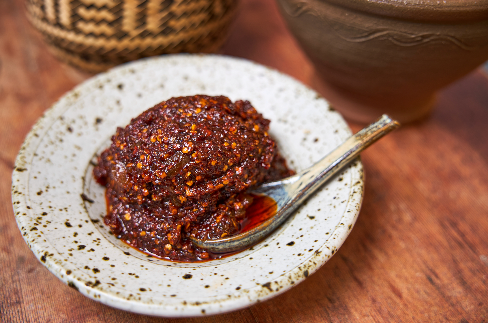

# Jeow Bong (Lao Sweet Roasted Chilli Paste)

*Luang Prabang's canonical condiment: dried red chillies, garlic and shallots dry-roasted till deeply blackened, pounded with palm sugar, fish sauce, lime, salt and (the canonical Luang Prabang addition) shreds of dried buffalo or pork skin into a thick deep-red sweet-spicy-funky paste. Spooned alongside sticky rice, sai oua, grilled meat, raw vegetables or steamed greens. The deep roasted flavour separates jeow bong from the lighter fresh jeow makheua (aubergine paste) or jeow mak len (tomato paste). The Lao condiment of choice.*

**Serves:** Makes 300 g paste (enough for many meals)

**Prep Time:** 25 minutes

**Cook Time:** 10 minutes

## Overview
Jeow (Lao for "dip" or "paste") covers a family of Lao condiments: jeow mak len (fresh tomato), jeow makheua (roasted aubergine), jeow makkok (sweet plum), and jeow bong (roasted chilli). The bong version is the Luang Prabang signature - distinguished by three Lao-specific moves. First, the deep roast: dried red chillies, whole garlic cloves and whole shallots are dry-roasted in a heavy pan over medium heat for 8-10 minutes till the skins blacken at the edges and the inside softens. This deep char is essential; under-roasted ingredients give a sharp, raw-tasting paste. Second, the dried buffalo / pork skin: the canonical Luang Prabang addition is small shreds of dried buffalo skin (or pork skin) rehydrated, finely chopped, and pounded into the paste. The skin gives the paste body and a faint umami chewiness that distinguishes jeow bong from other Lao jeow. Substitute with crispy pork crackling outside Laos. Third, the pounding: in a tall clay mortar (the same one used for tam mak hung) - dried chillies first to a coarse powder, then garlic-shallot to a paste, then the rehydrated dried meat, then the wet ingredients. Pounding (not blending) gives the canonical texture. Three details: DEEP-ROAST THE CHILLIES AND AROMATICS (the char is essential), USE DRIED MEAT IF YOU CAN SOURCE IT (the canonical Lao addition; substitute with crispy pork crackling), and ADJUST TO A SWEET-SPICY-FUNKY BALANCE (palm sugar, fish sauce, lime; taste as you go).

## Ingredients

### The aromatics (to roast)
- 30 g dried red chillies (about 12-15 medium dried chillies; mild guajillo or Thai red dried chillies)
- 1 whole head garlic (about 10 cloves), peeled
- 6 large shallots, peeled and halved

### The dried meat (canonical Luang Prabang)
- 30 g dried buffalo skin OR dried pork skin (sold at Lao / Thai grocers)
- (Substitute: 50 g crispy pork crackling, broken into small bits)

### The wet ingredients
- 4 tablespoons palm sugar
- 4 tablespoons fish sauce
- 3 tablespoons fresh lime juice
- 1 tablespoon padaek (Lao fermented fish sauce; optional but very canonical)
- 1 teaspoon salt
- 2 tablespoons vegetable oil

### To serve
- Spooned alongside sticky rice, sai oua, grilled meat, raw vegetables, steamed greens.
- Spread on toast or used as a sandwich condiment - the modern Lao kitchen variant.

## Method

### Stage 1 - Dry-roast the aromatics
1. Heat a heavy frying pan over medium heat (no oil).
2. Add the dried chillies, garlic cloves and shallot halves.
3. Toast 8-10 minutes, turning, till the chillies are deeply browned, the garlic skins are charred and the shallots are blackened at the edges.
4. The aromatics should smell deeply smoky and slightly bitter.
5. Tip into a heatproof bowl; let cool 5 minutes.

### Stage 2 - Prep the dried meat (if using)
1. Soak the dried buffalo or pork skin in hot water 5 minutes.
2. Drain; pat dry; chop finely.
3. (Or just crumble crispy pork crackling.)

### Stage 3 - Pound the paste
1. Place the cooled toasted dried chillies in a tall clay mortar (or a granite mortar).
2. Pound to a coarse powder.
3. Add the roasted garlic and shallots; pound to a paste (the skins integrate as you pound).
4. Add the chopped dried meat (or crackling); pound 30 seconds to combine.
5. Add the palm sugar, fish sauce, lime juice, optional padaek, salt and vegetable oil.
6. Pound and stir till you have a thick deep-red paste with visible specks of chilli skin and small bits of meat.

### Stage 4 - Taste and adjust
1. Taste; the paste should be sweet-spicy-funky in roughly equal parts.
2. Adjust palm sugar for more sweetness; fish sauce for more salt; lime for more sour; chilli (an extra dry-toasted one ground in) for more heat.

### Stage 5 - Cook briefly (optional but very canonical)
1. (The Luang Prabang home cook often cooks the paste briefly to deepen the flavour.) Transfer the paste to a small pan; warm over the lowest heat for 5-6 minutes, stirring.
2. The paste darkens slightly and the flavours marry.

### Stage 6 - Cool and store
1. Cool to room temperature.
2. Transfer to a clean glass jar.
3. Refrigerate.

## Notes
- **Deep-roast is essential:** under-roasted aromatics give a sharp, raw-tasting paste.
- **Dried meat (or crackling):** the canonical Lao signature - skip and the paste is missing its identity.
- **Mortar pounding gives the canonical texture:** a food processor gives a smoother paste; the mortar gives a coarse-rustic texture that's more Lao.
- **Adjust to taste:** palm sugar, fish sauce, lime are all adjustable; the balance is the cook's signature.
- **Cook briefly:** the canonical Luang Prabang move deepens the flavour. Skip if you want a fresher taste.

## Variations
**Vegetarian jeow bong:** skip the meat and fish sauce; use soy sauce + a teaspoon of doenjang for umami depth.
**Spicier jeow bong:** double the dried chillies for the heat-lovers.
**Sweeter jeow bong:** double the palm sugar for the modern variant.
**Jeow bong with sesame seeds:** add 2 tablespoons toasted sesame seeds at the end - the modern variant.
**Smoky jeow bong:** add 1 teaspoon liquid smoke or smoked paprika - the modern variant.

## Serving
At a Luang Prabang night market (the canonical setting; sold in small jars at the herb-and-spice stalls) · at every Lao home as the canonical condiment · alongside sticky rice + grilled meat + raw vegetables - the canonical Lao plate · in modern Lao-influenced cooking as a sandwich spread or a marinade base · paired with sai oua, laap, or grilled fish.

## Storage
- Refrigerates 1 month in a clean sealed jar; the flavour deepens further over 2-3 weeks.
- Freezes 6 months in small portions.
- The oil layer on top prevents oxidation; top up with a thin layer of oil if you see darkening.
- Don't keep at room temperature for more than a few hours - the moisture allows bacterial growth.
