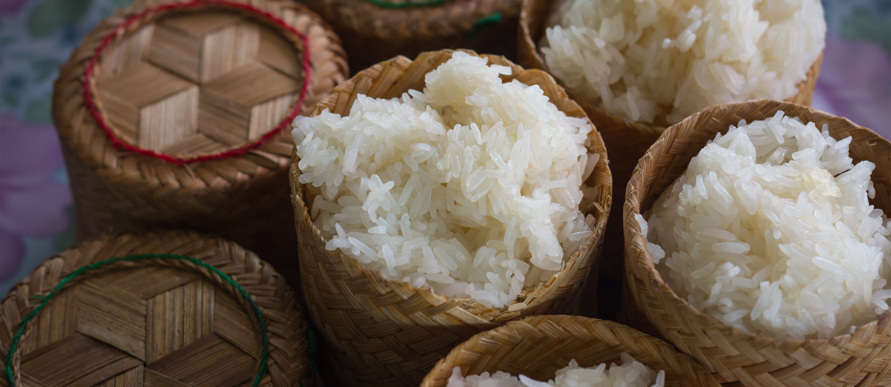

# Khao Niao (Lao Sticky Rice)

*Laos's staple grain and the foundation of every Lao meal: glutinous (sticky) rice soaked overnight, steamed in a tall conical bamboo basket over a pot of boiling water till the grains are translucent, fluffy and stretchy. Eaten by hand-rolling into small balls and dipping into the small plates of laap, tam mak hung, jeow bong, or whatever else covers the Lao table. Per capita, Laos consumes more sticky rice than any other country on earth; it is the Lao identity grain.*

**Serves:** 6 (about 600 g cooked rice)

**Prep Time:** 5 minutes (plus overnight soak)

**Cook Time:** 25 minutes

## Overview
Sticky rice is the most identity-defining Lao staple - so central to Lao identity that Lao people call themselves "luk khao niao" ("children of sticky rice"). Three things matter for canonical Lao sticky rice. First, the rice variety: Thai or Lao long-grain sticky rice (glutinous rice; sold as "Thai sticky rice", "sweet rice" or "glutinous rice" at Asian grocers; NOT short-grain Japanese sushi rice, which is a different type). Second, the overnight soak: the dry grains must be soaked in cold water for at least 6 hours, ideally 12-24. Skipping this step gives undercooked, hard grains. Third, the steaming: the soaked rice steams (never boils in water) in a bamboo conical basket (huay - the canonical Lao tool) over a pot of boiling water. The steam cooks the rice in 20-25 minutes; the grains become translucent, fluffy and stretchy. A perforated metal steamer or a fine sieve over a pot works as a substitute. Eaten by pulling a small ball with the fingers, rolling briefly to compact, and dipping into laap, tam mak hung, jeow or any other Lao small plate. Three details: SOAK OVERNIGHT (6-24 hours; non-negotiable), STEAM DON'T BOIL (the rice cooks in steam, never submerged in water), and SERVE FROM A BAMBOO BASKET (keeps the rice warm and slightly humid; an enamel bowl with a lid is the home substitute).

## Ingredients

### The rice
- 400 g Thai or Lao long-grain glutinous rice (sticky rice / sweet rice)
- 1.5 litres cold water (for soaking)
- 1 litre water (in the steamer pot)

### Equipment
- A bamboo conical sticky-rice basket (huay) AND a clay or metal pot to set it over
- OR a wide-bottomed pot with a metal steamer insert lined with a clean tea towel
- OR a sieve over a pot of boiling water, covered with a lid

### To serve
- A small bamboo basket (or tea-towel-lined bowl) for serving
- Goes with laap, tam mak hung, jeow bong, or-lam, sai oua, grilled fish, sai gawng (Lao grilled chicken)

## Method

### Stage 1 - Soak overnight
1. Place the dry rice in a large bowl.
2. Cover with cold water by 5 cm.
3. Leave at room temperature for 6-24 hours.
4. The grains will absorb water and become opaque-white. Drain in a sieve before cooking.

### Stage 2 - Set up the steamer
1. Fill a wide pot with 5 cm of water; bring to a steady boil.
2. Place the bamboo conical basket (or a steamer insert lined with a clean tea towel) over the boiling water.
3. The water should NOT touch the rice.

### Stage 3 - Steam
1. Tip the drained soaked rice into the bamboo basket (or onto the tea towel).
2. Cover with the basket lid (or a tight-fitting pot lid).
3. Steam over high heat for 20-25 minutes.
4. After 15 minutes, flip the rice if using a basket (gently turn the contents over so the bottom moves to the top; this ensures even cooking).
5. The rice is done when the grains are uniformly translucent, fluffy, slightly stretchy, and a single grain is fully tender (no chalky centre).

### Stage 4 - Transfer to a serving basket
1. Tip the cooked rice onto a clean board or into a serving basket.
2. Knead briefly with a wooden spoon to release steam (this prevents the rice going gummy).
3. Transfer to a small bamboo serving basket (the canonical Lao way) or a tea-towel-lined bowl with a tight lid.

### Stage 5 - Serve
1. Place the basket on the table.
2. Each diner pulls a small ball with the fingers, rolls briefly to compact, dips into laap or other small plates.
3. Sticky rice should be eaten warm; cold sticky rice firms unpleasantly.

## Notes
- **Use Thai / Lao sticky rice ONLY:** Japanese sushi rice, Chinese sticky rice or jasmine rice all give different (and wrong) results.
- **Overnight soak is non-negotiable:** the grains MUST absorb water before steaming.
- **Steam, never boil:** boiling submerged in water gives a porridge; the canonical Lao method is steam only.
- **Eat warm:** sticky rice firms as it cools. A small bamboo basket with a lid keeps it warm and slightly humid.
- **Hand-eating is canonical:** chopsticks or spoons are wrong. Pull a small ball with the fingers, roll, dip.

## Variations
**Coconut sticky rice (for desserts):** add 200 ml of coconut milk + 2 tablespoons sugar to the cooked rice; let absorb 10 minutes. For mango sticky rice.
**Black sticky rice:** swap half the white sticky rice for black sticky rice; soak and steam together; the Lao Northern variant.
**Smaller portion:** halve the ingredients for 3-4 diners.

## Serving
At every Lao meal (the canonical setting; sticky rice is on every Lao table at every meal) · at a Lao temple offering · at a Lao New Year (Pi Mai) feast · at a Lao family Sunday lunch · at home as the canonical Lao or Northern Thai staple · paired with laap, tam mak hung, or any Lao or Northern Thai dish.

## Storage
- Best eaten warm within 4 hours of cooking.
- Refrigerates 3 days; reheat by steaming for 5 minutes or microwaving with a damp paper towel covering.
- Day-old sticky rice can be sliced and pan-fried in oil till crisp on both sides - excellent for breakfast.
- Freezes 2 months in airtight bags; defrost and steam to refresh.
