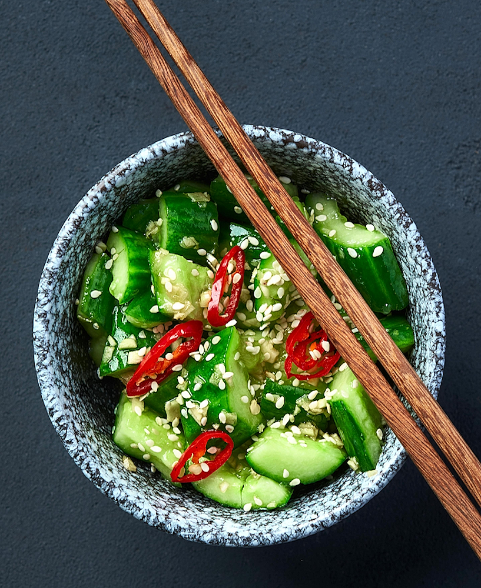

# Tam Mak Teng (Lao Cucumber Salad)

*Laos's lighter sister to tam mak hung: julienned green cucumber pounded in a tall clay mortar with garlic, bird's-eye chillies, palm sugar, lime juice, fish sauce, dried shrimp and chopped tomato. Brighter and fresher than the green-papaya version, the cucumber giving a clean cooling crunch beneath the same sour-spicy-funky dressing. Served alongside grilled meat, sai oua or laap; the canonical Lao late-summer salad when cucumbers are at their best.*

**Serves:** 4

**Prep Time:** 15 minutes

**Cook Time:** None

## Overview
Tam mak teng is the cucumber-based sibling to tam mak hung - same Lao mortar-pounded technique, same sour-spicy-funky dressing profile, but with green cucumber as the bulk vegetable instead of unripe papaya. The result is lighter, fresher, more clean-tasting and arguably better suited to Western palates (the cucumber is more familiar than green papaya). Three Lao-specific moves. First, the cucumber: long Asian / English cucumbers julienned with a sharp knife (or a julienne peeler) into long matchstick shreds. Don't deseed unless very watery; the seeds add texture. Second, the mortar pounding: garlic and chilli pounded to a paste; tomato added and pounded to release juice; dried shrimp pounded briefly; fish sauce, padaek, palm sugar, lime; finally the cucumber added and pounded/stirred till just bruised and dressed. Third, the brief rest: 5-10 minutes to let the cucumber release some water and absorb the dressing. Then served. Three details: JULIENNE THE CUCUMBER COARSE (matchstick width; finer shreds turn to slush), POUND THE AROMATIC BASE BEFORE THE CUCUMBER (cucumber is delicate; over-pound and it mushes), and EAT WITHIN 30 MINUTES (cucumber weeps water; the salad becomes watery if it sits).

## Ingredients

### Per salad (serves 4)
- 2 large English cucumbers (about 600 g total), julienned into 4 mm matchsticks
- 4 cloves garlic
- 4 bird's-eye chillies (or to taste)
- 8 cherry tomatoes, halved (or 2 medium tomatoes, wedged)
- 2 tablespoons dried shrimp (rehydrated 5 minutes in hot water; drain)
- 3 tablespoons fresh lime juice
- 2 tablespoons fish sauce
- 1 tablespoon padaek (Lao fermented fish sauce; substitute with extra fish sauce + 1 tsp shrimp paste)
- 2 tablespoons palm sugar (or soft brown)
- 4 long beans, cut into 3 cm pieces (optional)
- 2 tablespoons toasted crushed peanuts (optional)
- A small bunch fresh mint leaves
- A small bunch fresh cilantro

## Method

### Stage 1 - Julienne the cucumber
1. Top and tail each cucumber.
2. Cut lengthways into 4 quarters.
3. With a sharp knife, slice each quarter on the diagonal into 4 mm matchstick shreds.
4. (Or use a julienne peeler.)

### Stage 2 - Pound the aromatic base
1. In a tall clay mortar, pound the garlic and chillies 30 seconds till a coarse paste.
2. Add the long beans (if using); bruise 10-15 light pounds.
3. Add the tomato halves; pound 5-6 times till they release juice.
4. Add the dried shrimp; pound briefly.
5. Add the palm sugar, fish sauce, padaek and lime juice.
6. Stir/pound to combine.

### Stage 3 - Add the cucumber
1. Add the julienned cucumber.
2. Use the pestle to bruise-and-stir (lift the pestle, twist, press lightly) - the cucumber should bruise slightly and absorb the dressing without mushing.
3. Don't pound aggressively; cucumber is delicate.

### Stage 4 - Taste and adjust
1. Taste; should be bracingly sour, salty-funky, mildly sweet, gently hot.
2. Adjust lime, fish sauce, sugar and chilli.

### Stage 5 - Plate
1. Tip onto a serving plate; pour over any liquid from the mortar.
2. Scatter mint, cilantro and (optional) toasted peanuts over.

### Stage 6 - Serve immediately
1. Serve at room temperature.
2. Pair with sticky rice + sai oua + laap or any grilled Lao meat.

## Notes
- **Coarse julienne:** 4 mm matchsticks. Finer shreds turn to slush quickly.
- **Don't over-pound cucumber:** unlike papaya, cucumber bruises easily and becomes mushy.
- **Eat within 30 minutes:** cucumber weeps water; the salad gets watery.
- **Padaek is the canonical Lao signature:** without it, you've made Thai cucumber salad.

## Variations
**Tam mak teng with hard-boiled egg:** add 2 hard-boiled egg quarters - the more substantial variant.
**Tam mak teng with sesame:** add 2 tablespoons toasted sesame seeds - modern variant.
**Vegetarian tam mak teng:** skip the padaek and dried shrimp; use soy sauce + extra lime.
**Spicier:** double the chillies.

## Serving
At a Lao midday meal (the canonical setting) · alongside laap and sticky rice · at a Lao street stall · at a Lao New Year (Pi Mai) celebration · at home as a refreshing summer side · paired with sai oua or grilled fish.

## Storage
- Best within 30 minutes of making.
- Refrigerates 1 day but loses crunch.
- The dressing alone (without cucumber) keeps refrigerated 5 days; dress fresh cucumber to serve.
