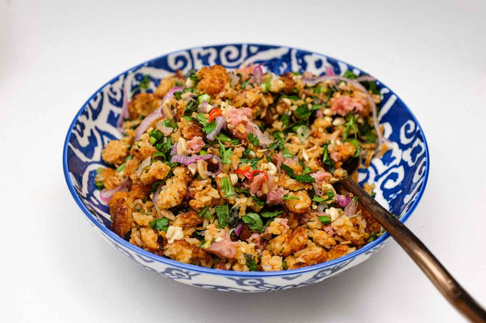

# Nam Khao (Lao Crispy Rice Salad)

*Laos's most-loved street salad: deep-fried curry rice balls shattered into chunks and tossed with sour fermented pork, shredded coconut, fresh herbs, shallots, chillies, lime, fish sauce and chopped peanuts.*

**Serves:** 6 (as starter or salad)

**Prep Time:** 35 minutes (plus 2-3 days fermenting the pork, OR use shortcut)

**Cook Time:** 30 minutes (rice balls)

## Overview
Nam khao is a Lao crispy-rice salad of remarkable textural complexity, sold at every Vientiane and Luang Prabang market stall. Cooked sticky rice mixes with red curry paste, finely chopped lemongrass, kaffir lime leaves and fresh ginger, shapes into golf-ball-sized rounds and deep-fries till crispy outside and tender inside. The fried balls then shatter with a heavy spoon into irregular chunks; the broken edges expose the inside crumb for absorbing the dressing. The traditional Lao addition is som moo, the sour fermented pork that gives the salad its tangy faintly funky backbone (raw pork fermented with sticky rice, garlic, salt and chilli for two or three days). Som moo is hard to source outside Laos; the workable shortcut is cooked sai oua sausage with a couple of tablespoons of lime juice to mimic the sour note. Tossed with lime juice, fish sauce, palm sugar, sliced chilli, shallots, fresh herbs and toasted peanuts just before serving. Eat by hand-wrapping spoonfuls into lettuce leaves with the herbs.

## Ingredients

### The curry rice balls
- 400 g cooked Lao sticky rice OR jasmine rice (cold or room temp)
- 2 tablespoons Thai red curry paste
- 1 stalk lemongrass (tender white only), very finely chopped
- 4 kaffir lime leaves, very finely sliced
- 2 cm piece fresh ginger, finely grated
- 1 small egg, lightly beaten
- 2 tablespoons rice flour OR cornflour
- 1/4 teaspoon salt
- 1 litre sunflower oil for deep-frying

### The som moo (sour fermented pork) - OR shortcut
**Traditional version:** 200 g som moo (Lao sour fermented pork; sold at Lao groceries; OR DIY: 200 g minced pork + 50 g cooked sticky rice + 4 cloves garlic + 1 tsp salt + 2 chillies, mixed in a bowl, left at room temp 2-3 days till sour)

**Shortcut substitute:**
- 200 g cooked Lao sai oua sausage (see [Sai Oua](../sai-oua.md)), sliced into 5 mm rounds
- 2 tablespoons fresh lime juice (to mimic the sour note)

### The dressing
- 3 tablespoons fresh lime juice
- 3 tablespoons fish sauce
- 1 tablespoon palm sugar
- 1 tablespoon padaek (Lao fermented fish sauce; optional)

### The fresh add-ins
- 4 shallots, sliced thin
- 4 spring onions, sliced thin
- 2-4 fresh red chillies, sliced thin
- A large bunch fresh mint leaves
- A large bunch fresh cilantro
- A small bunch culantro (sawtooth coriander), chopped
- 40 g toasted shredded unsweetened coconut (optional but very traditional)
- 80 g toasted crushed peanuts

### To serve
- 1 head of butter lettuce or iceberg lettuce (whole leaves for wrapping)
- A few extra fresh herb sprigs
- Lime wedges
- A glass of cold Lao iced coffee or Beerlao

## Method

### Stage 1 - Make the curry rice mix
1. In a large bowl, combine the cold cooked rice with the red curry paste, chopped lemongrass, kaffir lime leaves, grated ginger, beaten egg, rice flour and salt.
2. Knead with clean hands 1-2 minutes till the mixture holds together when pressed.

### Stage 2 - Shape rice balls
1. With damp hands (rice is sticky), scoop a heaped tablespoon of the mixture.
2. Press firmly into a ball about 4 cm across.
3. Place on a tray; you should make 18-20 balls.

### Stage 3 - Deep-fry
1. Heat the oil to 175°C in a deep pot.
2. Fry the balls in batches of 4-5, 4-5 minutes per batch, turning, till deep golden brown all over and crispy.
3. Lift onto kitchen paper to drain.

### Stage 4 - Shatter the balls
1. While the balls are still warm, place 4-5 on a board.
2. Press firmly with a heavy spoon or potato masher to SHATTER each ball into irregular chunks (not uniform crumbs).
3. The broken edges should expose the interior for absorbing the dressing.

### Stage 5 - Whisk the dressing
1. Whisk together the lime juice, fish sauce, palm sugar and optional padaek.

### Stage 6 - Toss the salad
1. In a very large mixing bowl, combine the shattered crispy rice, som moo (or sausage + lime), sliced shallots, spring onions and chillies.
2. Pour the dressing over.
3. Add the toasted coconut (if using) and most of the crushed peanuts (save some for garnish).
4. Toss gently to coat, work fast; the crispy rice softens within 20 minutes.
5. Add the fresh mint, cilantro and culantro at the very end; toss once.

### Stage 7 - Plate
1. Pile the salad on a large platter.
2. Surround with whole lettuce leaves for wrapping.
3. Scatter the reserved peanuts and a few extra herb sprigs over.
4. Add lime wedges.

### Stage 8 - Serve immediately
1. Each diner takes a lettuce leaf, spoons a generous portion of the salad onto it, adds extra herbs, folds and eats with the hands.
2. Eat within 20 minutes, the crispy rice softens fast.

## Notes
- **Shatter, don't crumb:** irregular chunks expose more interior; uniform crumbs go soggy faster.
- **Som moo (sour fermented pork) is the traditional Lao backbone:** the sausage + lime shortcut works but lacks the traditional depth.
- **Eat fast:** crispy rice softens within 20 minutes of dressing.
- **Lettuce wraps are traditional:** the lettuce + herbs + salad bundle is the Lao eating method.
- **Toss in stages:** the herbs go in at the very end so they stay bright.

## Variations
- **Vegetarian nam khao:** skip the meat; double the toasted peanuts and add 200 g of fried tofu cubes.
- **Nam khao with chicken:** swap the som moo for shredded poached chicken + lime juice.
- **Modern Vientiane café version:** plate the salad on a single large lettuce leaf as an open-faced presentation.
- **Spicier nam khao:** double the fresh chillies + add 1 teaspoon chilli flakes.
- **With shredded green papaya:** add a small handful of julienned green papaya, the Northern Lao variant.

## Serving
- At a Vientiane or Luang Prabang street stall (the traditional setting) · at a Lao home dinner · at a Lao Pi Mai (New Year) celebration · at a Lao temple festival · at home as a striking dinner-party starter · paired with sticky rice and a cold Beerlao.

## Storage
- Best eaten within 30 minutes of tossing.
- The fried rice balls (separately, undressed) keep at room temperature 2 days; refresh in a hot oven for 3 minutes.
- The som moo refrigerates 1 week.
- The dressing keeps refrigerated 1 week.
- Don't pre-toss; the salad goes soggy fast.
