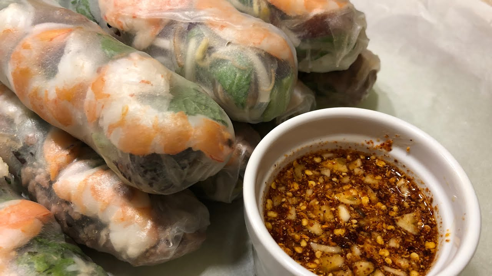

# Yor Pia (Lao Fresh Spring Rolls)

*Laos's fresh-not-fried summer roll: a thin moistened rice-paper wrapper rolled around cooked rice vermicelli, slices of cooked pork (or prawn or tofu), a generous fistful of fresh herbs (mint, cilantro, culantro), shredded lettuce, julienned cucumber and a thin slice of pickled carrot - served alongside a small dish of a sweet-savoury Lao peanut dipping sauce or a tangy fish-sauce-and-lime dressing. The Lao version differs from the Vietnamese gỏi cuốn in three small ways: more aggressive herb load, the canonical peanut sauce is thinner and more lime-forward, and laap can be a filling. Eaten at every Lao café and household summer lunch.*

**Serves:** 4 (8 rolls)

**Prep Time:** 45 minutes

**Cook Time:** 15 minutes (just for the pork or prawns)

## Overview
Yor pia (also spelled yawr pia) is Laos's summer fresh-roll tradition. Three Lao-specific moves. First, the herb load: Lao yor pia carries MORE fresh herbs than Vietnamese gỏi cuốn - a generous pile of mint, cilantro, culantro (sawtooth coriander), Thai basil and dill (the surprising Lao herb). The roll should be lush with herbs visible through the wrapper. Second, the canonical filling: thin slices of cooked pork belly (or boiled prawns, or marinated tofu) + cooked rice vermicelli (thin rice noodles, briefly soaked in hot water) + shredded lettuce + julienned cucumber + a thin slice of pickled carrot. The pork is the traditional choice; some Northern Lao variants use cooked laap as the filling for a more substantial version. Third, the dipping sauce: Lao yor pia is traditionally served with TWO sauces - a sweet-creamy peanut sauce (similar to but thinner than Indonesian sate sauce) AND a clear tangy fish sauce + lime + chilli + garlic dressing (similar to Vietnamese nuoc cham). The diner picks based on preference; some dip with both. Three details: MOISTEN THE RICE PAPER PROPERLY (15-20 seconds in warm water; over-soaking gives floppy soggy wrappers, under-soaking gives brittle ones), DON'T OVERFILL (a moderate filling rolls cleanly; an overfull roll splits), and EAT WITHIN 30 MINUTES (the rice paper dries out fast on standing).

## Ingredients

### The filling
- 200 g pork belly OR pork shoulder, cooked (poach 30 minutes till tender, slice thin)
- OR 16 large cooked prawns, peeled, halved lengthways
- OR 200 g firm tofu, pan-fried golden, sliced thin
- 100 g rice vermicelli (thin rice noodles)
- 1 head butter lettuce, leaves separated
- 1 large cucumber, peeled into thin ribbons OR julienned
- 1 large carrot, julienned and pickled (rice vinegar + sugar + salt; 30 min marinate)
- A large bunch fresh mint
- A large bunch fresh cilantro
- A small bunch culantro (sawtooth coriander)
- A small bunch Thai basil
- A small bunch fresh dill (the canonical Lao herb)
- 4 spring onions, cut lengthways into long thin strips
- 2 fresh red chillies, julienned (optional)

### The wrappers
- 8-10 round rice-paper wrappers (22 cm diameter; sold at Asian shops)
- A wide shallow dish of warm water

### The peanut dipping sauce (canonical Lao)
- 4 tablespoons crunchy peanut butter
- 2 tablespoons fish sauce
- 2 tablespoons fresh lime juice
- 2 tablespoons palm sugar
- 1 clove garlic, finely grated
- 1 small chilli, finely chopped
- 80 ml water (to thin)
- (Whisk all together; warm gently if too thick)
- 1 tablespoon crushed toasted peanuts to top

### The fish-sauce dipping (the canonical alternative)
- 4 tablespoons fish sauce
- 2 tablespoons fresh lime juice
- 1 tablespoon palm sugar
- 1 clove garlic, finely grated
- 2 fresh red chillies, finely chopped
- 60 ml water

## Method

### Stage 1 - Cook the pork (or prawn)
1. If using pork belly: place in a saucepan with cold water, salt and a piece of ginger; bring to a gentle simmer; cook 30 minutes till tender. Drain; cool; slice thin.
2. If using prawn: boil for 2-3 minutes in salted water; drain; cool; halve lengthways.

### Stage 2 - Cook the vermicelli
1. Soak the rice vermicelli in just-boiled water 4-5 minutes till soft but with bite.
2. Drain; rinse briefly under cold water; drain.

### Stage 3 - Pickle the carrot
1. Combine julienned carrot with 2 tbsp rice vinegar + 1 tbsp sugar + 1 tsp salt.
2. Let stand 30 minutes; drain.

### Stage 4 - Mix the sauces
1. Peanut sauce: whisk peanut butter, fish sauce, lime juice, palm sugar, garlic, chilli and water. Top with crushed peanuts.
2. Fish-sauce dipping: whisk all ingredients.

### Stage 5 - Set up the assembly station
1. Have all fillings ready and accessible on the work surface.
2. Place the dish of warm water in the centre.

### Stage 6 - Make each roll
1. Dip a rice-paper wrapper into the warm water for 15-20 seconds till just pliable (not floppy).
2. Lay flat on a clean dry work surface (a damp tea towel underneath helps grip).
3. About 4 cm from the bottom of the wrapper, lay:
   - 2-3 lettuce leaves (acts as a moisture barrier)
   - A small handful of rice vermicelli
   - 3-4 slices of pork (or prawn halves, or tofu)
   - A few cucumber ribbons and carrot strips
   - A generous handful of mint + cilantro + culantro + Thai basil + dill
   - A few strips of spring onion + chilli
4. Fold the bottom of the wrapper up over the filling.
5. Fold the two sides in.
6. Roll up tightly toward the top, keeping the filling tucked in.
7. Place seam-side-down on a serving plate.
8. Repeat with the remaining wrappers and filling.

### Stage 7 - Serve immediately
1. Arrange the rolls on a platter; cover with a damp tea towel if not serving right away.
2. Place both dipping sauces in small bowls alongside.
3. Eat with the hands; dip each roll in the sauce.

## Notes
- **Soak the wrapper just till pliable:** 15-20 seconds in warm water. Over-soaked wrappers are floppy and tear; under-soaked are brittle.
- **Lettuce as a moisture barrier:** placing a lettuce leaf first protects the wrapper from the wet filling.
- **Don't overfill:** moderate filling rolls cleanly; overfull splits.
- **Generous herbs:** the Lao version is herb-heavy. Don't skimp.
- **Eat within 30 minutes:** the rice paper dries out fast.

## Variations
**Yor pia with laap:** swap the cold meat for cooked laap as the protein - the more substantial Lao variant.
**Vegetarian yor pia:** swap meat for pan-fried tofu or marinated portobello strips.
**Spicier yor pia:** add more chilli strips inside each roll.
**With mango:** add julienned green mango for tartness - the modern variant.
**Larger format (whole-meal):** wrap with a single large lettuce leaf on the bottom for a bigger, more substantial wrap.

## Serving
At a Lao home summer lunch (the canonical setting) · at a Lao café · at a Lao Pi Mai (New Year) celebration · at home as a refreshing summer starter or light lunch · paired with cold Beerlao or a glass of nam mak nao (palm-sugar limeade).

## Storage
- Best within 30 minutes of rolling.
- Cover with a damp tea towel if not serving immediately; lasts up to 2 hours covered at room temperature.
- The fillings (vermicelli, cooked pork, herbs) keep refrigerated 24 hours separately.
- The sauces keep refrigerated 1 week.
- Don't refrigerate rolled yor pia - the rice paper hardens and goes leathery.
