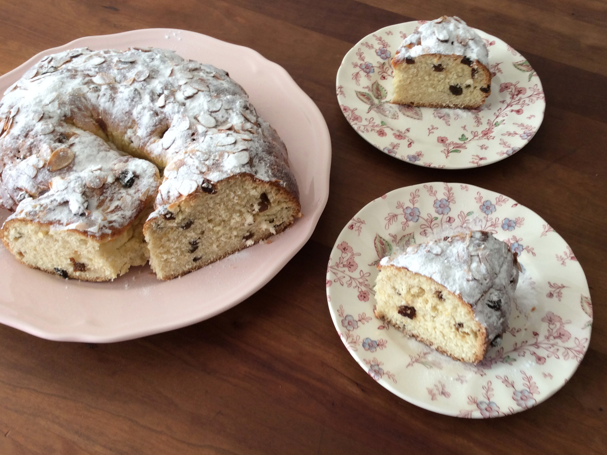

# Klingeris

*Latvian saffron sweet bread: an enriched yeasted dough scented with saffron and cardamom, studded with raisins and candied peel, shaped into a giant pretzel-like figure-of-eight, glazed with egg and crowned with pearl sugar and flaked almond. The name-day cake.*

**Serves:** 10 to 12

**Prep Time:** 30 minutes (plus 3 hours rising)

**Cook Time:** 30 minutes

## Overview
Klingeris (sometimes spelled kliņģeris) is the sweet bread Latvians bake to mark a name day, the celebration that matters in Latvia as much as a birthday. Every Latvian name is tied to a calendar day, and on that day friends and family bring a klingeris to the celebrant's door. The bread is an enriched yeasted dough, golden with saffron, scented with cardamom, studded with raisins and candied citrus peel, sometimes with chopped almond folded in. After two rises the dough is rolled into a long rope, then bent into the figure-of-eight (or pretzel) shape that gives the bread its name (from the German Kringel). Brushed with egg, scattered with pearl sugar and flaked almond, baked at moderate heat until deep gold. The crumb is tender, faintly sweet, with the saffron carrying through. The right way to eat it is in slices with butter and a cup of strong coffee or tea, and to wish the name-day celebrant a long life with the first slice.

## Ingredients

### Dough
- 500 g strong white bread flour
- 75 g caster sugar
- 1 teaspoon fine salt
- 7 g instant dried yeast (1 sachet)
- ½ teaspoon ground cardamom
- A large pinch of saffron threads (about 0.3 g)
- 250 ml whole milk
- 80 g unsalted butter, softened
- 2 large eggs

### Fruit
- 100 g raisins or sultanas
- 50 g candied citrus peel, chopped small
- 30 g whole almonds, roughly chopped (optional)
- 2 tablespoons dark rum or hot water (to plump the fruit)

### Glaze and topping
- 1 large egg, beaten with 1 tablespoon milk
- 3 tablespoons pearl sugar (Swedish-style nibbed sugar)
- 30 g flaked almonds

## Method

### Stage 1 - Bloom the saffron
1. Warm the milk gently to about 35°C (skin-warm).
2. Crumble the saffron threads into the warm milk; leave to steep 10 minutes. It should turn deep gold.

### Stage 2 - Plump the fruit
1. Soak the raisins and candied peel in the rum or hot water 15 minutes; drain.

### Stage 3 - Mix the dough
1. Combine flour, sugar, salt, yeast and cardamom in a large bowl.
2. Whisk the eggs into the warm saffron milk.
3. Pour the wet into the dry; mix with a wooden spoon to a shaggy dough.
4. Knead in the softened butter cube by cube; the dough will resist at first, then accept it. Continue kneading 10 minutes (by hand) or 6 minutes (stand mixer with dough hook) until smooth, elastic and glossy.

### Stage 4 - First rise
1. Cover the bowl; leave to rise in a warm spot 1 hour 30 minutes until doubled.

### Stage 5 - Fold in the fruit
1. Tip the dough onto a lightly floured surface. Press out gently.
2. Scatter the drained fruit and chopped almonds (if using) across the dough.
3. Fold over, knead briefly to spread the fruit evenly. Some pieces will sit on the surface; tuck them in.

### Stage 6 - Shape the klingeris
1. Roll the dough into a long rope about 70 cm long, slightly thicker in the middle and tapering at the ends.
2. Lay on a baking sheet lined with parchment.
3. Form the classic pretzel: bring both ends up and over to meet in the middle, twisting once, then press the ends down onto the body of the rope to make a figure-of-eight loop. Adjust so the bread sits flat and even.
4. Alternative: form a simpler figure-of-eight by laying the rope in two loops.

### Stage 7 - Prove
1. Cover loosely; prove 45 minutes to 1 hour until visibly puffy (it should spring back slowly when poked).

### Stage 8 - Glaze, top and bake
1. Heat the oven to 180°C (160°C fan).
2. Brush the bread generously with the egg-and-milk wash.
3. Scatter pearl sugar and flaked almonds across the top.
4. Bake 25 to 30 minutes until deep gold (cover with foil at 20 minutes if browning fast).
5. Tap underneath; the bread should sound hollow.

### Stage 9 - Cool and serve
1. Lift onto a wire rack; cool at least 30 minutes before slicing.
2. Eat warm or at room temperature with butter and strong coffee.

## Notes
- **Bloom the saffron in warm milk, not boiling.** Boiling water deadens the saffron; warm milk extracts the colour and flavour cleanly.
- **The dough is rich; knead long enough.** Butter-rich doughs need patient kneading to develop the gluten that holds them. Test with the windowpane stretch (a small piece should stretch thin enough to see light through it).
- **Pearl sugar, not granulated.** The pearl sugar holds its shape in the oven and gives the bread its sparkly white topping; granulated melts and disappears.

## Variations
- **With cinnamon sugar swirl:** Press the dough into a rectangle, scatter cinnamon sugar with the fruit, roll up tight before shaping into the pretzel; the slice shows a swirl.
- **Almond paste filled:** Roll the rope flat, lay a thin sausage of marzipan along the length, pinch closed, then form the klingeris.
- **Without saffron:** Replace with grated zest of a lemon and a teaspoon of vanilla; lighter, less festive.

## Serving
Serve sliced thick with cold butter and strong coffee or tea. A few slices go on the name-day table next to flowers and a small gift; tradition is to wish the celebrant a long and easy life with the first slice.

## Storage
- Keeps 3 days at room temperature, wrapped in a cloth or a tin.
- Freezes 2 months whole or in slices; thaw at room temperature, warm 5 minutes in a low oven.
- Day-old slices are excellent toasted with butter.
