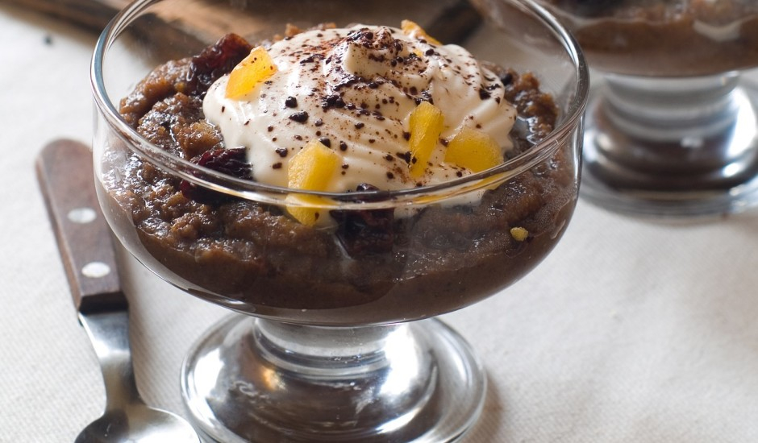

# Maizes zupa

*Latvian sweet rye bread soup: stale rupjmaize simmered with dried apricots, prunes, raisins and cranberries, sweetened with honey and sugar, spiked with cinnamon and lemon, then served cold with a swirl of whipped cream. Eat as a dessert-soup, not a pudding.*

**Serves:** 6

**Prep Time:** 15 minutes

**Cook Time:** 35 minutes (plus 4 hours chilling)

## Overview
Maizes zupa is the dessert-soup nobody quite knows how to classify. It is poured into bowls like a soup but taken with a small spoon like a pudding, served cold (sometimes warm) at the end of a meal but never with the main courses. The base is stale dark rye bread, broken up and simmered with mixed dried fruits (prunes, apricots, raisins, sometimes dried cranberries or pears) and a stick of cinnamon, sweetened with honey and a little sugar, sharpened with lemon zest and juice. The bread breaks down into a thick fruity slurry; some cooks blitz it smooth, others leave it textured with whole fruit pieces visible. The soup chills 4 hours; cold contracts the sweetness and concentrates the dried-fruit flavour. Served in shallow bowls with a swirl of softly whipped cream and a scatter of toasted almond flakes. A summer dessert as much as a winter one, the Latvian Sunday lunch closer.

## Ingredients

### Soup base
- 300 g stale dark rye bread (rupjmaize), torn into pieces
- 1.2 litres water
- 1 cinnamon stick
- 1 strip lemon peel (no white pith)
- 1 strip orange peel (optional)

### Dried fruits
- 100 g pitted prunes, halved
- 100 g dried apricots, halved
- 80 g raisins or sultanas
- 80 g dried cranberries (or dried sour cherries)

### Sweetening and finishing
- 4 tablespoons honey
- 2 tablespoons soft brown sugar (more to taste)
- Juice of 1 lemon
- 1 tablespoon cornflour (optional, to thicken)
- 2 tablespoons dark rum or brandy (optional)

### To serve
- 200 ml double cream
- 1 tablespoon icing sugar
- ½ teaspoon vanilla
- 30 g flaked almonds, toasted

## Method

### Stage 1 - Soak the bread
1. Tear the stale rupjmaize into pieces in a wide pot.
2. Pour over the water; let it soak 20 minutes until the bread is soft.

### Stage 2 - Simmer with fruit
1. Add the cinnamon stick, lemon peel, orange peel (if using), prunes, apricots, raisins and cranberries.
2. Bring to a simmer; cook 25 minutes, stirring now and then. The bread will break down, the fruits will plump.

### Stage 3 - Sweeten and finish
1. Stir in the honey, brown sugar and lemon juice. Taste; adjust sweet and sour balance.
2. If you want a thicker soup, mix the cornflour with 2 tablespoons of cold water, stir in, simmer 2 minutes more.
3. Off the heat, stir in the rum or brandy if using.
4. Lift out the cinnamon stick and the citrus peels.

### Stage 4 - Choose your texture
1. For chunky soup: leave as is.
2. For smooth: pulse with a stick blender 5 seconds, leaving some fruit pieces visible.
3. For smoothest: blitz fully (unusual for the dish but some prefer it).

### Stage 5 - Chill
1. Cool to room temperature, then refrigerate at least 4 hours; overnight is best.
2. Stir before serving; if too thick after chilling, loosen with a splash of cold water or apple juice.

### Stage 6 - Whip and serve
1. Whip the cream with icing sugar and vanilla to soft peaks.
2. Ladle the cold soup into shallow bowls.
3. Drop a generous spoon of whipped cream on top; scatter toasted almond flakes.
4. Eat cold with a small spoon.

## Notes
- **Stale rye is right.** Fresh bread holds too much moisture and goes gluey. Three to four days old, dried in a low oven if necessary.
- **Adjust the sweetness late.** Different dried fruits and different honey give different sweetness; taste after the soup has simmered and adjust then.
- **Chill is the recipe.** Warm bread soup is not the dish. Four hours minimum; the texture changes as it cools.

## Variations
- **Warm version (winter):** Some Latvian households serve it warm; honest and homely, but cold is the more iconic form.
- **With curd cheese dumplings:** Drop small balls of biezpiens (curd cheese) sweetened with sugar onto the surface before serving; the dumplings sit white on the dark soup.
- **With kefir:** Stir in 200 ml kefir before chilling for a tangier version; common in older home cooking.
- **Apple version:** Add 2 peeled diced eating apples with the dried fruits; lightens the dessert.

## Serving
Serve cold in shallow bowls as a dessert. Some restaurants offer it as a starter; the home tradition is at the end of a meal. A small almond biscuit on the saucer.

## Storage
- Keeps 4 days refrigerated; deepens on day two.
- Freezes 2 months without the cream; thaw and refresh with a splash of water.
- The cream is whipped to order; do not store on top of the soup.

