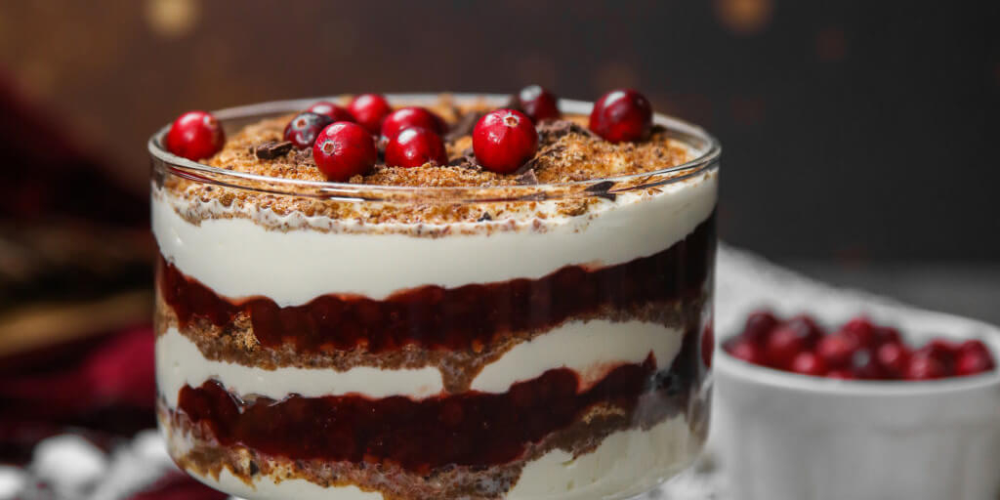

# Rupjmaizes kārtojums

*Latvian layered rye bread pudding: dark rye breadcrumbs toasted with butter and sugar, layered into glasses with whipped cream and sweetened cranberry or lingonberry purée, chilled for a few hours so the layers settle. Cold, sweet-sour, gently boozy if you add a splash of rum. The national dessert.*

**Serves:** 6

**Prep Time:** 30 minutes

**Cook Time:** 15 minutes (plus 4 hours chilling)

## Overview
Rupjmaizes kārtojums (literally "layered rye bread") is the dessert that turns the country's daily bread into a sweet. Stale rupjmaize gets blitzed to breadcrumbs, toasted in a pan with butter, brown sugar, cinnamon and a splash of rum or kirsch until they smell biscuity and just begin to crisp. Cranberries or lingonberries (the small sharp red berries of the Baltic forest floor) are cooked with sugar to a thick purée. The two sit in cool glasses in alternating layers with softly whipped cream sweetened with a tablespoon of icing sugar and scented with vanilla. The pudding needs at least four hours in the fridge so the breadcrumbs soften slightly and the layers settle, then comes out cold and clean. The dark rye flavour reads more like a chocolate or biscuit base than a bread, which is what makes the dessert work. A final scatter of toasted breadcrumbs on top, a few whole berries, eat with a long spoon.

## Ingredients

### Rye bread layer
- 300 g stale rupjmaize (dark Latvian rye), broken up
- 50 g unsalted butter
- 80 g soft brown sugar
- 1 teaspoon ground cinnamon
- 2 tablespoons dark rum, kirsch, or strong cold coffee (optional)

### Berry purée
- 350 g cranberries or lingonberries (fresh or frozen)
- 120 g caster sugar
- 50 ml water
- 1 teaspoon lemon juice
- 1 small stick of cinnamon (optional)

### Cream layer
- 400 ml double cream (or whipping cream)
- 2 tablespoons icing sugar
- 1 teaspoon vanilla extract

### To finish
- A handful of berries (poached or fresh) for the top
- 2 tablespoons of the toasted crumb mix, reserved
- A sprig of mint (optional)

## Method

### Stage 1 - Make the rye crumb
1. Blitz the stale rupjmaize in a food processor to coarse crumbs (the size of small lentils). If using a blender, do it in batches.
2. Melt the butter in a wide pan on medium heat.
3. Add the crumbs; stir to coat.
4. Sprinkle in the brown sugar and cinnamon; cook 8 to 10 minutes, stirring often, until the crumbs are dark, dry to the touch and smell biscuity.
5. Off the heat, stir in the rum or coffee if using; the residual heat will burn off the alcohol.
6. Cool on a tray, spread thin, until completely cold.

### Stage 2 - Cook the berry purée
1. Tip the berries into a small saucepan with sugar, water, lemon juice and cinnamon.
2. Bring to a simmer; cook 12 to 15 minutes until the berries burst and the liquid thickens to a loose jam.
3. Remove the cinnamon stick; mash with a fork (or pulse smooth if you prefer).
4. Cool completely.

### Stage 3 - Whip the cream
1. Whip the cream with icing sugar and vanilla to soft peaks; it should hold a soft fold, not stand up stiff.

### Stage 4 - Layer the glasses
1. Reserve 2 tablespoons of the toasted crumbs and a few berries for the tops.
2. In six wine glasses or tumblers, build in this order: crumb, berry, cream; crumb, berry, cream; finish with crumb.
3. Each layer about a tablespoon (adjust to glass size).

### Stage 5 - Chill
1. Cover; chill 4 hours (or overnight). The crumbs soften, the layers set into the cream, the flavours marry.

### Stage 6 - Finish
1. Top each glass with the reserved crumb, a poached berry and a mint sprig.
2. Eat cold with a long spoon.

## Notes
- **The crumbs must be fully cool and dry before layering.** Warm or soft crumbs sink into the cream and you lose the layer texture.
- **Cranberry or lingonberry, not strawberry.** The dessert wants sharp acidic berries to cut through the rich cream and sweet crumb; soft sweet berries (strawberry, raspberry) make it cloying.
- **Rupjmaize, not generic rye.** A pumpernickel or other rye works, but the molasses-deep flavour of rupjmaize is the reason the dessert exists.

## Variations
- **With apple instead of berry:** Stewed apple with cinnamon replaces the berry layer; gentler, sweeter version.
- **With curd cheese:** Add a layer of sweetened curd cheese (biezpiens) between the crumb and the cream; thickens the dessert toward a torte.
- **As a torte:** Press the crumbs into a 20 cm springform tin as a base, spread the cream over, top with berry purée, chill 6 hours, slice as a torte rather than a glass dessert.

## Serving
Serve cold from the fridge, straight to the table. A small glass of black balsam on the side for adults.

## Storage
- Keeps 2 days refrigerated, but the crumb softens with time. Eat on day one if possible.
- Do not freeze (the cream separates).
- The crumb and berry purée can be made 2 days ahead and stored separately; assemble the glasses 4 hours before serving.
