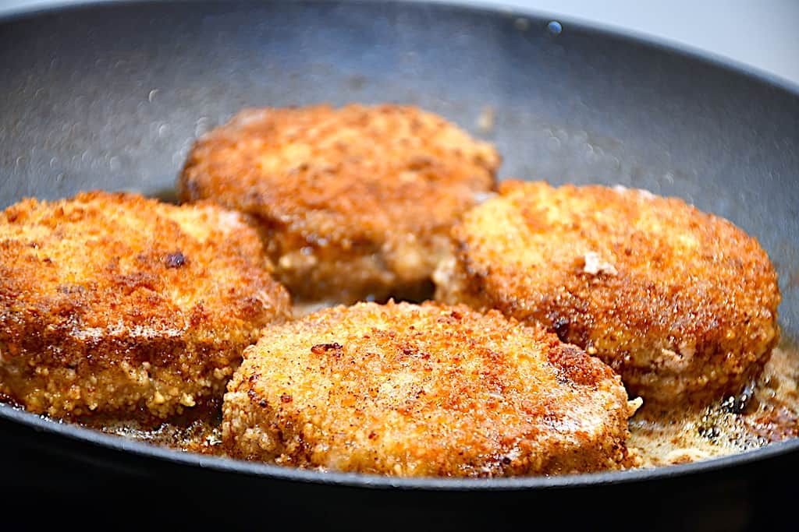

# Karbonāde

*Latvian breaded pork: a thin pork loin steak pounded flat, dredged in flour, dipped in egg and breadcrumbs, then shallow-fried golden in butter and oil. The everyday Sunday lunch, served with boiled potatoes, lingonberry jam and dill cucumbers.*

**Serves:** 4

**Prep Time:** 20 minutes

**Cook Time:** 15 minutes

## Overview
Karbonāde is the Latvian cousin of the Wiener Schnitzel, brought over by Baltic Germans who ran Riga for centuries and absorbed straight into the Latvian Sunday table. The build is simple but the details matter: a boneless pork loin slice cut thick (about 2 cm), pounded between two sheets of clingfilm to half a centimetre, salted lightly, then put through the three-stage breading line (flour, beaten egg, fine breadcrumbs). The fry is in butter mixed with a neutral oil (butter for flavour, oil so it does not burn), on medium-high heat for two minutes a side until golden and just cooked through. The classic plate brings the pork chop alongside boiled buttery potatoes, a spoon of lingonberry or cranberry jam, a couple of dill cucumbers and a lemon wedge. Some households spike the breadcrumbs with paprika or finely grated cheese; others stick to the plain version that lets the pork speak.

## Ingredients

### Pork
- 4 boneless pork loin steaks (about 180 g each, 2 cm thick)
- 1 teaspoon salt
- Freshly ground black pepper

### Breading line
- 80 g plain flour
- 2 large eggs
- 2 tablespoons whole milk
- 150 g fine dry breadcrumbs (panko works; Latvian style is finer)

### For frying
- 40 g unsalted butter
- 3 tablespoons sunflower oil

### To serve
- Lemon wedges
- Lingonberry or cranberry jam
- Dill cucumbers (Latvian-style pickled gherkins)
- Boiled new potatoes, buttered
- A small bunch of dill, chopped

## Method

### Stage 1 - Pound the pork
1. Lay each pork steak between two sheets of clingfilm.
2. Pound with the flat side of a meat mallet (or the base of a heavy pan) until about 5 to 7 mm thick. Work from the centre outwards, even thickness across the steak.
3. Season both sides with salt and a few grinds of pepper. Rest 10 minutes (the salt seasons inwards).

### Stage 2 - Set up the breading
1. Plate one: flour.
2. Plate two: eggs beaten with the milk and a pinch of salt.
3. Plate three: fine breadcrumbs.

### Stage 3 - Bread the chops
1. Take a pork steak; dredge in flour, shake off the excess.
2. Drop into the egg wash, turn to coat fully, lift letting excess drain.
3. Press into the breadcrumbs, turn, press again. The whole surface should be coated; press the breadcrumbs in lightly with the heel of your hand.
4. Repeat with all four steaks; set on a plate.

### Stage 4 - Fry
1. Heat a large heavy frying pan on medium-high.
2. Add the oil, then drop in the butter; the butter should foam but not blacken.
3. Lay in two steaks (do not crowd the pan).
4. Fry 2 minutes; the underside should be deep golden. Flip carefully with a fish slice.
5. Fry the second side 1 minute 30 seconds. The chop is done when firm to the touch and the juices run clear.
6. Drain on kitchen paper. Repeat with the remaining steaks (top up butter and oil if needed).

### Stage 5 - Plate
1. Set a karbonāde on each warmed plate with the buttered potatoes alongside.
2. Spoon a heap of lingonberry jam to one side, two dill cucumbers next to that, a lemon wedge.
3. Shower with chopped dill. Eat hot.

## Notes
- **Pound to even thickness.** Uneven pork cooks unevenly; the thin edges overcook before the thick centre is done. Aim for 5 to 7 mm everywhere.
- **Butter and oil together.** Pure butter burns at frying temperature; pure oil tastes bland. The mix browns the crumb without bitterness.
- **Do not crowd the pan.** Two steaks at a time keeps the temperature up and the crust crisp. Four crammed in releases steam, the crumb goes soggy.

## Variations
- **With cheese in the crumb:** Mix 30 g finely grated mature cheese (Latvian Rūsiņš or a hard cheddar) into the breadcrumbs.
- **Paprika karbonāde:** Add 1 teaspoon sweet paprika to the breadcrumbs.
- **Mushroom karbonāde:** Top each fried chop with sliced chestnut mushrooms sautéed in butter with dill; common in restaurant menus.

## Serving
The classic side is boiled new potatoes with butter and dill, plus lingonberry jam (sweet-sour, cuts the fried richness), dill cucumbers and a lemon wedge. A glass of cold beer or kefir.

## Storage
- Best straight from the pan; the crumb softens after an hour.
- Leftovers keep 2 days refrigerated; reheat 8 minutes in a hot oven on a rack (microwave makes the crumb soggy).
- Cooked breaded chops freeze 1 month; bake from frozen at 180°C for 15 minutes.
