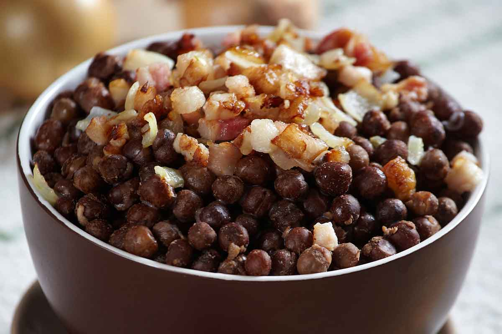

# Pelēkie zirņi ar speķi

*Latvia's national dish: grey peas soaked overnight, simmered tender, then folded with cubes of golden fried smoked bacon and sweated onion. Eat on Christmas Eve by tradition, with a glass of kefir or buttermilk and dark rye on the side.*

**Serves:** 4 to 6

**Prep Time:** Overnight soak plus 15 minutes

**Cook Time:** 1 hour 45 minutes

## Overview
Pelēkie zirņi ar speķi (grey peas with bacon) is the dish Latvians return to every Christmas Eve, and the dish the country claims as its national plate. The grey pea (Pisum sativum, the Latvian local cultivar) is bigger and earthier than the green garden pea, with a beige-grey skin and a starchy buttery interior; the closest substitute outside the Baltic is a dried marrowfat pea, though a yellow split pea works at a pinch. The cooking is patient: overnight soak, slow simmer with a bay leaf and a peeled onion for an hour and a half until each pea is creamy but holds its shape, then drain. Meanwhile small cubes of smoked speķis (Latvian smoked pork belly) render down with a finely chopped onion until the bacon is gold and the onion soft and translucent. The peas go into the bacon pan to warm through and pick up the rendered fat. Season with salt and plenty of black pepper, and that is the dish. Serve in a deep bowl with a glass of cold kefir or buttermilk to drink on the side, and the leftover sour drink is meant to be poured over the spoon of peas in the bowl. Country tradition says every pea on the table must go on Christmas Eve, or the new year will bring tears.

## Ingredients

### Peas
- 400 g dried grey peas (substitute marrowfat peas, or yellow split peas as a last resort)
- 2 litres cold water for soaking
- 1 onion, peeled and halved (for cooking)
- 1 bay leaf
- 1 teaspoon salt

### Bacon and aromatics
- 300 g smoked pork belly (speķis), rind off, cubed 1 cm (substitute thick-cut smoked streaky bacon)
- 1 large onion, finely chopped
- Black pepper, freshly ground
- Salt to taste

### To serve
- 500 ml cold kefir or buttermilk
- Rupjmaize, sliced
- Salted butter

## Method

### Stage 1 - Soak
1. Tip the dried peas into a large bowl, cover with 2 litres cold water. Soak overnight (8 to 12 hours).
2. Next day, drain and rinse.

### Stage 2 - Simmer the peas
1. Put the drained peas in a large pot with fresh cold water to cover by 3 cm.
2. Add the halved onion and the bay leaf. Do not add salt yet (it toughens the skins).
3. Bring slowly to a simmer; skim the foam.
4. Cover partially and simmer gently 75 to 90 minutes until the peas are tender right through but still hold shape.
5. Stir in the teaspoon of salt for the last 10 minutes.
6. Drain (save the cooking liquid for soup if you like). Discard the onion and bay.

### Stage 3 - Render the bacon
1. Heat a wide heavy pan on medium-low (no oil).
2. Add the cubed bacon; render slowly 8 to 10 minutes, stirring, until golden and crisp around the edges and the fat has run out.
3. Add the chopped onion to the rendered fat; cook 6 to 8 minutes until soft and golden, not dark.

### Stage 4 - Fold and warm
1. Tip the drained warm peas into the bacon pan.
2. Fold gently so every pea is coated in fat. Warm through 3 minutes; do not mash.
3. Grind in plenty of black pepper; taste, add salt only if needed (the bacon will have salted the dish).

### Stage 5 - Serve
1. Spoon into deep bowls.
2. Pour a glass of cold kefir or buttermilk for each diner; some pour a splash over the peas before eating, others drink it alongside.
3. Serve with rupjmaize and butter.

## Notes
- **Do not salt the soak or the early simmer.** Salt makes the pea skins tough and refuses to let the interior soften. Add it only at the end of the cook.
- **The peas should hold their shape.** This is not a pea purée. Cook just until tender; fold gently. A burst pea or two is fine; a mush is wrong.
- **Speķis is smoked, not unsmoked.** The smoke is half the flavour. If your bacon is unsmoked, the dish loses its character. Use the smokiest you can find.

## Variations
- **With grīslis (mashed):** Some families take the bacon-warmed peas, mash half coarsely with a fork, and serve as a thicker spread; eat with rye and pickle.
- **Latgale style:** A spoonful of sour cream stirred in at the end; richer, less austere.
- **With sauerkraut:** A side of sauerkraut at the table is common in the east, cutting through the richness.

## Serving
The Christmas Eve table sets pelēkie zirņi as one of nine traditional dishes alongside rasols, smoked fish, sauerkraut, piparkūkas and rupjmaize. Day to day it is a one-bowl supper. The cold buttermilk on the side is not optional in tradition; it is the proper drink.

## Storage
- Keeps 4 days refrigerated; reheats well in a pan with a splash of water.
- Freezes 2 months.
- Day-two bowls are arguably better; the bacon fat has set into the peas.
