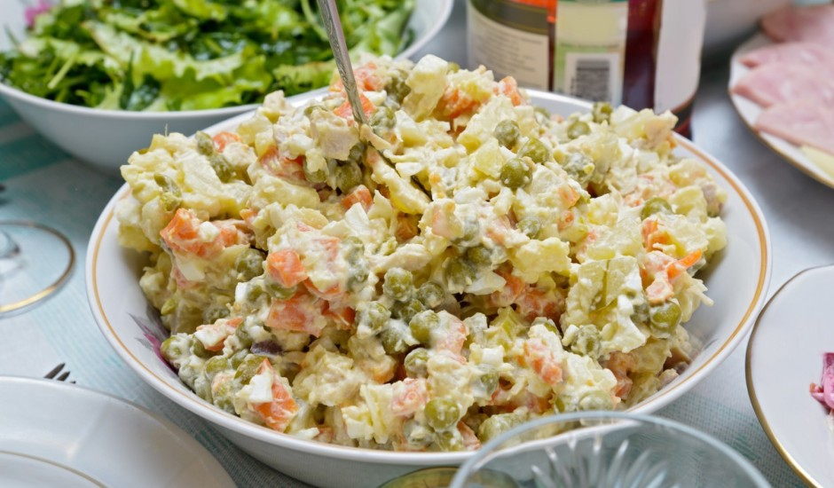

# Rasols

*The Latvian festive salad: diced boiled potato, salted herring, hard-boiled egg, pickled cucumber, peas and a sharp sour-cream-and-mustard dressing. The dish that turns up at every birthday, name-day and Christmas table in Latvia, and the one nobody agrees on which Baltic country invented.*

**Serves:** 6 to 8 as a side

**Prep Time:** 45 minutes

**Cook Time:** 25 minutes

## Overview
Rasols is the festive layered salad that defines a Latvian celebration table. Every household has its own version, and arguments over the proper ratio (more potato or more herring? peas or no peas? apple or no apple?) run for generations. The reliable build is small even dice of boiled waxy potato, hard-boiled egg, pickled gherkin, salted herring fillet, cooked peas and finely chopped onion, all folded together with a dressing that balances sour cream against Dijon-style mustard and a slick of mayonnaise to hold it. The salad needs at least two hours in the fridge to settle, and tastes best the next day when the flavours have come together. Garnish with extra dill, sliced egg, a few capers and a sprinkle of paprika for colour. Eat with rupjmaize and a small glass of vodka if it is a proper occasion.

## Ingredients

### Salad base
- 600 g waxy potatoes (Charlotte, Désirée or similar)
- 4 large eggs
- 200 g salted herring fillets (or 2 marinated matjes-style fillets, drained)
- 4 medium pickled gherkins (about 150 g, drained)
- 150 g cooked peas (frozen, thawed and blanched 2 minutes)
- 1 small red onion, finely chopped
- 1 small tart apple (optional; Granny Smith or similar), peeled and diced

### Dressing
- 150 g thick sour cream
- 100 g mayonnaise
- 2 teaspoons Dijon mustard
- 1 tablespoon white wine vinegar
- 1 teaspoon caster sugar
- Salt and black pepper
- 2 tablespoons finely chopped fresh dill

### To finish
- 1 hard-boiled egg, sliced
- 1 tablespoon small capers, drained
- A pinch of sweet paprika
- Extra dill sprigs

## Method

### Stage 1 - Boil the potatoes and eggs
1. Scrub the potatoes (skins on) and boil in salted water 18 to 22 minutes until just tender; a knife should meet a little resistance.
2. Drain and cool fully. Peel.
3. Hard-boil the eggs (10 minutes from a cold start), cool in iced water, peel.

### Stage 2 - Soak the herring (if needed)
1. If using salted herring fillets that taste fiercely salty, soak in cold milk or cold water for 30 minutes, then drain and pat dry.
2. Marinated matjes-style fillets usually need no soaking.

### Stage 3 - Dice everything small
1. Dice the cooled potato into 8 mm cubes.
2. Dice the hard-boiled eggs the same size.
3. Dice the gherkins and the herring fillet to match.
4. Finely chop the onion. If using apple, dice 8 mm.
5. Tip everything into a wide bowl with the cooked peas.

### Stage 4 - Make the dressing
1. Whisk together the sour cream, mayonnaise, mustard, vinegar, sugar, salt, pepper and dill.
2. Taste: it should sit sharp, faintly sweet, properly seasoned.

### Stage 5 - Fold and chill
1. Pour the dressing over the salad; fold gently with a spatula until everything is coated.
2. Cover and chill at least 2 hours; overnight is better.

### Stage 6 - Garnish and serve
1. Smooth the top in a shallow dish.
2. Lay sliced egg in a row down the centre, scatter capers, dust with paprika, finish with dill.
3. Serve cold with rupjmaize.

## Notes
- **The dice must be small and even.** Rasols is judged by the dice. Eight millimetres or smaller, all components the same size; the salad eats wrong otherwise.
- **Herring is the soul.** Skipping the herring gives you a potato salad, not rasols. If sourcing is hard, jarred matjes-style fillets in oil from any European supermarket work; rinse the oil off first.
- **Rest is the recipe.** The salad needs the fridge time. The dressing seeps into the potato dice and the components stop tasting separate; this is the texture you want.

## Variations
- **With beetroot (rosālas variation):** Add 200 g cooked diced beetroot at the end; the salad turns the famous pink that some Latvian families consider the only right rasols.
- **Without herring (vegetarian):** Skip the fish, double the egg and add 100 g cubed cheddar-style cheese; not traditional but seen on tables where someone does not eat fish.
- **With diced ham:** Some households add 150 g diced cooked ham along with the herring; common at Christmas.

## Serving
- Serve cold with rupjmaize and butter. A spoonful sits next to roasted meats, fried sprats and salted cucumbers on a Latvian festive table.

## Storage
- Keeps 3 days refrigerated; eats best on day two.
- Do not freeze (the potato and egg go grainy).

