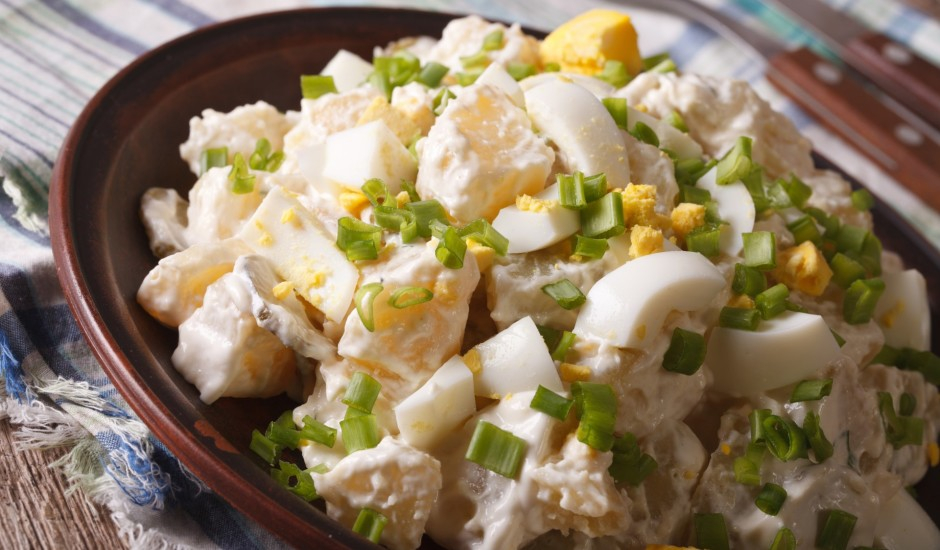

# Kartupeļu salāti

*Latvian potato salad: waxy potatoes diced small, folded with sour cream, mustard, hard-boiled egg, pickled gherkin, red onion and dill. Sharp, creamy, slightly sour. The everyday side at barbecues, picnics and Sunday lunch.*

**Serves:** 6

**Prep Time:** 30 minutes

**Cook Time:** 20 minutes

## Overview
Where rasols is the festive layered salad with herring, kartupeļu salāti is the simple Tuesday-evening version: cooked potato cubes folded with a sour-cream-and-mustard dressing, lifted with dill cucumbers, red onion and chopped hard-boiled egg, scattered with plenty of dill. The dressing is sour cream forward, with a small slick of mayonnaise to bind, sharp Dijon-style mustard, a splash of vinegar from the cucumber jar and a pinch of sugar to round it. The dice must be small and even (1 cm cubes) so the dressing coats every surface, and the salad needs an hour minimum in the fridge before serving to let the flavours settle. Salt is critical: salt the potato cooking water heavily, salt again after dicing, taste a final time after dressing. Eat with cold cuts, fried sausages, grilled fish, or just on its own with a slice of rupjmaize and butter.

## Ingredients

### Salad
- 800 g waxy potatoes (Charlotte, Désirée or new potatoes)
- 4 large hard-boiled eggs
- 5 dill cucumbers (about 200 g, drained), diced
- 1 small red onion, very finely chopped
- A small bunch of fresh dill, finely chopped

### Dressing
- 200 g thick sour cream
- 50 g mayonnaise
- 2 teaspoons Dijon mustard
- 1 tablespoon vinegar (from the dill cucumber jar, or white wine vinegar)
- 1 teaspoon caster sugar
- 1 teaspoon salt
- Freshly ground black pepper

### To finish
- Extra dill
- A few cucumber slices
- Sweet paprika for dusting (optional)

## Method

### Stage 1 - Boil
1. Scrub the potatoes; leave the skins on. Cut larger potatoes in half so all are roughly the same size for even cooking.
2. Cover with cold water in a pot; add 2 tablespoons of salt.
3. Bring to a boil; simmer 18 to 22 minutes until a knife slides through with a little resistance.
4. Drain; cool to room temperature (do not run cold water over them, they go soggy).

### Stage 2 - Peel and dice
1. Peel the cooled potatoes (skins slip off with thumbs).
2. Dice into even 1 cm cubes.
3. Tip into a wide bowl.

### Stage 3 - Prepare the mix-ins
1. Dice the hard-boiled eggs to match the potato cubes; reserve half a sliced egg for the top.
2. Dice the gherkins the same size; add to the potato.
3. Add the chopped red onion and most of the dill.

### Stage 4 - Make the dressing
1. Whisk together sour cream, mayonnaise, mustard, vinegar, sugar, salt and pepper.
2. Taste: sharp, creamy, faintly sweet, well-salted.

### Stage 5 - Fold and rest
1. Pour the dressing over the salad; fold gently with a spatula. Do not stir hard; you want the potato cubes whole.
2. Cover and chill 1 hour minimum (or up to overnight).

### Stage 6 - Finish
1. Smooth the top in a shallow dish.
2. Lay the reserved sliced egg in the centre, scatter dill, lay a few cucumber slices, dust paprika if using.
3. Serve cool, not fridge-cold.

## Notes
- **Cool the potatoes properly before dressing.** Hot potato breaks the sour cream and soaks the dressing into a paste. Cool to room temperature first.
- **Skins on, then peel after boiling.** This stops the flesh going waterlogged.
- **Cucumber juice not lemon.** The brine from the dill cucumber jar carries garlic, dill seed and salt; it gives the dressing the right Latvian character.

## Variations
- **With apple:** A small tart apple diced in gives crunch and brightness; common in summer.
- **With smoked fish:** Add 100 g flaked smoked mackerel for a heartier salad-as-supper.
- **Vegan version:** Replace the sour cream with thick cashew cream or plant yoghurt and skip the egg; add extra dill and a teaspoon of capers.

## Serving
Serve cool alongside grilled sausage, smoked fish, cold cuts, fried karbonāde, or as part of a midsummer (Jāņi) table. A glass of cold kefir or beer.

## Storage
- Keeps 3 days refrigerated; eats best on day two.
- Do not freeze.

