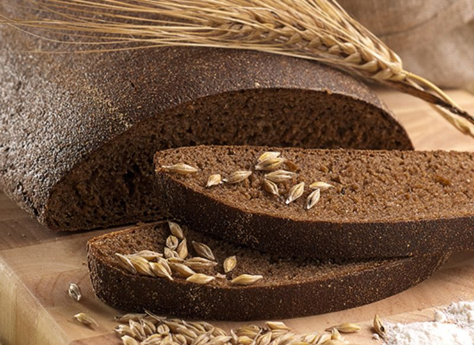

# Rupjmaize ar sviestu

*Latvian dark rye bread with cold salted butter: a thick slice cut from a dense sourdough rye loaf, the butter laid on cold and thick. Latvia's national side, served with every soup, every salted fish, every glass of milk and every shot of vodka.*

**Serves:** 6

**Prep Time:** 30 minutes (active); plus 8 to 24 hours for the loaf

**Cook Time:** 1 hour 15 minutes

## Overview
Rupjmaize is the dark dense sourdough rye loaf that anchors the Latvian table. Latvians say "kur rudzi tur Latvija" (where there is rye, there is Latvia), and the bread is on the table for breakfast, alongside every soup, behind every glass of milk and propping up every smoked fish. The traditional bake is hot, long and demanding: a rye sourdough starter, a coarse rye flour scalded with hot water and rested for a day to develop the malty sweetness, then mixed with caraway, salt, a touch of malt or molasses for colour, kneaded brief, fermented overnight, formed and baked. This version makes a single dense loaf at home with a simpler timeline (overnight sponge, morning bake). The butter side of the dish matters as much as the bread: thick cold salted butter, sliced and laid on the slice rather than spread thin. The two together are a Latvian breakfast in their own right.

## Ingredients

### Sponge (night before)
- 300 g coarse rye flour
- 300 ml warm water
- 1 tablespoon rye sourdough starter (active), or 5 g instant dried yeast as a substitute
- 1 tablespoon caraway seeds
- 1 teaspoon caster sugar

### Final dough
- 300 g coarse rye flour
- 100 g strong wheat flour (for structure)
- 200 ml warm water
- 2 tablespoons dark molasses or malt extract
- 2 teaspoons fine salt
- 1 tablespoon caraway seeds
- 1 teaspoon ground coriander (optional, traditional)

### To finish
- 1 tablespoon coarse rye flour, for dusting
- Cold salted butter (Latvian-style cultured if available; about 80 g per loaf-meal)

## Method

### Stage 1 - Sponge (night before)
1. In a large bowl, whisk the rye sourdough starter into the warm water.
2. Add the rye flour, caraway and sugar; stir to a thick paste.
3. Cover loosely; rest 12 to 16 hours at room temperature. It should smell sour and tangy, with bubbles across the surface.

### Stage 2 - Mix the final dough
1. Add the remaining rye flour, wheat flour, warm water, molasses, salt, caraway and coriander to the sponge.
2. Mix with a sturdy spoon (rye dough is sticky, not stretchy) until uniform.
3. Cover; rest 1 hour at warm room temperature.

### Stage 3 - Shape
1. Tip the dough onto a heavily floured surface (rye flour).
2. With wet hands, shape into a tight oblong or domed round.
3. Place into a heavily floured banneton, or onto a sheet of parchment dusted with rye flour. Dust the top with rye flour.
4. Cover; prove 2 to 3 hours until the surface is fissured and the loaf has grown by half.

### Stage 4 - Bake
1. Heat the oven to 240°C (220°C fan) with a baking stone or heavy tray inside, plus a small tray on the lower shelf for steam.
2. Transfer the loaf to the hot stone; pour a cup of boiling water into the lower tray.
3. Bake 15 minutes at 240°C.
4. Drop the heat to 190°C (170°C fan); bake 50 to 60 minutes more. The crust should be very dark, the loaf should sound hollow when tapped underneath, and the internal temperature should hit 96 to 98°C.

### Stage 5 - Cool fully before cutting
1. Lift onto a wire rack.
2. Cool at least 4 hours before slicing (rye is gummy if cut warm).
3. Best on day two and three.

### Stage 6 - Serve with butter
1. Slice 1 to 1.5 cm thick with a serrated knife.
2. Lay a thick cold slice of salted butter on top, do not spread it thin.
3. Eat with anything on the Latvian table.

## Notes
- **Cool fully or the inside is gummy.** Rye needs hours to finish setting; cutting warm gives a sticky crumb.
- **Cold butter laid on, not spread.** The Latvian habit is to lay a cold slice of butter on a slice of rye, the butter softens on the bread as you eat. Spreading thin is a habit from white bread, not from rupjmaize.
- **Caraway is non-negotiable.** Without the caraway it is not Latvian rye. The coriander is the more contested addition.

## Variations
- **With sunflower seeds:** Fold in 80 g toasted sunflower seeds at the final mix.
- **Saldskābmaize style:** A sweet-sour variant common in Latvia, with extra molasses and a small dice of soaked dried fruit folded in.
- **Bakery shortcut:** A 100 percent rye sourdough loaf from a good bakery, sliced thick with salted butter, gets you 80 percent of the way.

## Serving
With every soup, with herring, with cold cuts, with cheese, with cucumber and dill, with a glass of cold milk, kefir or buttermilk. The slice of rye and butter is also a breakfast and a midnight snack.

## Storage
- Keeps a week in a tin or wrapped in linen; the crumb darkens and the flavour deepens.
- Freezes 2 months, sliced; toast straight from frozen.
- Stale slices toast for snacks (see Rye Bread Chips).
