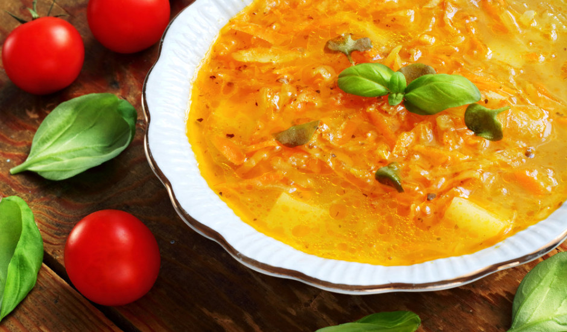

# Skābu kāpostu zupa

*Latvian sauerkraut soup: pork ribs and smoked pork simmered with sauerkraut, pearl barley and potato into a sour-savoury winter bowl, finished with sour cream and dill. Eat with thick slices of dark rye and a small glass of something stronger if the weather is bad.*

**Serves:** 6

**Prep Time:** 20 minutes

**Cook Time:** 2 hours

## Overview
Skābu kāpostu zupa is the sour-cabbage soup that warms Latvian kitchens from October to April. The base is pork (ribs for collagen, a piece of smoked rib or smoked bacon for depth), simmered into a clean stock with bay and peppercorns. Sauerkraut is rinsed once if it screams too sharp, then dropped in with pearl barley and diced potato to thicken. The barley needs a full hour to soften and to give the broth its bind, and the sauerkraut should keep some bite at the end. Carrot and onion go in early, a knob of tomato paste rounds the sour edge, and the soup rests off the heat for half an hour before serving so the flavours settle. The finish is a spoon of thick sour cream stirred into the bowl and a scatter of dill. Eat with rupjmaize and salted butter.

## Ingredients

### Stock and meat
- 600 g pork ribs (meaty, cut between bones)
- 250 g smoked pork rib or smoked pork belly (in one piece)
- 2.5 litres cold water
- 2 bay leaves
- 8 black peppercorns
- 4 allspice berries

### Vegetables and grain
- 500 g sauerkraut (drained; rinsed once if very sharp)
- 100 g pearl barley
- 3 medium potatoes (about 400 g, diced 1.5 cm)
- 1 large onion, finely chopped
- 1 large carrot, coarsely grated
- 2 tablespoons tomato paste
- 2 tablespoons sunflower oil or lard
- 1 teaspoon caraway seeds
- Salt and black pepper

### To finish
- 200 ml thick sour cream
- A small bunch of fresh dill, finely chopped
- Rupjmaize (dark rye bread) and butter, to serve

## Method

### Stage 1 - Build the stock
1. Put the pork ribs and the smoked pork piece in a large pot with the cold water, bay leaves, peppercorns and allspice.
2. Bring slowly to a bare simmer; skim off the grey foam as it rises.
3. Simmer gently, half-covered, for 1 hour. The meat should pull easily from the bone.

### Stage 2 - Sweat the vegetables
1. While the stock cooks, heat the oil or lard in a wide pan on medium heat.
2. Add the onion; sweat 6 minutes until soft.
3. Add the grated carrot and caraway; cook 4 minutes.
4. Stir in the tomato paste; cook 2 minutes until it darkens slightly.

### Stage 3 - Build the soup
1. Lift the meat out of the stock onto a board. Pick the rib meat off the bones, shred it, dice the smoked piece, set both aside.
2. Add the pearl barley to the strained stock; simmer 30 minutes.
3. Add the sauerkraut, the onion-carrot mix, and the diced potato.
4. Simmer 25 minutes more until the barley is tender and the potato is soft.
5. Return the shredded meat. Taste for salt (the smoked pork carries a lot).

### Stage 4 - Rest and serve
1. Pull off the heat, cover, rest 20 minutes.
2. Ladle into bowls. Stir a generous spoonful of sour cream into each, scatter dill.
3. Eat with rupjmaize and butter.

## Notes
- **Rinse the sauerkraut only if you must.** A good sauerkraut should keep its sharpness; rinsing only when it tastes too aggressive on its own. The soup wants sour.
- **Pearl barley not rice.** Barley is the right grain here; it thickens the broth and gives the chew. Rice goes mushy and changes the soup completely.
- **Rest is part of the recipe.** Twenty minutes off the heat lets the sour and the smoke marry. The next-day bowl is better still.

## Variations
- **Without smoked pork:** Use 200 g unsmoked bacon plus a small handful of dried porcini for depth.
- **Latgale style:** Add 100 g dried beans (soaked overnight) at the same time as the barley; the soup goes thicker and heartier.

## Serving
- Serve with rupjmaize, salted butter, and a spoonful of grated fresh horseradish on the side for those who want extra heat.

## Storage
- Keeps 4 days refrigerated; deepens on day two and three.
- Freezes 2 months without the sour cream (add cream after reheating).
- Reheat slowly; do not boil hard or the sour cream will split if already mixed in.

