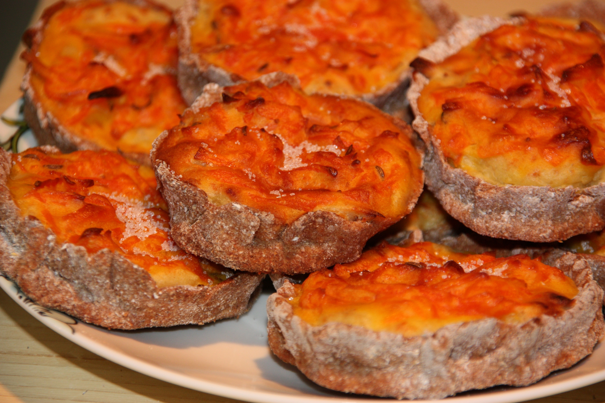

# Sklandrausis

*The PGI-protected Latvian carrot tart: a flat round of unleavened rye-flour dough with raised edges, filled with a sweet potato base and topped with mashed carrot, then baked until set, brushed with butter and dusted with cinnamon. The bake from Courland that holds European protected status.*

**Serves:** 8 small tarts

**Prep Time:** 1 hour

**Cook Time:** 30 minutes

## Overview
Sklandrausis (also called sklandu rausis or sklandiņš) is the only Latvian dish on the European Union's protected food register, granted Traditional Speciality Guaranteed status in 2013. It comes from Courland (Kurzeme), the western region, and is one of the oldest written-down Latvian recipes. The build is two layers of sweet root-vegetable mash sitting in a rye-dough cup. The base is mashed potato sweetened with sugar and bound with sour cream and an egg yolk; the top is mashed carrot sweetened the same way. The pastry is unleavened, made from rye flour, lard, sour cream and an egg, rolled thin and pinched up by hand at the edges to hold the filling (sklanda means a "slanted edge" or "rim"). After 25 minutes in a hot oven the dough is firm and the tops have set with a faint golden blush; brush each warm tart with melted butter and dust the carrot top with cinnamon. Eat at room temperature with milk, kefir or tea. Traditionally a winter-solstice and autumn-harvest bake.

## Ingredients

### Rye dough
- 250 g rye flour (medium grind)
- 60 g lard (or unsalted butter), cold, cubed
- 60 g thick sour cream
- 1 large egg
- ½ teaspoon salt
- 1 tablespoon caster sugar
- 2 to 3 tablespoons cold water (as needed)

### Potato layer
- 400 g floury potatoes, peeled and cubed
- 30 g unsalted butter
- 2 tablespoons sour cream
- 1 large egg yolk
- 2 tablespoons caster sugar
- ¼ teaspoon salt

### Carrot layer
- 500 g carrots, peeled and sliced
- 30 g unsalted butter
- 2 tablespoons sour cream
- 1 large egg yolk
- 3 tablespoons caster sugar
- ¼ teaspoon salt
- ½ teaspoon ground caraway (optional, traditional)

### To finish
- 30 g unsalted butter, melted
- 1 teaspoon ground cinnamon

## Method

### Stage 1 - Make the dough
1. Tip the rye flour into a wide bowl with salt and sugar.
2. Rub in the cold lard with fingertips until the mix looks like coarse crumbs.
3. Whisk the egg with the sour cream; pour into the flour.
4. Bring together with a fork, adding cold water 1 tablespoon at a time until the dough comes into a stiff ball.
5. Knead 1 minute on a lightly floured surface; wrap, rest 30 minutes at room temperature.

### Stage 2 - Cook the fillings
1. Boil the potato cubes in salted water 15 minutes until soft. Drain.
2. Boil the carrot slices in salted water 15 to 20 minutes until completely soft. Drain.
3. Mash the potato with its butter, sour cream, egg yolk, sugar and salt; smooth, not gluey.
4. Mash the carrot with its butter, sour cream, egg yolk, sugar, salt and caraway; smooth.
5. Both fillings should be thick enough to hold a spoon shape, not runny.

### Stage 3 - Shape the bases
1. Heat the oven to 200°C (180°C fan). Line a baking sheet with parchment.
2. Divide the dough into 8 equal pieces.
3. Roll each into a ball, flatten with the palm, then roll out to a round 10 to 11 cm across and about 3 mm thick.
4. Lift each round onto the sheet. Pinch the edge up all the way round with thumb and forefinger to form a 1 cm raised wall (the sklanda).

### Stage 4 - Fill in two layers
1. Spoon 2 tablespoons of the potato mash into each base; spread to the wall.
2. Spoon 2 tablespoons of the carrot mash on top of the potato; spread to the wall, smooth.
3. The tart should sit flat-topped, fillings level with the dough rim.

### Stage 5 - Bake
1. Bake 25 to 30 minutes until the dough rim is firm and faintly browned and the carrot top is set and tinged gold.
2. Lift onto a wire rack.

### Stage 6 - Glaze and dust
1. Brush each warm tart with melted butter while still hot.
2. Dust the carrot tops lightly with cinnamon.
3. Cool to room temperature before eating; the textures set properly as they cool.

## Notes
- **Rye flour, not wheat.** The character of the dough is the rye. Plain wheat flour gives a softer pastry that misses the point. Medium rye (not pumpernickel-dark, not light) is right.
- **The fillings must be thick.** If they slump, the tart bakes flat and the layers blend. Drain the boiled veg well, mash dry, add the sour cream sparingly.
- **Pinch the edge cleanly.** A solid raised wall is the signature of the tart. Press firmly so the dough does not flop open in the oven.

## Variations
- **All-carrot version:** Skip the potato layer and fill with 4 tablespoons of carrot only; a sweeter, simpler tart.
- **Modern saffron touch:** A pinch of saffron infused in the carrot's cooking water turns the top a deeper orange; not traditional but flattering.
- **Pumpkin top:** Some northern variants use mashed pumpkin instead of carrot.

## Serving
Eat at room temperature with a glass of cold milk, kefir, or strong tea. The tart sits between snack and dessert; not breakfast, not a main, but the right thing with a cup at four in the afternoon.

## Storage
- Keeps 3 days at room temperature in a tin lined with paper; 5 days refrigerated.
- Freezes 1 month; thaw at room temperature, warm 5 minutes in a low oven to refresh.
- Re-brush with butter after warming.
