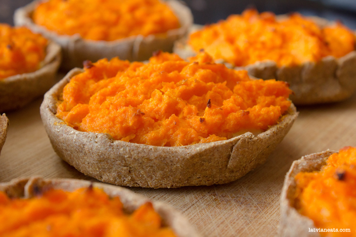

# Sklandrausis (snack size)

*Mini Latvian carrot-rye tartlets: bite-sized versions of the PGI-protected sklandrausis, 5 cm across, two-layered with sweetened potato and carrot mash in a rye crust, baked, butter-brushed and cinnamon-dusted. Coffee-break and party-platter friendly.*

**Serves:** 16 tartlets

**Prep Time:** 45 minutes

**Cook Time:** 22 minutes

## Overview
A bite-sized version of the classic sklandrausis: same rye dough, same potato-then-carrot fillings, same butter glaze and cinnamon dusting, but rolled smaller and lined up across a tray for coffee breaks and party platters. The snack version benefits from the smaller surface-to-filling ratio: the rye dough crisps faster, the fillings hold their layer cleanly, and a single tartlet is one or two bites. Best made in batches and stored in a tin lined with paper. They travel well, which is why Latvian visitors carrying baked goods to a party in another part of the country reach for the smaller form.

## Ingredients

### Rye dough
- 250 g rye flour (medium grind)
- 60 g lard or unsalted butter, cold and cubed
- 60 g thick sour cream
- 1 large egg
- ½ teaspoon salt
- 1 tablespoon caster sugar
- 2 to 3 tablespoons cold water

### Potato layer
- 300 g floury potatoes, peeled and cubed
- 25 g unsalted butter
- 1.5 tablespoons sour cream
- 1 large egg yolk
- 1.5 tablespoons caster sugar
- ¼ teaspoon salt

### Carrot layer
- 400 g carrots, peeled and sliced
- 25 g unsalted butter
- 1.5 tablespoons sour cream
- 1 large egg yolk
- 2.5 tablespoons caster sugar
- ¼ teaspoon salt
- ½ teaspoon ground caraway (optional)

### To finish
- 25 g unsalted butter, melted
- 1 teaspoon ground cinnamon

## Method

### Stage 1 - Dough
1. Rub the cold lard into the rye flour, salt and sugar until coarse-crumb texture.
2. Whisk egg with sour cream; stir into the flour.
3. Add cold water 1 tablespoon at a time until the dough comes together into a stiff ball.
4. Knead 1 minute; wrap, rest 30 minutes.

### Stage 2 - Fillings
1. Boil potatoes 15 minutes; drain, mash with butter, sour cream, egg yolk, sugar and salt. Smooth and thick.
2. Boil carrots 18 to 20 minutes; drain, mash with butter, sour cream, egg yolk, sugar, salt and caraway. Smooth and thick.

### Stage 3 - Shape the bases
1. Heat the oven to 200°C (180°C fan). Line a baking sheet with parchment.
2. Divide the dough into 16 pieces.
3. Roll each into a small ball, flatten, roll to a round about 6 cm across and 2 to 3 mm thick.
4. Lift onto the sheet; pinch the edge up around the rim to form a small raised wall (about 8 mm).

### Stage 4 - Fill
1. Drop a slightly heaped teaspoon of potato mash into each tartlet; spread to the wall.
2. Drop a slightly heaped teaspoon of carrot mash on top; smooth flat to the rim.

### Stage 5 - Bake
1. Bake 18 to 22 minutes until the rim is firm and lightly browned and the carrot top has set with a faint golden blush.
2. Lift onto a wire rack.

### Stage 6 - Glaze and serve
1. Brush each warm tartlet with melted butter.
2. Dust each carrot top with cinnamon.
3. Cool to room temperature; the textures set properly as they cool.

## Notes
- **Drier mashes for the small form.** Slightly less sour cream than the big version keeps the small tartlets sharp-edged in the oven.
- **Don't over-fill.** A heaped teaspoon of each layer is plenty; overfilled tartlets spill in the oven and lose their rim.
- **Cool to room temperature.** Warm out of the oven the rye is gummy; cooled it firms up cleanly.

## Variations
- **Saffron carrot top:** Add a pinch of saffron to the carrot's cooking water for a richer colour and faint floral note.
- **All-carrot:** Skip the potato layer, double the carrot mash, fill in a single layer.
- **Pumpkin top:** Replace the carrot with roasted mashed pumpkin; common in modern bakery versions.

## Serving
Serve at room temperature alongside coffee or strong tea. They sit happily on a sweet platter next to piparkūkas and klingeris slices.

## Storage
- Keeps 3 days at room temperature in a tin lined with paper.
- Freezes 1 month; thaw at room temperature, warm 4 minutes in a low oven, brush with fresh butter.
